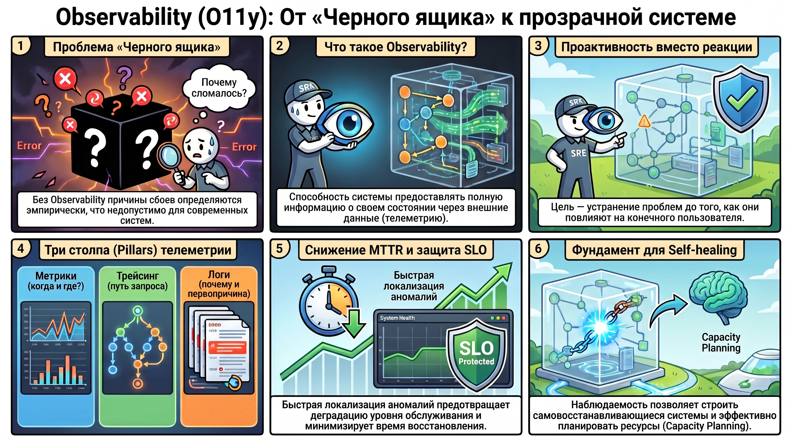
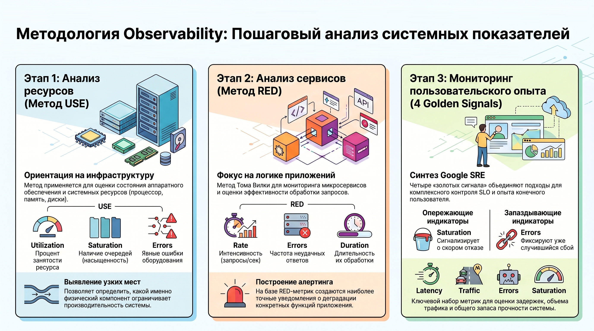
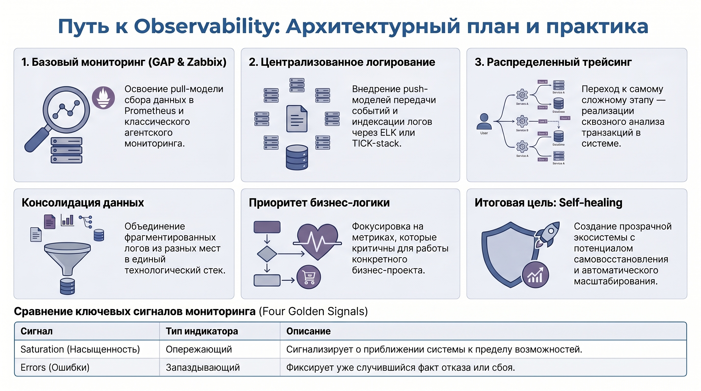

# Системы Observability: концептуальный обзор и методология построения отказоустойчивых сервисов

## 1. Концепция и стратегическое значение Observability в ИТ-инфраструктуре

Observability (наблюдаемость) — это математическая функция оценки внутреннего состояния системы на основе её внешних выходных данных (телеметрии). В контексте SRE-практик это не просто инструментарий мониторинга, а стратегический фундамент, обеспечивающий прозрачность сложной распределенной архитектуры. Основная цель внедрения Observability заключается в минимизации среднего времени восстановления (MTTR) и переходе от реактивного подавления инцидентов к проактивному управлению надежностью.

### Функциональное назначение и задачи анализа

Архитектура наблюдения призвана детерминировано отвечать на вопросы о текущем состоянии системы, локализации замедлений и идентификации точек отказа. Внедрение систем алертинга на основе качественных данных позволяет фиксировать аномалии на ранних стадиях, предотвращая деградацию Service Level Objectives (SLO). Без комплексного подхода эксплуатация остается в рамках «черного ящика», где причины сбоев определяются эмпирически, что недопустимо для промышленно эксплуатируемых систем.

### Влияние на надежность сервисов

Своевременная идентификация отклонений позволяет купировать риски до того, как они трансформируются в негативный пользовательский опыт. Эффективная Observability-модель превращает разрозненные потоки данных в структурированную аналитическую базу, необходимую для принятия архитектурных решений. Для реализации этой модели требуется глубокая интеграция трех фундаментальных компонентов: мониторинга метрик, логирования и распределенного трейсинга.

## 2. Структурные компоненты системы наблюдения: мониторинг, логирование и трейсинг

Архитектура телеметрии строится на иерархическом принципе. Эффективный инцидент-менеджмент требует четкой сегрегации потоков данных: каждый тип телеметрии решает свою часть диагностического уравнения.

### Мониторинг и визуализация метрик

Мониторинг обеспечивает верхнеуровневый контекст («Когда и где возникла проблема?»). Задачи этого слоя включают:

* Нотификацию о критических сбоях и дрейфе системных параметров.
* Отражение состояния ресурсов (серверов), сервисов и их компонентов в реальном времени.
* Построение дашбордов для оперативного контроля SLO и пользовательского опыта.
* Анализ трендов потребления ресурсов для Capacity Planning (планирования масштабирования).

### Централизованное логирование и распределенный трейсинг

Если метрики указывают на факт аномалии, то логирование и трейсинг позволяют вскрыть её природу. Логирование должно быть централизованным и агрегировать данные из приложений, системных служб, аудита безопасности, операционных систем и внешних интеграций. Трейсинг же визуализирует путь прохождения конкретного запроса через микросервисную среду, выявляя скрытые задержки в межсервисных взаимодействиях.

### Архитектурная синергия данных

С точки зрения системного архитектора, компоненты дополняют друг друга следующим образом: метрики предоставляют контекст инцидента, трейсинг визуализирует флоу (поток) запроса, а логи выявляют первопричину (Root Cause) на уровне конкретной строки кода или системного события. Игнорирование любого из этих слоев создает «слепые зоны», увеличивая время простоя системы.

## 3. Методологические подходы к анализу системных показателей

Для исключения хаотического накопления данных необходимо использовать стандартизированные методологии, такие как подходы Тома Вилки, которые разделяют анализ сервисов и ресурсов.

Применение методов RED и USE Для построения эффективной системы алертинга инженер должен комбинировать две модели:

1. **Метод RED (ориентирован на сервисы):**
    * **Rate (Интенсивность):** количество запросов в единицу времени.
    * **Errors (Ошибки):** частота неудачных запросов.
    * **Duration (Длительность):** распределение времени обработки запросов.
2. **Метод USE (ориентирован на ресурсы/инфраструктуру):**
    * **Utilization (Утилизация):** процент времени, в течение которого ресурс был занят полезной нагрузкой.
    * **Saturation (Насыщенность):** объем отложенной работы (очереди к ресурсу).
    * **Errors (Ошибки):** количество ошибок самого ресурса.

### Концепция Four Golden Signals

Мониторинг пользовательского опыта базируется на четырех «золотых сигналах»: Latency (задержка), Traffic (трафик), Errors (ошибки) и Saturation (насыщенность). Важное архитектурное различие: Saturation (насыщенность) является опережающим индикатором (leading indicator) — она сигнализирует о приближении системы к пределу возможностей. В то время как Errors (ошибки) зачастую являются запаздывающим индикатором (lagging indicator), фиксирующим уже случившийся факт отказа.

## 4. Архитектурный план освоения технологий и практические рекомендации

Переход к полноценной Observability требует последовательного освоения технологических стеков и изменения подходов к работе с данными.

### Технологический стек и последовательность реализации

Обучение и внедрение должны следовать логике от простых метрик к сложным распределенным связям:

1. **GAP-stack (Grafana, Prometheus) и Zabbix:** освоение pull-модели сбора данных (Prometheus) и классического агентского мониторинга.
2. **Централизованное логирование (ELK-stack, TICK-stack):** внедрение push-моделей передачи событий и индексации логов.
3. **Системы трейсинга:** реализация сквозного анализа транзакций.

### Рекомендации по реализации

* **Миграция фрагментированных данных:** Одной из приоритетных задач является консолидация разрозненных логов и метрик в единый стек. Отсутствие унификации («логи в куче разных мест») — критический барьер для быстрой диагностики.
* **Приоритезация и фокус:** При избыточности материала необходимо фокусироваться на метриках, критичных для конкретной бизнес-логики.
* **Практическая интеграция:** Рекомендуется интегрировать инструменты мониторинга непосредственно в текущие рабочие проекты (например, внедрение GAP-stack в legacy-инфраструктуру) для получения немедленного фидбека от системы.

## 5. Итоги

Главным результатом построения системы Observability является создание прозрачной, управляемой и предсказуемой экосистемы. Понимание задач мониторинга, логирования и трейсинга позволяет архитектору не только оперативно устранять последствия сбоев, но и формировать фундамент для продвинутых практик: **автомасштабирования (Auto-scaling)** и построения **самовосстанавливающейся инфраструктуры (Self-healing)**.

Целостная модель наблюдения — это необходимый компонент обеспечения надежности в промышленном масштабе, позволяющий трансформировать «шум» сырой телеметрии в четкие аналитические сигналы для бизнеса и разработки.
