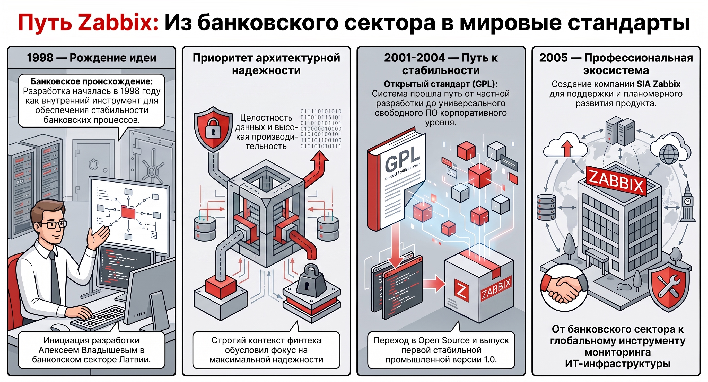
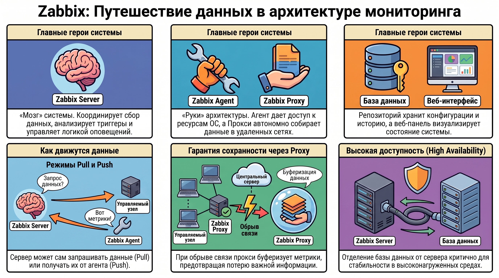
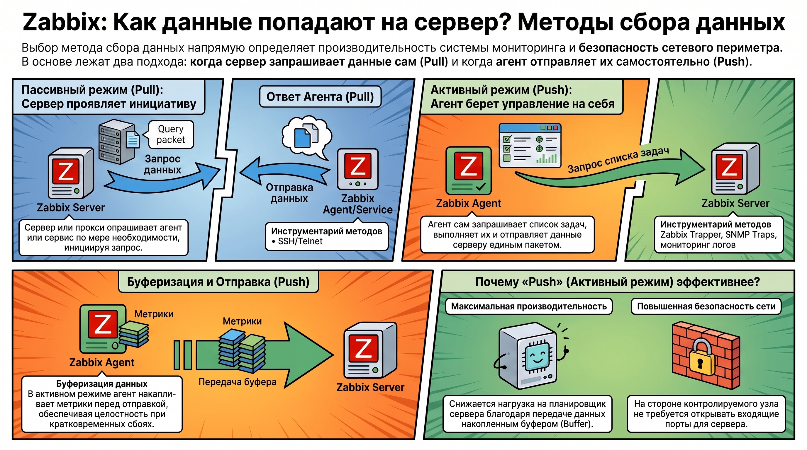
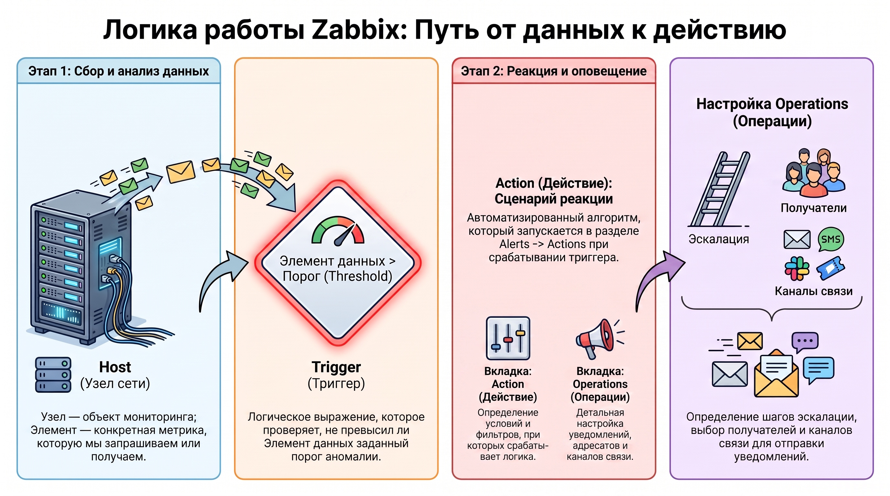

# Система мониторинга Zabbix — архитектура, установка и конфигурирование

### 1. Генезис и функциональное назначение системы

В современной высоконагруженной ИТ-среде системы мониторинга выполняют стратегическую функцию обеспечения непрерывности бизнес-процессов. Zabbix представляет собой зрелое свободное программное обеспечение (лицензия GPL), ориентированное на комплексный контроль состояний сетевых объектов и сервисов. Специфика продукта во многом предопределена его происхождением: разработка началась в 1998 году как внутренний проект крупного латвийского банка. Столь строгий контекст обусловил приоритет архитектурной надежности, целостности данных и высокой производительности, которые остаются фундаментом системы и по сей день.

**История развития:**

* **1998 год:**  Инициация разработки Алексеем Владышевым в банковском секторе (Латвия).  
* **7 апреля 2001 года:**  Переход проекта в формат Open Source под лицензией GPL.  
* **23 марта 2004 года:**  Выпуск первой стабильной версии 1.0, подтвердившей готовность системы к промышленной эксплуатации.  
* **Апрель 2005 года:**  Создание компании SIA Zabbix для обеспечения профессиональной поддержки и планомерного развития экосистемы.

Длительная эволюция от банковского инструмента до универсального корпоративного стандарта позволяет системе предлагать глубоко проработанную архитектурную модель взаимодействия компонентов.

### 2. Архитектурная модель и взаимодействие компонентов

Масштабируемость и отказоустойчивость Zabbix базируются на модульном принципе, позволяющем гибко распределять вычислительную нагрузку. В высоконагруженных средах критически важным является отделение базы данных от серверной части для обеспечения высокой доступности (High Availability).

**Основные компоненты и векторы взаимодействия:**

* **Zabbix Server:**  Центральный узел, координирующий сбор данных, анализ триггеров и логику оповещений.  
* **Zabbix Proxy:**  Автономный сборщик данных. Его независимость позволяет накапливать метрики даже при временном отсутствии связи с основным сервером, что критично для территориально распределенных сетей.  
* **Zabbix Agent:**  Локальный программный модуль, обеспечивающий прямой доступ к ресурсам ОС и приложений.  
* **База данных:**  Репозиторий конфигураций и исторических данных (переход от MySQL MyISAM к InnoDB является обязательным при росте нагрузки).  
* **Веб-интерфейс:**  Консолидированная панель визуализации и администрирования.

Направления потоков данных определяются режимом работы:

* **Pull (Опрос):**  Zabbix Server/Proxy инициирует запрос к источнику (Server -> Agent).  
* **Push (Передача):**  Источник самостоятельно отправляет пакеты данных на сервер (Agent -> Server).

**Роль Zabbix Proxy в распределенных сетях:**  Прокси-сервер не просто снижает сетевую нагрузку на центральный узел, но и выступает гарантом сохранности данных. Буферизация метрик на стороне прокси нивелирует риски потери информации при сбоях в магистральных каналах связи.

Понимание архитектурной иерархии является необходимым условием для корректного выбора методологии получения метрик.

### 3. Методология и механизмы сбора данных

Выбор метода сбора данных напрямую влияет на производительность системы и безопасность сетевого периметра. Архитектор должен балансировать между простотой настройки и минимизацией накладных расходов.

**Режимы работы и протоколы:**

1. **Pull (пассивные проверки):**  
    * Проверки доступности сетевых сервисов.  
    * Пассивный режим агента (сервер опрашивает агент по мере необходимости).  
2. Дистанционное выполнение команд через SSH/Telnet.  
    * **Push (активные проверки):**  
    * Активный режим агента.  
    * Zabbix Trapper и получение SNMP Traps.  
    * Мониторинг лог-файлов в реальном времени.

**Анализ режимов работы агента:**  Взаимодействие между сервером и агентом подчиняется строгой логике. В пассивном режиме сервер запрашивает конкретную метрику, и агент немедленно возвращает значение. В активном режиме агент самостоятельно запрашивает список задач у сервера, выполняет их и передает накопленный пакет (Buffer) единым блоком.

**Преимущества активного режима:**  значительно более высокая производительность (снижение нагрузки на планировщик сервера) и повышенная безопасность, так как на стороне контролируемого узла не требуется открытие входящих портов.

Грамотное сочетание этих методов позволяет оптимизировать требования к аппаратному обеспечению системы.

### 4. Системные требования и параметры масштабируемости

Предварительный расчет ресурсов — залог стабильности системы при масштабировании инфраструктуры. Особое внимание следует уделять типу используемой СУБД, так как она является основным узким местом при записи исторических данных.

**Спецификации оборудования:**

| Размер сети | Узлы | Платформа | Ресурсы (ЦПУ/RAM) | Рекомендуемая БД |
| ------ | ------ | ------ | ------ | ------ |
| **Маленькая** | 20 | Ubuntu Linux | PII 350MHz / 256MB | MySQL MyISAM |
| **Средняя** | 500 | Ubuntu 64-bit | AMD Athlon 3200+ / 2GB | MySQL InnoDB |
| **Большая** | >1000 | Ubuntu 64-bit | Intel Dual Core 6400 / 4GB | RAID10 MySQL InnoDB / PostgreSQL |
| **Очень большая** | >10000 | RedHat Enterprise | Intel Xeon 2xCPU / 8GB | Fast RAID10 MySQL/PostgreSQL/Oracle |

Переход к промышленной эксплуатации требует соблюдения строгого регламента развертывания.

### 5. Регламент развертывания и первичной конфигурации

Стандартизация процесса инсталляции минимизирует риски возникновения скрытых ошибок в конфигурации компонентов.

**Алгоритм установки для Linux-дистрибутивов:**

1. **Репозитории:**  Подключение официального пакета `zabbix-release` для актуальной версии (например, 6.4).  
2. **Установка пакетов:**  
    * *CentOS 8:*  Установка `zabbix-server-mysql`, `zabbix-web-mysql`, `zabbix-apache-conf`, `zabbix-sql-scripts`, `zabbix-selinux-policy`, `zabbix-agent`.  
    * *Ubuntu 22:*  Установка аналогичных пакетов с использованием `apt`.  
3. **Конфигурация СУБД (MySQL):**  
    * Создание БД `zabbix` с обязательной кодировкой и колляцией: `character set utf8 collate utf8_bin`.  
    * Импорт схемы данных с использованием набора символов `utf8mb4` для корректной поддержки всех типов данных.  
4. **Управление службами:**  
    * *CentOS 8:*  Перезапуск и активация `zabbix-server`, `zabbix-agent`, `httpd`, `php-fpm`.  
    * *Ubuntu 22:*  Перезапуск и активация `zabbix-server`, `zabbix-agent`, `apache2`.

**Постинсталляционная настройка веб-интерфейса:**  При первичной конфигурации через браузер система проверяет соответствие PHP-параметров. Критически важны: `max_input_time = 300`, `post_max_size = 16M`, `memory_limit = 128M` и `max_execution_time = 300`.

**Конфигурация Zabbix Agent:**  В файле `zabbix_agentd.conf` необходимо четко разграничивать параметры:

* `Server`: Список IP для пассивных проверок.  
* `ServerActive`: IP сервера для активных проверок. Некорректная настройка этих параметров является наиболее частой причиной отсутствия данных в системе.

Техническая готовность компонентов позволяет перейти к формированию логической модели мониторинга.

### 6. Понятийный аппарат и логика функционирования

Логическая структура Zabbix трансформирует сырые технические данные в осмысленную информацию о состоянии ИТ-активов.

**Базовые сущности:**

* **Host (Узел сети):**  Логический объект мониторинга. Важно помнить, что один физический сервер может быть представлен в системе несколькими узлами сети для различных задач.  
* **Item (Элемент данных):**  Единица сбора метрики (запрос/получение данных).  
* **Trigger (Триггер):**  Логический предикат, оценивающий состояние элемента данных относительно заданного порога аномалии.  
* **Action (Действие):**  Сценарий автоматизированной реакции на инцидент.

**Механизм оповещения (Trigger actions):**  В версии 6.4 управление реакциями сосредоточено в разделе  *Alerts -> Actions -> Trigger actions*.

* **Вкладка Action:**  Определение комплексных условий (фильтров), при которых активируется действие.  
* **Вкладка Operations:**  Детальная настройка шагов эскалации, выбор адресатов и медиа-типов (каналов связи) для уведомлений.

### 7. Итог

Zabbix - это иерархическая система, где каждый уровень (от аппаратного обеспечения до логики действий) должен быть тщательно спланирован. Фундаментом надежности выступает банковское наследие системы, диктующее высокие требования к целостности данных. Корректная архитектурная настройка (выбор между Push/Pull, использование прокси-серверов) и точное соблюдение регламентов установки (параметры БД, пререквизиты PHP) создают базу для построения масштабируемого мониторинга, способного превентивно выявлять проблемы на всех уровнях ИТ-инфраструктуры: от физического оборудования до высокоуровневых бизнес-приложений.
