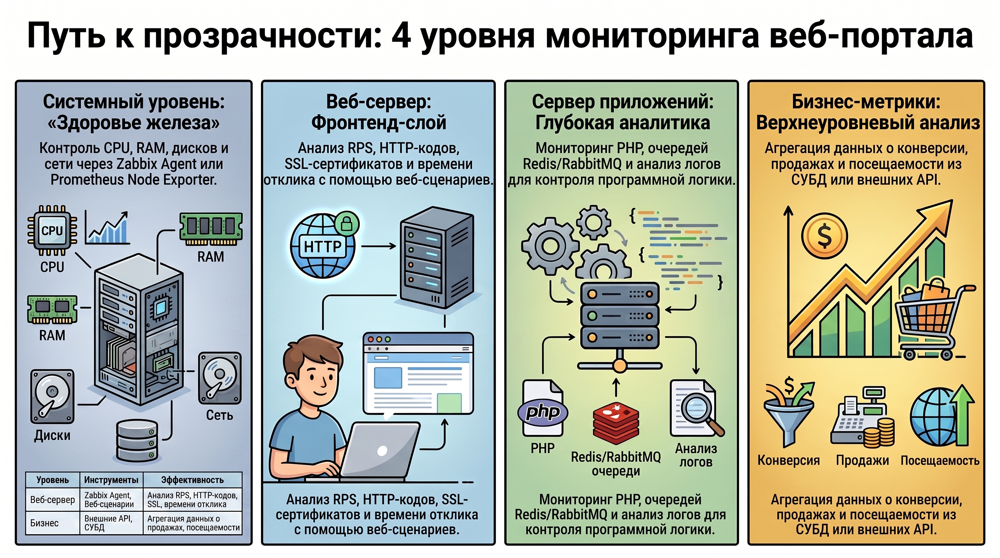
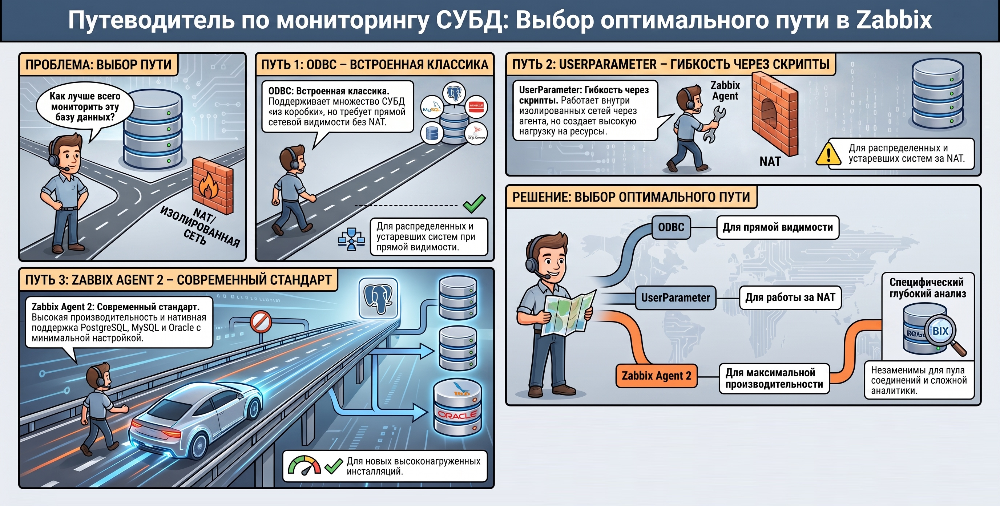

# Мониторинг веб\-порталов и баз данных средствами Zabbix 

### 1. Методологическая иерархия мониторинга веб-порталов 

Обеспечение непрерывности критически важных бизнес-процессов в современной ИТ-инфраструктуре требует внедрения многоуровневой системы контроля. Стратегическая важность такого подхода заключается в возможности своевременной декомпозиции инцидентов: от выявления деградации аппаратных ресурсов до фиксации падения конверсии на стороне пользовательского интерфейса. Комплексный охват всех технологических слоев позволяет сформировать достоверную аналитическую модель состояния системы и сократить время локализации неисправностей.

На основе анализа операционных процессов выделяются четыре ключевых смысловых блока метрик:

* **Системный уровень:** мониторинг базовых показателей жизнедеятельности вычислительного узла. Контролируемые параметры включают загрузку центрального процессора (CPU), использование оперативной памяти (RAM), состояние дисковой подсистемы (I/O, свободное место), сетевую активность и параметры безопасности операционной системы.
* **Веб-сервер:** анализ корректности работы фронтенд-слоя. К обязательным показателям относятся статус сервиса, доступность сетевых портов, количество запросов в секунду (RPS), распределение HTTP-кодов завершения, ошибки сервера, валидность SSL-сертификатов и время отклика (Response time).
* **Сервер приложений:** глубокий мониторинг программной логики и промежуточного ПО. Контролю подлежат RPS специфических компонентов (PHP, Redis, RabbitMQ), интенсивность использования буферов и очередей, количество и статусы активных процессов, а также специфические сообщения об ошибках в лог-файлах.
* **Бизнес-метрики:** верхнеуровневый анализ эффективности продукта. Включает мониторинг посещаемости, показателей конверсии, объемов продаж и статистики скачиваний приложений. 

Для реализации мониторинга на различных уровнях целесообразно использование следующего инструментария:

| Уровень мониторинга | Рекомендуемые инструменты получения данных | Эффективность и глубина анализа |
| ------ | ------ | ------ | 
| **Системный** | Zabbix Agent, Prometheus Node Exporter | Высокая точность сбора низкоуровневых данных ОС через штатные шаблоны. | 
| **Веб-сервер** | Zabbix Agent, Web-сценарии, Simple check, UserParameter | Позволяет имитировать действия пользователя и собирать внутреннюю статистику сервера. |
| **Сервер приложений** | Zabbix Agent, UserParameter, Анализ логов | Глубокая кастомизация под специфику конкретных сервисов, очередей и буферов. | 
| **Бизнес-метрики** | UserParameter, Вычисляемые элементы данных | Агрегация данных из СУБД или внешних API для формирования аналитических отчетов. |

Системный подход к иерархии метрик создает необходимый фундамент для перехода от теоретического проектирования к практической настройке компонентов инфраструктуры.

### 2. Технологический стек и конфигурация мониторинга веб-сервера (на примере Apache)

Прозрачность функционирования современных веб\-серверов обеспечивается их модульной архитектурой. Использование специализированных модулей позволяет экспортировать внутренние показатели производительности в машиночитаемом формате, что является обязательным условием для интеграции с Zabbix. Алгоритм подготовки среды мониторинга на базе ОС Ubuntu включает следующие этапы:

1. **Активация модуля:** верификация наличия `status_module` выполняется командой apachectl `-M | grep status_module`. При отсутствии модуля производится его активация командой `a2enmod status`.
2. **Конфигурация доступа:** редактирование файла `status.conf` (обычно в `/etc/apache2/mods-available/`). В блоке `<Location /server-status>` устанавливается обработчик `SetHandler server-status` и ограничивается доступ (`Require local` или `Require ip 127.0.0.1/32`). Директива `ExtendedStatus On` активирует сбор расширенной информации о запросах.
3. **Применение и верификация:** после проверки синтаксиса (`apachectl -t`) и перезапуска сервиса (`systemctl restart apache2`) доступность данных проверяется утилитой `curl: curl http://127.0.0.1/server-status?auto`.

Универсальность штатных шаблонов Zabbix («Apache by Zabbix agent») достигается за счет использования макросов, позволяющих адаптировать мониторинг под конкретную инсталляцию:

* `{$APACHE.STATUS.SCHEME}` — протокол (http/https);
* `{$APACHE.STATUS.HOST}` — адрес страницы статуса (например, 127.0.0.1);
* `{$APACHE.STATUS.PORT}` — сетевой порт (по умолчанию 80);
* `{$APACHE.STATUS.PATH}` — путь к обработчику статистики (по умолчанию `server-status?auto`).

Визуализация собранных данных в Zabbix Dashboards позволяет проводить глубокую диагностику. Помимо графиков использования памяти (vsize/rss) и общей интенсивности запросов (RPS), критически важным является анализ состояний воркеров (Worker states). Визуализация таких состояний, как Reading request, Sending reply, Keepalive (read), DNS lookup, Logging и Closing connection, позволяет выявлять узкие места в конфигурации серверного ПО. Тем не менее, мониторинг веб-слоя является лишь частью общей аналитической картины, требующей обязательной интеграции с данными систем управления базами данных.

### 3. Сравнительный анализ подходов к мониторингу СУБД

Выбор метода взаимодействия Zabbix с СУБД определяется архитектурой сети, требованиями к безопасности и производительностью. Оптимальный подбор коннектора минимизирует нагрузку на целевую систему и обеспечивает полноту собираемых данных.

Ниже представлен сравнительный анализ пяти основных технологических подходов:

1. **ODBC мониторинг (встроенный модуль):**
    * *Преимущества:* полная интеграция в Zabbix; поддержка широкого спектра СУБД (Oracle, MySQL, PostgreSQL, MSSQL, IBM DB2, MongoDB, Firebird); наличие официальных шаблонов.
    * *Недостатки:* требует прямого сетевого соединения с СУБД (не работает за NAT); отсутствие поддержки пула соединений (каждый запрос инициирует новую сессию); зависимость от Linux-сервера.
2. **UserParameter (Zabbix Agent):**
    * *Преимущества:* работа непосредственно на сервере СУБД (активный режим обходит NAT); высокая гибкость за счет кастомных скриптов; кроссплатформенность.
    * *Недостатки:* значительные накладные расходы ресурсов (CPU, RAM) при высокой частоте опроса; отсутствие пула соединений; необходимость установки дополнительных интерпретаторов (например, Python).
3. **Загружаемые модули:**
    * *Преимущества:* высокая производительность за счет интеграции в код агента.
    * *Недостатки:* ограничение платформой Linux; специфичность под конкретную СУБД; стагнация разработки многих модулей; необходимость ручной сборки из исходного кода.
4. **Внешние агенты (например, DBforBIX):**
    * *Преимущества:* поддержка пула соединений; кроссплатформенность; специализированный функционал для глубокого анализа.
    * *Недостатки:* сложность конфигурации; необходимость развертывания дополнительной среды исполнения (Java, Python, Perl); возможные конфликты с политиками безопасности (отсутствие поддержки PSK/SSL в ряде решений).
5. **Zabbix Agent 2 (Golang):**
    * *Преимущества:* нативная поддержка Redis, Memcached, PostgreSQL и MySQL «из коробки»; недавно внедренный плагин для Oracle; компактность и малая нагрузка на ресурсы; работа в режиме службы в Windows.
    * *Недостатки:* отсутствие поддержки MSSQL на текущий момент; ограничения компилятора Golang для устаревших систем (AIX \< 7.2); **отсутствие поддержки работы в режиме демона в Linux** .

Для принятия архитектурного решения рекомендуется использовать следующую матрицу применимости:

* **ODBC** целесообразен для мониторинга legacy-систем и распределенных СУБД при наличии прямой сетевой видимости.
* **UserParameter** применим в изолированных сегментах сети (за NAT) при необходимости сбора уникальных метрик.
* **Zabbix Agent 2** является приоритетным решением для новых инсталляций PostgreSQL, MySQL и Oracle на современных ОС в силу минимальных требований к настройке и высокой производительности.

### 4. Итог

Результатом применения изложенных методик является формирование комплексной отказоустойчивой среды мониторинга. Интеграция системных показателей, параметров сервисного слоя и бизнес-метрик позволяет достичь полной прозрачности ИТ-ландшафта. Переход от мониторинга отдельных компонентов к анализу концептуальной модели «от «железа» до бизнеса» обеспечивает возможность не только оперативного реагирования на инциденты, но и проактивного управления мощностями, гарантируя соответствие ИТ-инфраструктуры операционным требованиям бизнеса.
