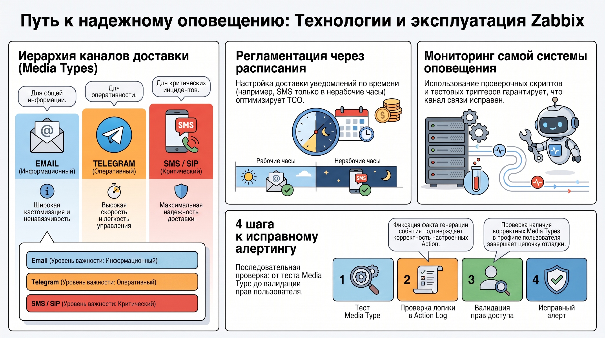

# Методология и практика настройки алертинга в Zabbix

Система оповещений в архитектуре мониторинга выполняет роль критического узла, обеспечивающего минимизацию TTR (Time To Resolution) и непрерывность бизнес-процессов. Алертинг не ограничивается фиксацией технических сбоев, он служит стратегическим инструментом управления надежностью, переводя эксплуатацию из реактивного режима в плоскость прецизионного контроля инцидентов.

### 1. Концептуальные основы проектирования системы уведомлений

#### **1.1. Селекция параметров мониторинга и бизнес-ориентированный подход**

Выбор метрик для генерации оповещений требует жесткой приоритизации на основе их влияния на качество предоставляемых сервисов. Практика включения уведомлений по всем доступным параметрам (выбирать все) квалифицируется как создание избыточного операционного шума, деградирующего культуру реагирования персонала. Критерии отбора должны базироваться на требованиях бизнеса и архитектурной специфике софта. Эффективная система поставляет только те данные, которые требуют обязательного действия со стороны администратора.

#### **1.2. Методология определения порогов срабатывания**

Настройка триггеров основывается на предварительном анализе поведения метрики за репрезентативный период наблюдения. Логика срабатывания обязана учитывать не только пиковые значения, но и их продолжительность для исключения ложных алертов при кратковременных всплесках. Архитектурно оправдано внедрение многоуровневых порогов для одной метрики. Это позволяет дифференцировать инциденты: начальные уровни уведомляют дежурную смену о потенциальных проблемах, тогда как критические пороги требуют немедленной мобилизации профильных инженеров.

#### **1.3. Принятие решений о включении уведомлений**

Методология оптимизации потока событий базируется на исключении неинформативных сообщений. Если на уведомление отсутствует реакция, его необходимо деактивировать для предотвращения флуда. При вводе новых параметров допускается их временное включение для первичного сбора статистических данных и оценки корректности настроенных порогов.Качественная конфигурация триггеров формирует фундамент для последующей классификации инцидентов и регламентации процессов отклика.

#### 2. Иерархическая структура и жизненный цикл инцидента

Структурирование событий по степени их влияния на инфраструктуру является обязательным условием для эффективного распределения ресурсов технической поддержки и приоритизации работ.

#### **2.1. Классификация по уровням важности**

Приоритет инцидента в Zabbix градируется через системные уровни важности: Not classified, Information, Warning, Average, High, Disaster. Процесс эксплуатации требует разделения событий на критические проблемы и события, требующие внимания. Визуализация состояния достигается за счет цветового кодирования, а функциональное разделение реализуется через назначение различных каналов связи для разных уровней критичности.

#### **2.2. Механизмы и примеры эскалации**

Эскалация представляет собой формализованную процедуру привлечения дополнительных ресурсов в случаях, когда прогресс устранения инцидента не соответствует установленным регламентам. Проектирование уровней эскалации должно выполняться заранее для всех типовых сценариев. Критическим аспектом является четкая фиксация причин изменения приоритета, что необходимо для последующего аудита инцидентов. Технологическая цепочка может включать переход от Email к Telegram и далее к SMS или SIP-звонкам. Финальным этапом процесса является интеграция с системами управления рабочими потоками, такими как Jira, для создания тикетов и контроля Workflow.

#### **2.3. Оптимизация потока через дедупликацию и зависимости**

Минимизация информационного шума достигается за счет отказа от персональных оповещений в пользу групповых каналов связи. Основным инструментом дедупликации в Zabbix выступают зависимости триггеров. Данный механизм предотвращает лавинообразную генерацию уведомлений от дочерних объектов при выходе из строя узлового компонента инфраструктуры, фокусируя внимание инженера на первопричине сбоя.

Регламентация указанных процессов обеспечивает переход от технической настройки к промышленной эксплуатации системы.

### 3. Технологический инструментарий и эксплуатационная надежность

Обеспечение работоспособности каналов доставки уведомлений является сложной задачей, требующей постоянной верификации всех компонентов системы.

#### **3.1. Сравнительная характеристика каналов доставки (Media types)**

Zabbix поддерживает различные Media types, каждый из которых занимает свою нишу в архитектуре оповещений:

* Email используется как информационный слой. К его преимуществам относятся широкие возможности кастомизации шаблонов через SMTP и ненавязчивость (unobtrusiveness).  
* Telegram обеспечивает высокую оперативность доставки. Рекомендуется настройка через официальные репозитории: https://git.zabbix.com/projects/ZBX/repos/zabbix/browse/templates/media/telegram. Канал позволяет быстро и безвозвратно отключить уведомления при необходимости.  
* SMS и SIP-звонки формируют критический слой оповещения. Они обладают максимальной надежностью и универсальностью, но увеличивают совокупную стоимость владения системой (TCO) из\-за необходимости оплаты услуг сторонних провайдеров и шлюзов.

#### **3.2. Регламентация и верификация системы**

Эксплуатация Enterprise-решений требует внедрения расписания алертов. Эта концепция подразумевает распределение каналов доставки по времени суток и дням недели (например, SMS только в нерабочее время). Настройка уведомлений признается непрерывным процессом, включающим постоянное обновление инструкций. Мониторинг самой системы оповещения через проверочные скрипты и тестовые триггеры является критически важным для гарантии доставки сообщений.

#### **3.3. Алгоритм отладки уведомлений**

Для верификации цепочки оповещений применяется последовательный алгоритм:

1. Тестирование работоспособности Media type встроенной функцией Test.  
2. Проверка логики и условий срабатывания в настройках Action.  
3. Валидация факта генерации и отправки события через Action log.  
4. Верификация прав доступа субъекта и наличия корректных Media types в профиле пользователя.

Технологическая готовность инструментов должна быть подкреплена глубоким пониманием бизнес-логики защищаемых сервисов.

### 4. Итог

Концепция эффективного алертинга представляет собой сбалансированную систему, в которой техническая реализация триггеров и Media types в Zabbix неразрывно связана с бизнес-целями и жесткой регламентацией процедур реагирования. Главным результатом освоения методологии является достижение минимального времени реакции на инциденты при полном исключении информационного шума. Успех внедрения обеспечивается за счет непрерывной коррекции порогов, использования механизмов дедупликации и регулярной верификации каналов доставки.  
