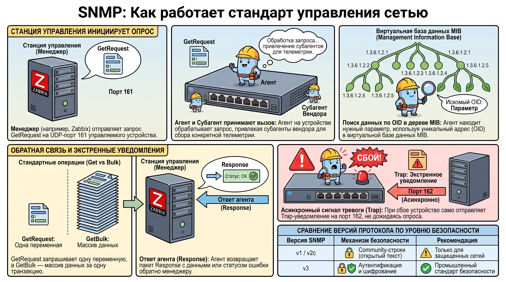
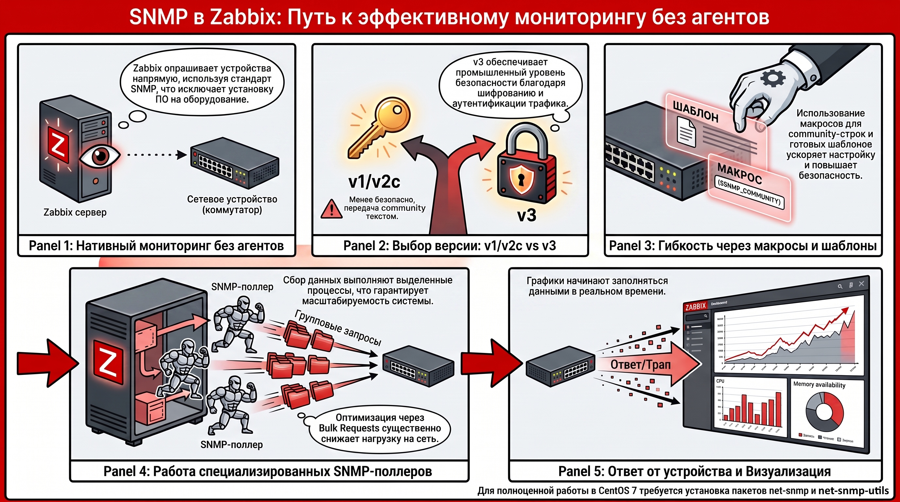
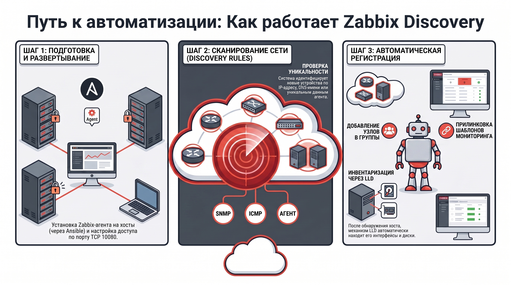
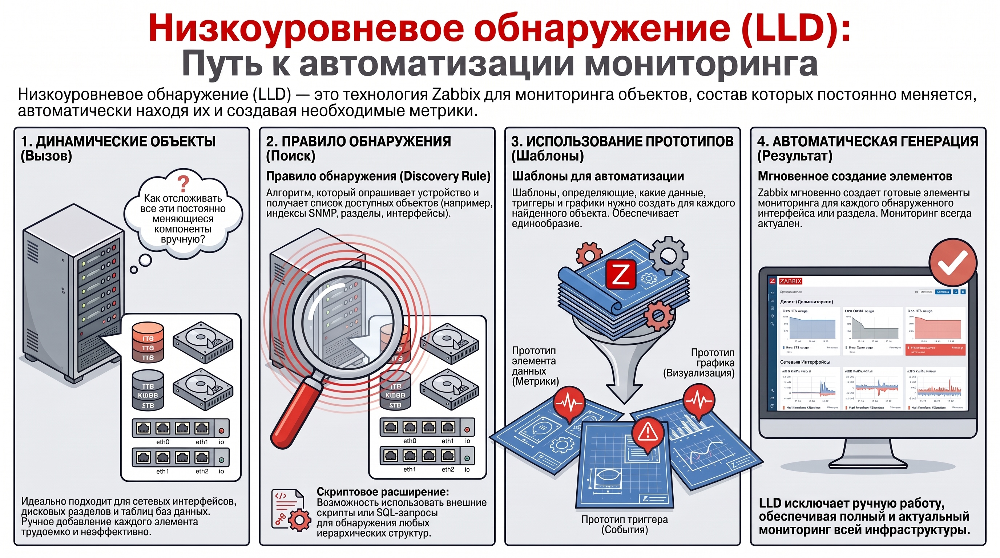

# Методы сетевого мониторинга и автоматизации обнаружения в Zabbix

Протокол SNMP (Simple Network Management Protocol) является фундаментальным отраслевым стандартом, обеспечивающим унифицированное взаимодействие с гетерогенными элементами сетевой инфраструктуры. Его стратегическая значимость заключается в возможности построения централизованной системы управления устройствами (маршрутизаторами, коммутаторами, серверами) в IP-сетях, независимо от их производителя и внутренней архитектуры.

### 1. Протокол SNMP как стандарт управления сетевой инфраструктурой

#### **1.1. Архитектурные компоненты и иерархия взаимодействия**

Функционирование SNMP базируется на иерархическом взаимодействии трех ключевых сущностей:

* **Станция управления (Менеджер):**  Активный компонент системы мониторинга, инициирующий запросы к объектам управления.  
* **Агент:**  Программный модуль, функционирующий на стороне управляемого устройства. Структурно разделяется на  **мастер-агента** , обеспечивающего первичную обработку запросов менеджера, и  **субагентов** .  
* **Субагент:**  Специфический программный модуль, поставляемый вендором оборудования. Его задачей является сбор телеметрии с конкретных аппаратных узлов устройства.  
* **Объект управления:**  Непосредственно конечное устройство, чьи параметры подвергаются мониторингу.

#### **1.2. Функциональные операции и типы запросов**

Стандарт обмена данными предусматривает набор строго определенных операций. Стандартные запросы и команды управления (Get, Set, GetNext) используют транспортный протокол UDP и  **порт 161** . К основным типам операций относятся:

* **GetRequest:**  Получение значения одной или нескольких переменных.  
* **SetRequest:**  Изменение параметров объекта. Агент обязан выполнить данную операцию в атомарном режиме.  
* **GetNextRequest:**  Итерационное обнаружение переменных путем запроса следующего элемента в структуре данных.  
* **GetBulkRequest:**  Оптимизированный механизм, позволяющий получить массив связанных переменных за одну транзакцию, что существенно снижает сетевую нагрузку по сравнению с последовательными GetNext-запросами.  
* **Response:**  Стандартный ответ агента, содержащий запрашиваемые данные или статус ошибки.  
* **Trap:**  Асинхронное уведомление, направляемое агентом менеджеру на  **порт 162**  при наступлении определенных событий. Пакет Trap включает значение времени работы системы (`sysUpTime`), OID типа события и опциональные связанные переменные.

#### **1.3. Структура управляющей информации (MIB и OID)**

Логическая организация данных регламентируется стандартами RFC-1213 и RFC-1212. Основными понятиями являются:

* **MIB (Management Information Base):**  Виртуальная база данных, описывающая структуру управляемых объектов.  
* **OID (Object Identifier):**  Уникальный идентификатор параметра, состоящий из текстового имени и цифрового адреса в дереве MIB (например, `iso.org.dod.internet...`). Дерево OID организовано в строгом лексикографическом порядке, что позволяет системе мониторинга последовательно обходить иерархию метрик.

Эффективная интеграция SNMP в экосистему Zabbix позволяет использовать данные возможности для мониторинга аппаратного обеспечения на нативном уровне.

### 2. Специфика реализации SNMP в среде Zabbix

Zabbix обеспечивает глубокую нативную поддержку SNMP, что гарантирует высокую масштабируемость системы при сборе метрик с сетевого оборудования без установки дополнительных агентов.

#### **2.1. Поддержка версий и безопасность**

Система поддерживает три итерации протокола:

* **v1 и v2c:**  Используют идентификацию через community-строки (открытый текст), что ограничивает их применение в незащищенных сетях.  
* **v3:**  Реализует современные механизмы аутентификации и шифрования трафика, обеспечивая необходимый уровень безопасности промышленного класса.

#### **2.2. Механизмы опроса и оптимизация**

Сбор данных выполняется специализированными процессами —  **SNMP-поллерами** . Для оптимизации производительности Zabbix использует пакетную обработку (bulk requests). Безопасность и гибкость конфигурации обеспечиваются применением пользовательских макросов для community-строк. Ускорение процесса интеграции оборудования достигается за счет использования  **предопределенных шаблонов**  для SNMP, поставляемых в базовой конфигурации системы.

Для подготовки среды мониторинга на базе CentOS 7 используется установка соответствующего инструментария: `yum install net-snmp net-snmp-utils`

Статическое описание объектов дополняется динамическими методами автоматизированного наполнения базы данных мониторинга.

### 3. Технологии автоматизированного обнаружения хостов (Discovery)

Механизмы сетевого обнаружения (Discovery) минимизируют долю ручного администрирования, обеспечивая автоматическую регистрацию новых устройств и поддержание актуальности топологии сети.

#### **3.1. Алгоритм сетевого сканирования**

Процедура автоматизированного развертывания включает следующие этапы:

1. Инсталляция  **zabbix-agent**  на целевые системы. Для повышения эффективности в DevOps-практиках рекомендуется использовать  **Ansible-плейбуки**  для массовой раскатки агента.  
2. Конфигурирование сетевой доступности  **TCP-порта 10050**  и указание адреса сервера в параметре `Server`.  
3. Настройка правил обнаружения ( **Discovery rules** ) с определением диапазонов IP-адресов и типов проверок (агент, SNMP, ICMP).

#### **3.2. Автоматизация через Discovery Actions**

Динамическое управление жизненным циклом хоста реализуется через  **Discovery Actions** . При совпадении критериев уникальности (IP, DNS или данные агента) система автоматически добавляет узел, включает его в группы и прилинковывает шаблоны.

Для детальной инвентаризации внутренних динамических компонентов обнаруженных систем применяются механизмы LLD.

### 4. Низкоуровневое обнаружение (Low-Level Discovery — LLD)

LLD является критическим инструментом для мониторинга объектов, состав которых изменяется динамически, таких как сетевые интерфейсы, дисковые разделы или таблицы баз данных.

#### **4.1. Структура и компоненты LLD-правила**

Технология LLD оперирует двумя типами сущностей:

* **Правило обнаружения:**  Описывает алгоритм получения списка объектов (например, опрос SNMP-индексов или выполнение скрипта).  
* **Прототипы:**  Шаблоны, на основе которых Zabbix автоматически генерирует элементы данных, триггеры, графики и узлы сети для каждого обнаруженного объекта.

#### **4.2. Скриптовое расширение возможностей**

Функционал LLD может быть расширен путем использования внешних скриптов или SQL-запросов, что позволяет создавать кастомные метрики для любых иерархических структур данных.

В сценариях, исключающих возможность прямого опроса со стороны сервера, применяются методы активной передачи данных.

### 5. Протоколы активной передачи данных: Zabbix-sender и Zabbix-trapper

Механизмы асинхронной передачи данных необходимы для регистрации событий от внешних систем, скриптов или при длительных вычислительных процессах.

#### **5.1. Функционал утилиты Zabbix-sender**

**Zabbix-sender**  представляет собой специализированную консольную утилиту, выступающую в роли  *инструмента доставки*  метрик. Она инициирует передачу данных непосредственно на сервер мониторинга.

#### **5.2. Сравнительный анализ Push и Pull моделей**

Ключевое отличие Push-модели заключается в том, что на стороне Zabbix-сервера данные принимаются элементами с типом  **Zabbix-trapper**. Данная архитектура существенно снижает нагрузку на серверные поллеры, так как сервер не тратит ресурсы на ожидание ответов от медленных или асинхронных источников данных.

### 6. Итог

Главным результатом освоения представленных технологий является способность проектировать комплексную, высокоавтоматизированную систему мониторинга. Синергия промышленного стандарта SNMP (с учетом портов 161/162 и RFC-спецификаций), механизмов сетевого сканирования и низкоуровневого обнаружения (LLD) позволяет минимизировать трудозатраты на поддержку инфраструктуры. Использование связки Zabbix-sender и Trapper-элементов обеспечивает необходимую гибкость для обработки асинхронных потоков данных и сложных сценариев мониторинга.  
