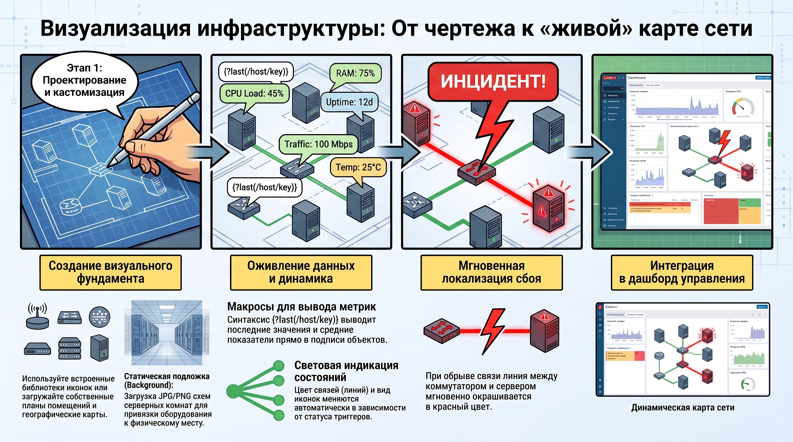
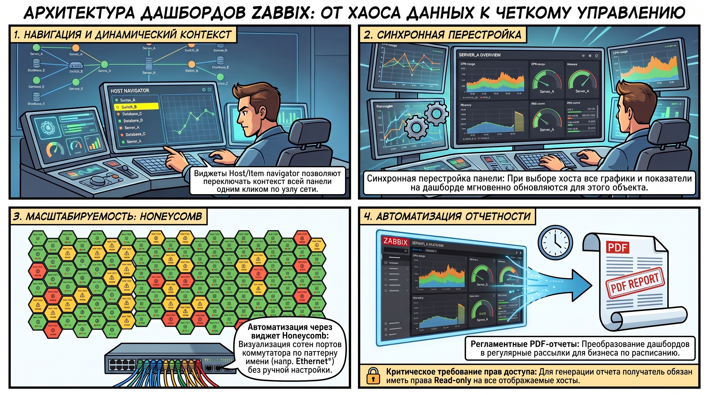
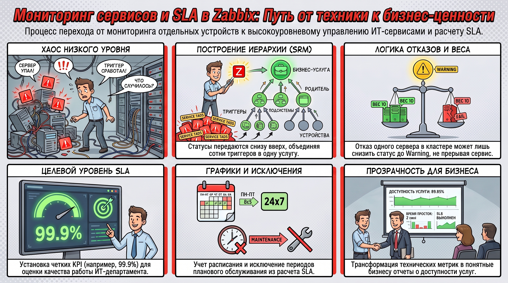
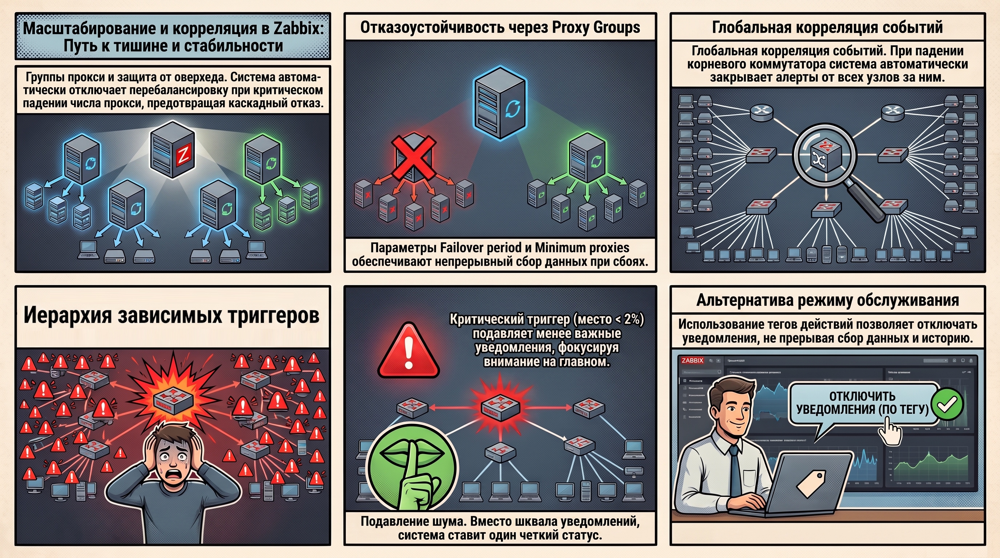

# Визуализация данных и ситуационное управление в Zabbix

В современной практике эксплуатации ИТ-систем графическая визуализация является не просто вспомогательным инструментом, а стратегическим компонентом анализа. Для архитектора систем мониторинга консолидация инструментов визуализации внутри одной экосистемы — это вопрос снижения TCO (Total Cost of Ownership). Использование встроенных инструментов Zabbix вместо внешних решений (таких как Grafana) позволяет минимизировать операционные затраты, обеспечивая при этом глубокую интеграцию с логикой сбора данных для оперативного выявления аномалий в реальном времени.

### 1. Инструментарий графической визуализации метрик

Zabbix предоставляет многоуровневую систему работы с графиками, обеспечивая переход от моментальной оценки данных к сложным аналитическим представлениям.

* **Простые и ситуационные графики:**  Автоматическая генерация доступна для любых числовых элементов данных типов  *Numeric (Float)*  и  *Numeric (Unsigned)*  в разделе «Последние данные» (Latest Data). Функции  **Display graph**  и  **Display stacked graph**  (закрашенная область) позволяют архитектору мгновенно сопоставлять метрики, анализируя их динамику.  
* **Преднастроенные графики и шаблонизация:**  Эффективность мониторинга типовых сервисов (например, СУБД PostgreSQL) базируется на использовании графиков, определенных на уровне шаблонов. Применение прототипов графиков в правилах низкоуровневого обнаружения (LLD) позволяет системе автоматически масштабировать визуализацию при появлении новых объектов (баз данных, разделов диска), исключая ручной труд.  
* **Расширенная настройка визуальных представлений:**  Функционал позволяет использовать левую и правую оси одновременно (например, для отображения процентов и байтов на одном поле), применять  **Time shift**  (временной сдвиг) для сравнения текущих трендов с историческими периодами и выводить триггеры непосредственно на график. Это критически важно для понимания контекста инцидента.

**Связующая нить:**  Анализ изолированных метрик неизбежно ведет к необходимости визуализации топологии всей системы для понимания логики прохождения трафика и зависимостей компонентов.

### 2. Проектирование и динамика карт сети

Карты сети являются инструментом высокоуровневой визуализации физической и логической инфраструктуры, позволяя наглядно представить связи между узлами.

* **Создание и кастомизация объектов:**  Zabbix поддерживает ручное формирование топологий с использованием встроенных библиотек иконок или внешних паков (например, из репозиториев GitHub). В качестве подложки допустимо использование статических изображений (JPG/PNG), таких как планы серверных комнат или фрагменты географических карт.  
* **Динамические данные и макросы:**  Для вывода метрик в подписи объектов и связей используются макросы выражений. Синтаксис вида `{?last(/host/key)}` позволяет выводить последнее значение, а функции агрегации — данные за период (например, среднее значение входящего трафика `net.if.in` за последний час).  
* **Визуальная индикация состояний:**  Цвет связей и вид иконок динамически меняются в зависимости от статуса привязанных триггеров. Это обеспечивает мгновенную локализацию неисправности: например, при обрыве связи линия между коммутатором и сервером окрашивается в красный цвет.

**Связующая нить:**  Карта сети часто сама становится ключевым виджетом в составе комплексных операционных панелей, объединяющих топологию и аналитику.

### 3. Архитектура комплексных панелей (Dashboards)

Дашборды выступают центральным узлом управления Observability-платформой, агрегируя разнородные данные в едином интерфейсе.

* **Виджеты навигации и динамический контекст:**  Виджеты  **Host navigator**  и  **Item navigator**  позволяют создавать динамические панели. При выборе объекта в навигационном виджете контекст всего дашборда синхронно меняется, перестраивая графики и показатели для выбранного хоста.  
* **Автоматизация через виджет Honeycomb:**  Виджет «соты» (honeycomb) идеален для массовой визуализации. Используя паттерны имен (например, `Ethernet*`), можно автоматически вывести статусы всех 48 портов коммутатора. Это избавляет от необходимости ручного создания объектов для каждого интерфейса.  
* **Регламентная отчетность:**  Панели могут трансформироваться в  **Scheduled reports**  в формате  **PDF** .  **Архитектурное требование:**  для корректного формирования отчета у получателя (пользователя, от имени которого генерируется отчет) должны быть права  **Read-only**  на все отображаемые хосты, иначе отчет будет пустым.

**Связующая нить:**  От технической визуализации параметров дашборды позволяют перейти к оценке качества ИТ-сервисов в рамках сервисно-ресурсных моделей.

### 4. Мониторинг сервисов и метрики SLA

Сервисно-ресурсная модель (SRM) позволяет абстрагироваться от состояния отдельных единиц оборудования и сосредоточиться на бизнес-показателях.

* **Иерархия сервисов:**  Модель строится на связях «родитель — потомок». Статус распространяется снизу вверх ( **Status propagation** ). Настройка «веса связи» позволяет реализовать сложную логику: например, отказ одного из десяти серверов в кластере лишь понижает статус сервиса до Warning, не прерывая оказание услуги.  
* **Настройка SLA:**  При определении целевого уровня (например, 99.9%) крайне важно правильно задать временные графики (Schedule, например, 8х5 или 24х7) и исключить периоды планового обслуживания (Maintenance).  
* **Критическое различие:**  Необходимо четко разделять  **Service tags**  (теги сервисов) и теги триггеров. Теги сервисов используются для связки триггеров с конкретными узлами сервисной иерархии, и ошибка в их сопоставлении приведет к некорректному расчету SLA.

**Связующая нить:**  Точность SLA-метрик напрямую зависит от надежности архитектуры сбора данных и чистоты потока событий.

### 5. Расширенные механизмы корреляции и масштабирования

Минимизация «шума» и обеспечение отказоустойчивости — ключевые задачи при проектировании крупных инсталляций.

* **Proxy groups и защита от перегрузки:**  Использование групп прокси с параметрами `Failover period` и `Minimum number of proxies` обеспечивает высокую доступность. Архитектурная особенность: если количество активных прокси падает ниже установленного минимума, Zabbix  **отключает перебалансировку** . Это защищает оставшиеся узлы от лавинообразного роста нагрузки («оверхеда») и каскадного отказа всей инфраструктуры сбора.  
* **Стратегии корреляции событий:**  
    1. **Зависимые триггеры:**  Подавление вторичных алертов (например, триггер «место на диске \< 2%» подавляет «место на диске \< 5%»).  
    2. **Корреляция по тегам:**  Применяется для логов и SNMP-трапов, позволяя событию восстановления закрывать конкретное событие проблемы по уникальному идентификатору.  
    3. **Глобальная корреляция:**  Работает на уровне всего сервера.  **Пример:**  если упал корневой коммутатор 3-го этажа, система автоматически  **закрывает**  (а не просто скрывает) события от всех рабочих станций за ним, предотвращая шквал уведомлений.  
* **Альтернатива Maintenance:**  Для гибкого управления уведомлениями вместо стандартного режима обслуживания можно использовать  **пользовательские теги действий (Actions)** . Это позволяет инженерам временно отключать оповещения через тег на хосте, не прерывая сбор данных и не искажая историю триггеров.

### 6. Итог

Глубокое понимание инструментов визуализации, сервисной иерархии и механизмов корреляции в Zabbix позволяет трансформировать разрозненный поток технических метрик в структурированную систему поддержки принятия решений. Переход от мониторинга отдельных компонентов к сервисно-ресурсной модели обеспечивает полную прозрачность ИТ-инфраструктуры для бизнеса, минимизирует операционные затраты и позволяет архитектору обоснованно управлять качеством предоставляемых ИТ-сервисов.  
