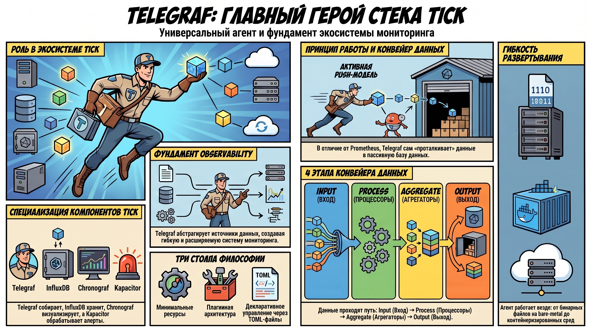
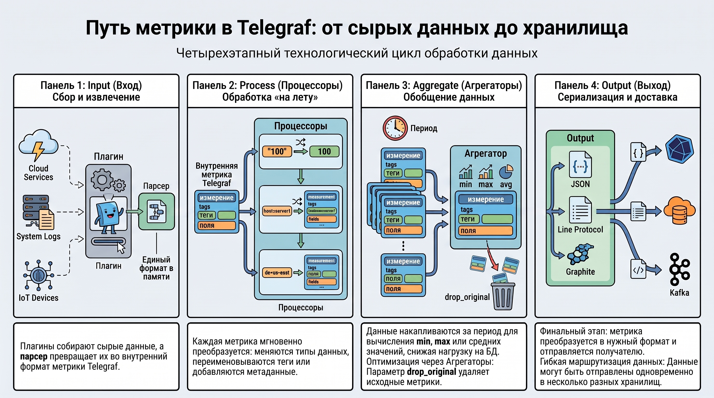
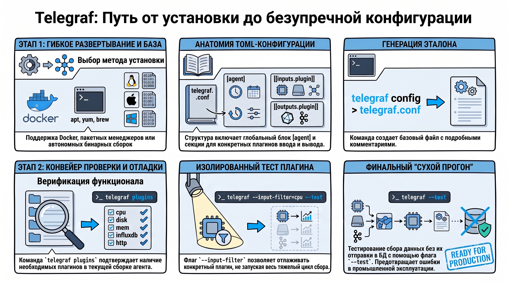
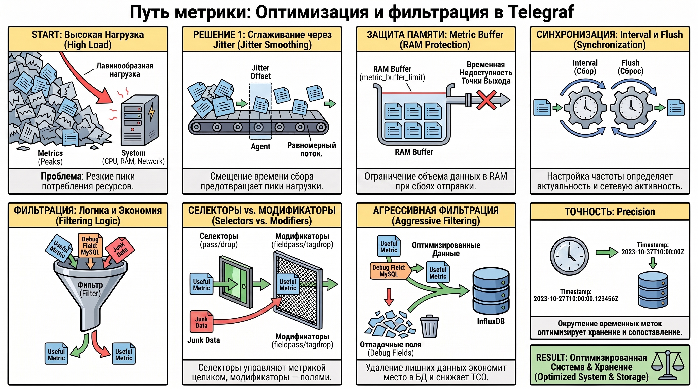
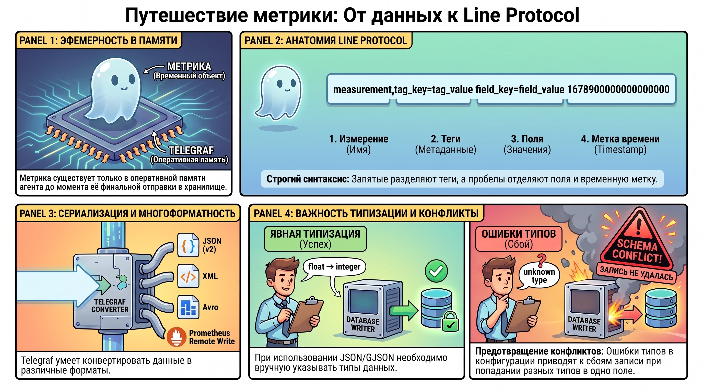
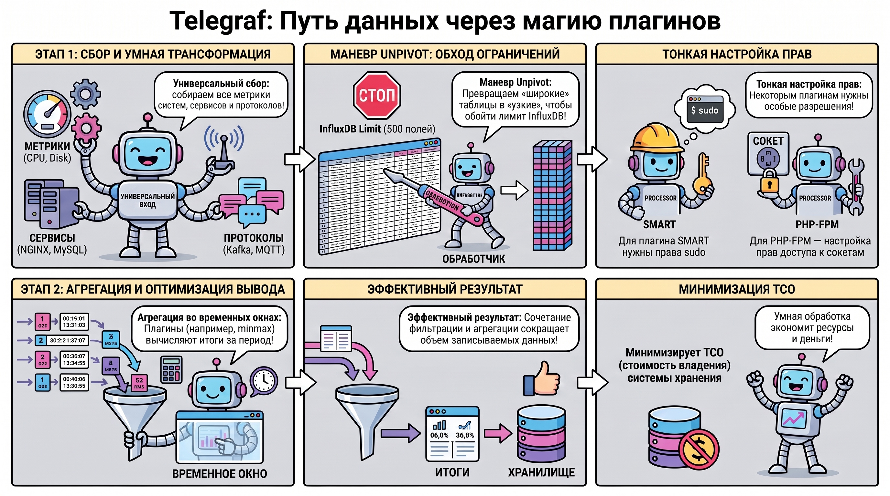

# Агент сбора метрик Telegraf в экосистеме TICK

### 1. Концептуальное позиционирование Telegraf в стеке TICK

Telegraf является фундаментом архитектуры мониторинга TICK, выполняя роль универсального и легковесного агента для сбора, обработки и передачи данных. В рамках этой экосистемы каждый компонент имеет четкую специализацию: **Telegraf** отвечает за сбор метрик, **InfluxDB** служит высокопроизводительным хранилищем временных рядов (Time Series Database), **Chronograf** предоставляет визуальный интерфейс для анализа и управления оповещениями, а **Kapacitor** обеспечивает потоковую обработку данных и генерацию алертов. Стратегическая роль Telegraf заключается в абстрагировании источников данных от хранилища, что позволяет создать гибкую и расширяемую систему Observability.

В отличие от Pull-модели, характерной для систем вроде Prometheus (где сервер сам опрашивает экспортеры), Telegraf реализует **Push-модель** . В этой архитектуре агент активно «проталкивает» собранные данные в InfluxDB через API, тогда как база данных занимает пассивную роль, ожидая запросы на запись. Такой подход упрощает мониторинг динамических инфраструктур и систем за сетевыми экранами, перенося логику сбора на сторону конечного узла. Философия Telegraf базируется на трех столпах: минимальное потребление системных ресурсов, плагинная архитектура и декларативное управление через конфигурационные файлы (TOML). Архитектурная легкость агента позволяет реализовать различные стратегии развертывания — от бинарных файлов на bare-metal серверах до контейнеризированных сред, что детально рассматривается в методологии установки.

### 2. Технологический цикл обработки данных: Input → Process → Aggregate → Output

Логика работы Telegraf организована в виде конвейера данных (Data Pipeline), где метрики проходят последовательные стадии трансформации. Этот цикл обеспечивает высокую гибкость маршрутизации: данные могут быть собраны из одного источника, модифицированы и отправлены одновременно в несколько хранилищ.

Цикл включает четыре ключевых этапа:

* **Input (Вход):** Плагины извлечения данных. Помимо системных показателей, конвейер может обрабатывать данные самомониторинга агента через плагин `internal`, что критично для диагностики производительности самого сборщика.
* **Processors (Процессоры):** Обрабатывают каждую метрику «на лету». Используются для переименования тегов, конвертации типов или добавления метаданных.
* **Aggregators (Агрегаторы):** Накапливают данные за период для вычисления суммарных показателей (min, max, mean). **Важный архитектурный нюанс:** при активации параметра `drop_original = true` агрегация существенно снижает нагрузку на БД, но создает риск потери исходной детализации, необходимой для расследования инцидентов.
* **Output (Выход):** Финальная точка, где данные сериализуются и отправляются в целевую систему (InfluxDB, Kafka и др.).

Универсальность этого конвейера подтверждается широтой сценариев: от мониторинга IT-инфраструктуры и анализа логов приложений до сложных промышленных IIoT-конвейеров и IoT-решений. Гибкость маршрутизации позволяет адаптировать агент под любые требования бизнеса к точности и объему данных.

### 3. Методология установки и управления конфигурацией

Telegraf поддерживает мультиплатформенное развертывание. Основные методы включают использование пакетных менеджеров (`apt`, `yum`, `brew`), подключение официальных репозиториев InfluxData, запуск в Docker-контейнерах или использование автономных бинарных сборок.

Управление агентом осуществляется через конфигурацию в формате **TOML** . Структура включает глобальную секцию `[agent]`, определяющую параметры процесса, и секции плагинов (`[[inputs]]`, `[[outputs]]` и т.д.). Для обеспечения стабильности эксплуатации используются ключевые команды:

* `telegraf plugins` — позволяет верифицировать доступный функционал и плагины, включенные в конкретную сборку бинарного файла.
* `telegraf config > telegraf.conf` — генерация эталонного файла конфигурации с подробными комментариями.
* `telegraf --config telegraf.conf --test` — тестирование сбора данных без отправки в БД.
* `--input-filter` — критически важный флаг для дебаггинга, позволяющий тестировать конкретный плагин в сложных конфигурациях с сотнями инпутов, не запуская весь цикл сбора.

Тщательное тестирование конфигурации перед запуском в промышленную эксплуатацию является обязательным этапом методологии DevOps.

### 4. Спецификация параметров агента и логика фильтрации метрик

Тонкая настройка секции agent напрямую влияет на сетевую нагрузку и потребление памяти. Ключевые параметры:

* **interval** и **flush_interval:** Частота сбора и максимальный интервал между сбросами данных.
* **metric_batch_size** и **metric_buffer_limit:** Размер пакета отправки и лимит метрик в памяти (защита RAM при недоступности Output).
* **collection_jitter:** Размазывает нагрузку на CPU и источники данных, смещая время начала сбора.
* **flush_jitter:** Смещает время отправки данных, предотвращая лавинообразную нагрузку на сеть и базу данных при мониторинге крупного парка серверов.
* **precision:** Настройка точности округления временных меток.

Механизмы фильтрации разделяются на **селекторы** (`pass`, `drop`), управляющие метрикой целиком по имени или тегу, и **модификаторы** (`fieldpass`, `fielddrop`, `tagpass`, `tagdrop`), удаляющие отдельные поля. Это позволяет оптимизировать объем хранимых данных, исключая избыточную информацию (например, сотни отладочных полей MySQL) на уровне агента, что существенно снижает TCO (Total Cost of Ownership) системы хранения.

### 5. Модель данных и форматы сериализации

Метрика в Telegraf существует исключительно в памяти до момента отправки. Её структура строго соответствует Line Protocol InfluxDB:

* **Measurement (Измерение):** Имя показателя.
* **Tags (Теги):** Индексируемые метаданные «ключ=значение» для фильтрации и группировки.
* **Fields (Поля):** Фактические значения (не индексируются).
* **Timestamp:** Метка времени.

Синтаксис протокола использует запятые для разделения тегов и пробелы для отделения полей и временной метки. Telegraf поддерживает JSON (версия JSON 2), XML, Avro и Prometheus Remote Write. При работе с JSON через пути GJSON критически важна **явная типизация данных** . Архитектор обязан задавать типы (например, конвертация из `float` в `integer`) в конфигурации, чтобы избежать конфликтов схем в InfluxDB, когда данные разного типа по ошибке попадают в одно поле.

### 6. Функциональный анализ плагинов: сбор, трансформация и агрегация

Плагинная система обеспечивает модульность агента. Категории плагинов:

* **Системные:** CPU, Mem, Disk. Плагин `smart` для мониторинга состояния дисков требует запуска Telegraf с правами `sudo`.
* **Сервисные:** NGINX, MySQL, Postgres, Clickhouse.
* **Коммуникационные:** Kafka, MQTT, HTTP.

Процессоры `pivot` и `unpivot` решают проблему лимитов БД. Использование **unpivot** преобразует «широкие» таблицы в «узкие», где имена полей становятся значениями тегов. Это единственный способ обойти ограничение InfluxDB в 500 полей на таблицу, часто встречающееся в СУБД (MySQL) или Zookeeper. Агрегаторы (например, `minmax`) работают в рамках временных окон, снижая объем записываемых данных.

Мониторинг веб-стека требует специфических настроек: для NGINX необходима активация `location /status`, а для PHP-FPM при использовании Unix-сокетов крайне важна настройка параметра `listener_mode` или корректное изменение прав доступа к сокету (chown/chmod), чтобы пользователь `telegraf` имел права на чтение.

### 7. Итог

Telegraf представляет собой высокопроизводительный, масштабируемый и универсальный инструмент, являющийся стандартом де-факто для построения современных систем Observability. Понимание его внутренней логики — от эфемерности данных в памяти до механизмов сериализации — позволяет проектировать отказоустойчивые системы сбора метрик.

Итоговый результат внедрения Telegraf: создание эффективного конвейера данных, где выбор правильных плагинов, разграничение типов джиттера и агрессивная фильтрация на стороне агента минимизируют нагрузку на инфраструктуру. Это обеспечивает максимальную информативность мониторинга при сохранении высокой производительности всей системы.
