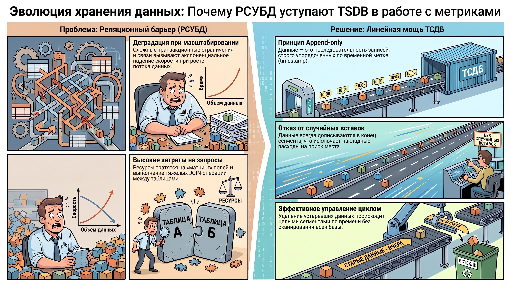
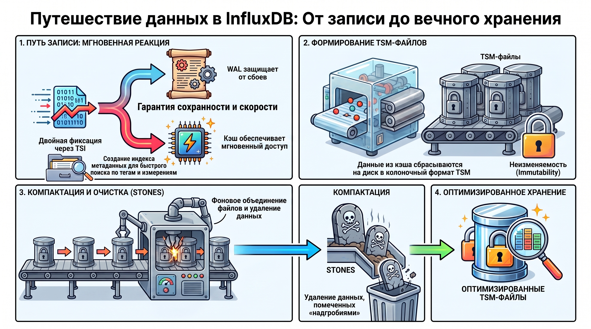
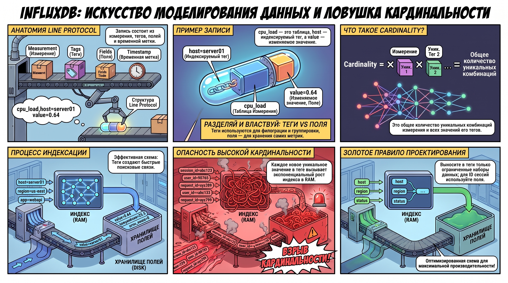

# Хранение временных рядов с использованием InfluxDB: аналитический обзор архитектуры и инструментария

В современной практике проектирования систем мониторинга стратегический переход от реляционных моделей (RDBMS) к специализированным базам данных временных рядов (TSDB) обусловлен необходимостью обработки экстремальных нагрузок при записи метрик. Традиционные реляционные СУБД, ориентированные на поддержание консистентности через сложные связи и транзакционные ограничения, демонстрируют экспоненциальную деградацию производительности при масштабировании в условиях высокой интенсивности поступления данных (throughput). Специализированная архитектура TSDB позволяет минимизировать накладные расходы, обеспечивая эффективную обработку потоковых данных в реальном времени.

### 1. Концептуальные различия между реляционными СУБД и базами данных временных рядов (TSDB)

Реляционные базы данных опираются на многомерные структуры со множеством связанных таблиц и механизмов контроля целостности. Выполнение запросов в таких системах сопряжено с высокими вычислительными затратами на «мэтчинг» полей и выполнение JOIN-операций. В противоположность этому, база данных временных рядов определяется как последовательность строковых записей, строго упорядоченных по временной метке ( **timestamp** ).

Архитектурная простота TSDB базируется на принципе  **последовательной записи (append-only)** . Поскольку временная метка выступает в роли инкрементального счетчика, данные всегда дописываются в конец сегмента. Отсутствие операций вставки в произвольное место таблицы (random inserts) и исключение сложных реляционных констрейнтов позволяют достигать максимальной скорости записи. Простота структуры становится фундаментом производительности, позволяя эффективно управлять жизненным циклом данных: например, путем удаления устаревших сегментов по таймстампу без необходимости сканирования всей базы.

### 2. Внутренняя архитектура хранения и жизненный цикл данных в InfluxDB

Для оптимизации дисковой подсистемы и минимизации латентности (latency) архитектору необходимо понимать внутреннюю логику перемещения данных между подсистемами.

* **Путь записи (Write Path):**  При поступлении данных они немедленно фиксируются в журнале опережающего логирования ( **WAL** ) на диске. Это обеспечивает долговечность данных (durability) при сбоях. Параллельно данные попадают в кэш в оперативной памяти для обеспечения мгновенного доступа к «горячим» метрикам.  
* **Формат TSM (Time Structured Merge Tree):**  При заполнении кэша или по истечении тайм-аута данные сбрасываются на диск в файлы формата TSM. Это специализированный колоночно-ориентированный формат сжатия. Файлы TSM являются  **неизменяемыми (immutable)** : однажды записанный файл не может быть отредактирован «по месту».  
* **Индексация через TSI (Time Series Index):**  Для ускорения фильтрации по метаданным используется индекс временных рядов (TSI). Индексация строится на основе уникальных комбинаций измерений и тегов, что позволяет системе быстро локализовать нужные наборы данных.  
* **Компактация и удаление данных (Stones):**  Для удаления данных используются файлы-«надгробия» ( **Stones** ), содержащие идентификаторы серий, помеченных к очистке. Поскольку TSM-файлы неизменяемы, процесс компактации считывает старые файлы, фильтрует записи на основе Stones и записывает  **новые**  оптимизированные TSM-файлы. Этот процесс также включает агрегацию данных для долгосрочного хранения.

Эффективность кастомных структур TSM/TSI напрямую зависит от корректного проектирования схемы данных, к анализу которой следует перейти.

### 3. Модель данных и управление кардинальностью

Проектирование схемы данных (Schema Design) — критический этап, определяющий стабильность системы. Ошибочный выбор между тегами и полями может привести к исчерпанию ресурсов и падению системы.

Физическая запись в InfluxDB осуществляется через  **Line Protocol (нативный протокол записи)** . Структура строки выглядит следующим образом: `measurement,tag_key=tag_value field_key=field_value timestamp`

Пример записи: `cpu_load,host=server01,region=us-west value=0.64,core_usage=0.12 1434055562000000000`

#### **Компоненты данных:**

* **Measurement (Измерение):**  Описывает тип данных (аналог имени таблицы).  
* **Tags (Теги):**  Индексируемые метаданные. Необходимы для быстрой фильтрации и группировки (например, хост или версия ПО).  
* **Fields (Поля):**  Неиндексируемые значения, которые постоянно изменяются (например, температура или процент загрузки).  
* **Timestamp:**  Временная метка (обычно в наносекундах).

**Кардинальность серий (Series Cardinality):**  Это общее количество уникальных комбинаций измерения и набора тегов. Поскольку индекс TSI является серийно-ориентированным, каждое новое уникальное значение в теге (например, ID сессии пользователя) ведет к экспоненциальному росту индекса. Высокая кардинальность вызывает деградацию производительности индекса и чрезмерное потребление оперативной памяти. В теги следует выносить только ограниченные наборы метаданных, по которым требуется регулярный поиск.

### 4. Сравнительный анализ эволюции версий: InfluxDB 1.x, 2.x и 3.x

Эволюция продукта отражает переход от классического мониторинга к универсальной облачной аналитике.

* **Версия 1.x:**  Написана на Go. Использует SQL-подобный язык  **InfluxQL** . Важно отметить, что начиная с версии  **1.8** , реализована поддержка языка  **Flux** , которую можно активировать через конфигурационный файл. Основные сущности: Database, User/Password.  
* **Версия 2.x:**  Переход на функциональный язык запросов  **Flux** . Введена новая терминология: базы данных заменены на  **Buckets** , аутентификация осуществляется через организации ( **Orgs** ) и токены. Появился встроенный графический интерфейс.  
* **Версия 3.x:**  Радикальная смена парадигмы. Система переписана на  **Rust** . Вместо TSM используется открытый колоночный формат  **Parquet**  и объектные хранилища (S3). Архитектура разделена на специализированные компоненты:  **Router**  (маршрутизация записи),  **Ingester**  (прием данных и ведение WAL),  **Querier**  (выполнение запросов) и  **Compactor** .  
* **Решение проблемы кардинальности в 3.x:**  Проблема TSI-индексов решена за счет внедрения  **реляционного каталога**  метаданных. Это позволяет использовать полноценный SQL (движок Data Fusion) и снимает жесткие ограничения на количество уникальных тегов.

### 5. Конфигурирование системы и экосистема мониторинга (TICK Stack)

Стабильность среды зависит от настройки параметров в конфигурационном файле, разделенном на группы:  `[logging]`, `[admin]`, `[api]`, `[storage]`, `[wal]`, `[input_plugins]` и `[raft]`. Настройка `[input_plugins]` позволяет принимать данные из внешних источников (например, MQTT) напрямую, а группа `[raft]` отвечает за лидерство и консенсус в Enterprise-кластерах.

Классический стек мониторинга включает:

1. **Telegraf:**  Агент сбора данных.  
2. **InfluxDB:**  Ядро хранения.  
3. **Chronograf:**  Визуализация.  
4. **Kapacitor:**  Обработка алертов.

**Критические аспекты совместимости:**  При миграции на версию 2.x возникают проблемы с Kapacitor. В версии 1.x взаимодействие строилось на  **«подписках» (subscriptions)** , позволявших передавать данные стримом (stream processing). В версии 2.x этот функционал отсутствует, что заставляет переходить на батчинг ( **batching** ) и переписывать логику в TickScript. Для классических задач мониторинга и обеспечения максимальной совместимости в TICK-стеке рекомендуется использовать версию 1.x.

### 6. Заключение

Выбор InfluxDB обусловлен её специализацией на последовательных данных, где производительность достигается за счет отказа от реляционной сложности в пользу оптимизированных структур (TSM или Parquet). Эффективная работа с TSDB требует осознанного выбора версии: 1.x для классических легковесных решений и интернета вещей (IoT), либо 3.x для масштабной облачной аналитики, где использование реляционного каталога снимает ограничения традиционной индексации.  
