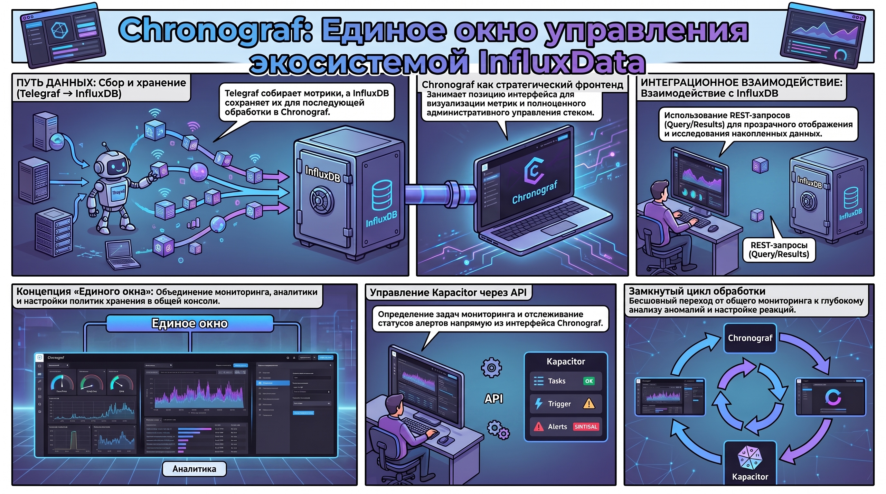
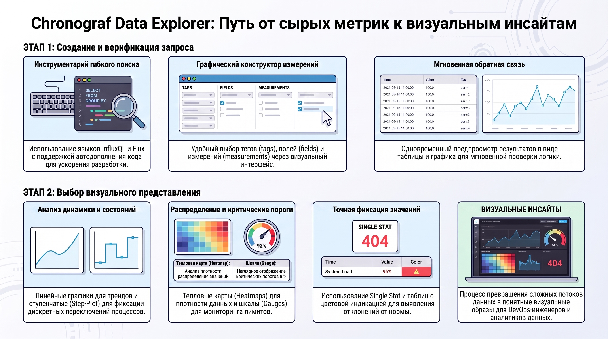
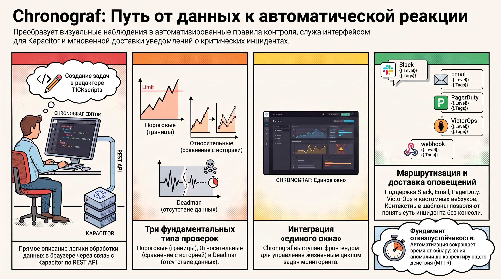
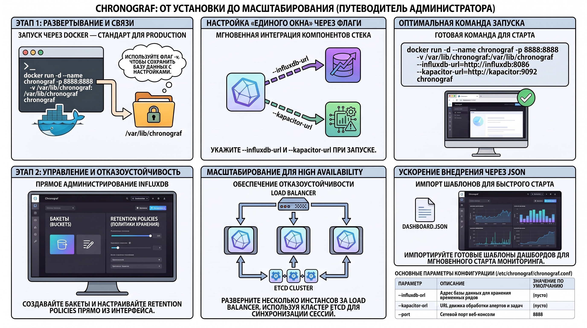

# Chronograf: системный анализ и функциональные возможности в составе TICK-стека

### 1. Архитектурный контекст и роль Chronograf в экосиместеме InfluxData

В современной парадигме управления ИТ-инфраструктурой визуализация и оперативное администрирование перестали быть вспомогательными функциями, превратившись в центральное звено обеспечения отказоустойчивости. В рамках платформы InfluxData именно Chronograf выполняет роль стратегического связующего компонента, преобразуя сырые потоки данных временных рядов в наглядную и управляемую информационную среду. Его значимость заключается в реализации концепции «единого окна» (Single Pane of Glass), объединяющего мониторинг, аналитику и управление всей инфраструктурой стека в единой консоли.



#### **1.1. Структура TICK-стека и позиционирование компонентов**

TICK-стек представляет собой вертикально интегрированное решение, состоящее из четырех ключевых элементов:

* **Telegraf:**  агент сбора метрик и событий из различных источников.  
* **InfluxDB:**  высокопроизводительная база данных, оптимизированная для хранения временных рядов.  
* **Chronograf:**  «родной» административный интерфейс платформы для визуализации и управления.  
* **Kapacitor:**  движок обработки данных в реальном времени и генерации оповещений.

Chronograf занимает в этой иерархии позицию фронтенда, обеспечивая не только графическое представление метрик, но и полноценный административный слой для настройки пользователей, баз данных и политик хранения.

#### **1.2. Интеграционное взаимодействие**

Архитектурный анализ потоков данных показывает, что Chronograf функционирует как управляющая надстройка над остальными компонентами. Он взаимодействует с InfluxDB посредством REST-запросов (Query/Results), обеспечивая прозрачность данных. Взаимодействие с Kapacitor осуществляется через API для определения задач (Define) и мониторинга статусов алертов. Таким образом, Chronograf выступает фронтендом для административного REST API Kapacitor, замыкая цикл обработки данных от момента их поступления в БД до формирования ответной реакции на инцидент.

Системная целостность стека, обеспечиваемая Chronograf, позволяет инженерам бесшовно переходить от общего мониторинга к глубокому исследованию аномалий в инструментах визуализации.

### 2. Анализ данных и механизмы визуализации (Data Explorer)

Интерактивное исследование данных имеет критическую когнитивную значимость для оперативного мониторинга. Грамотно выстроенная визуализация позволяет специалисту мгновенно распознать паттерны поведения системы, которые невозможно идентифицировать при анализе сырых логов или табличных данных.



#### **2.1. Инструментарий Data Explorer**

Центральным механизмом аналитики является Data Explorer, предоставляющий следующие возможности:

* **Гибкое построение запросов:**  поддержка языков InfluxQL (для классических сценариев) и Flux (для продвинутой аналитики).  
* **Ускорение разработки:**  функции автодополнения кода и графический интерфейс выбора измерений (measurements), тегов (tags) и полей (fields).  
* **Мгновенная обратная связь:**  одновременный предпросмотр результатов в табличном виде и их графическая интерпретация для верификации логики запроса.

#### **2.2. Типология графических представлений**

Для обеспечения максимальной читаемости метрик Chronograf предлагает иерархический набор инструментов визуализации:

* **Линейные и стековые графики:**  базовые инструменты для анализа динамики временных рядов и оценки долевого вклада отдельных компонентов (например, загрузки CPU по ядрам).  
* **Гистограммы и столбчатые диаграммы:**  средства сравнения групп данных и распределения значений.  
* **Ступенчатые графики (Step-Plot):**  незаменимы для мониторинга дискретных состояний и фиксации моментов переключения процессов.  
* **Табличные представления и Single Stat:**  точная фиксация текущих значений с возможностью цветовой индикации отклонений.  
* **Специализированные инструменты:**  тепловые карты (Heatmaps) для анализа плотности распределения и шкалы (Gauges) для наглядного отображения критических порогов в процентах.

Разнообразие форматов визуализации позволяет обнаружить критические отклонения и визуально определить пороги срабатывания, которые в дальнейшем кодифицируются в подсистеме алертинга.

### 3. Управление мониторингом и подсистема алертинга

Переход от пассивного наблюдения к проактивному реагированию реализуется через интеграцию Chronograf с движком Kapacitor. Это позволяет трансформировать визуальные наблюдения в автоматизированные правила контроля инфраструктуры.



#### **3.1. Взаимодействие с Kapacitor**

Chronograf предоставляет инженерам полноценный инструментарий для управления жизненным циклом задач мониторинга (tasks). В интерфейс встроен специализированный редактор TICKscripts, позволяющий описывать логику обработки данных непосредственно в браузере. Связь между Chronograf и Kapacitor через REST API гарантирует оперативную доставку определений задач и синхронизацию статусов выполнения.

#### **3.2. Классификация и настройка оповещений**

Система поддерживает три фундаментальных типа проверок:

* **Пороговые (Threshold):**  фиксация выхода значений за установленные статические границы.  
* **Относительные (Relative):**  сравнение текущих метрик с историческими периодами для выявления аномальных отклонений.  
* **Deadman:**  детекция отсутствия поступления данных, что критически важно для контроля доступности самих агентов сбора.

#### **3.3. Каналы уведомлений и маршрутизация**

Chronograf обеспечивает интеграцию с широким спектром Alert Endpoints для обеспечения оперативной доставки оповещений. Поддерживаются: Slack, Email, PagerDuty, VictorOps, OpsGenie и кастомные вебхуки (webhooks). Сообщения формируются на основе шаблонов с использованием переменных (уровень критичности, текущее значение, теги), что позволяет инженерам получать исчерпывающий контекст инцидента без перехода в консоль.

Автоматизированный контроль через систему алертинга является фундаментом отказоустойчивости, однако его эффективность напрямую зависит от качества настройки базовой инфраструктуры.

### 4. Администрирование, конфигурация и развертывание

Корректная настройка инфраструктурного слоя Chronograf критически важна для обеспечения производительности и безопасности интерфейса управления всей платформой данных.



#### **4.1. Варианты установки и системные требования**

Развертывание Chronograf стандартизировано для различных окружений:

* **Пакетные менеджеры:**  использование `dpkg` для Ubuntu/Debian или `yum` для RHEL/CentOS.  
* **Контейнеризация:**  предпочтительный метод для production-сред, обеспечивающий изоляцию и простоту обновлений.

**Оптимальная команда запуска в production (Docker):**

```
docker run -d \  
  --name chronograf \ 
  -p 8888:8888 \  
  -v /var/lib/chronograf:/var/lib/chronograf \  
  -e INFLUXDB\_URL=http://influxdb:8086 \  
  chronograf \  
  --influxdb-url=http://influxdb:8086 \  
  --kapacitor-url=http://kapacitor:9092
```

*Примечание: использование volume (`-v`) обязательно для сохранения базы данных Chronograf (.db), где хранятся настройки подключений и дашборды.*

#### **4.2. Параметры конфигурации**

Основной файл конфигурации находится по пути `/etc/chronograf/chronograf.conf`. Для тонкой настройки используются ключевые аргументы командной строки:

* `--influxdb-url`: адрес (или список адресов) InfluxDB.  
* `--kapacitor-url`: URL движка Kapacitor.  
* `--host` / `--port`: параметры сетевого интерфейса веб-консоли.  
* `--resources-path`: путь к статическим ресурсам и шаблонам.

#### **4.3. Администрирование InfluxDB**

Chronograf позволяет управлять логической структурой данных InfluxDB: создавать и удалять базы данных (в версии 1.x) или бакеты (Buckets в 2.x), настраивать политики хранения (Retention Policies). В Enterprise-версии через интерфейс реализуется ролевая модель доступа (RBAC) и управление учетными записями пользователей.

#### **4.4. Масштабируемость, HA и шаблонизация**

Для крупных инфраструктур Chronograf поддерживает архитектуру высокой доступности (High Availability). В таких сценариях несколько инстансов Chronograf разворачиваются за балансировщиком нагрузки (Load Balancer), а для хранения общего состояния и синхронизации сессий используется  **кластер etcd** , как показано на схемах распределенных систем.

Для ускорения внедрения предусмотрен экспорт/импорт дашбордов в формате JSON и использование готовых шаблонов (Docker, System Stats), что позволяет развернуть стандартный мониторинг за считанные минуты. Гибкость настройки обеспечивает адаптацию инструмента под специфические требования любой инфраструктуры.

### 5. Итог

Chronograf выступает ключевым компонентом для достижения полноценной Observability, являясь единственным элементом TICK-стека, который напрямую взаимодействует со всеми остальными частями платформы: агентами Telegraf (через структуру БД), хранилищем InfluxDB и процессором Kapacitor.

Объединяя в себе инструменты визуального анализа, глубокую диагностику через Data Explorer и оперативную настройку алертов, Chronograf радикально сокращает время от обнаружения аномалии до принятия корректирующего действия (MTTR). Бесшовная интеграция внутри стека превращает его из простого инструмента построения графиков в мощную административную консоль, необходимую для управления надежностью современных систем.  
