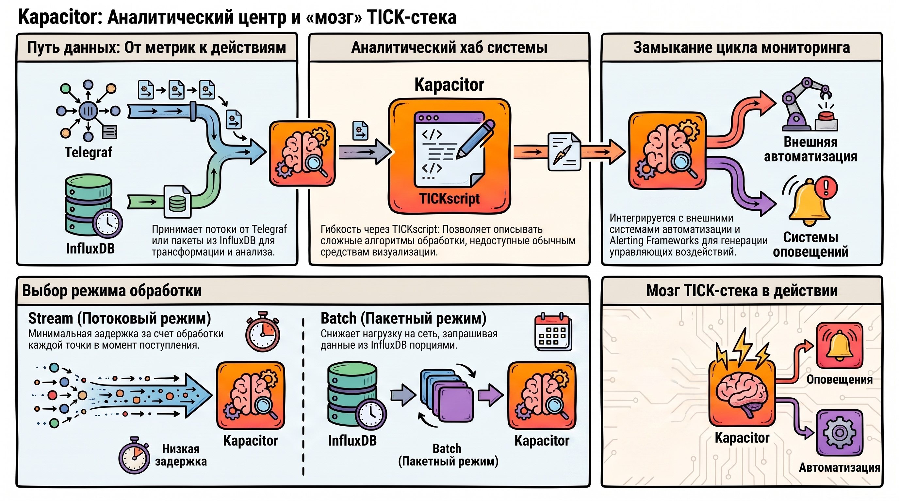
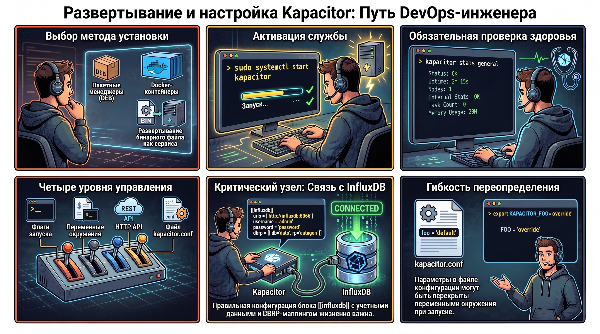
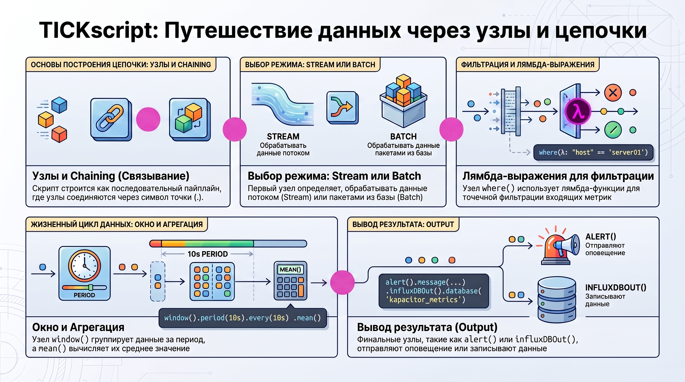
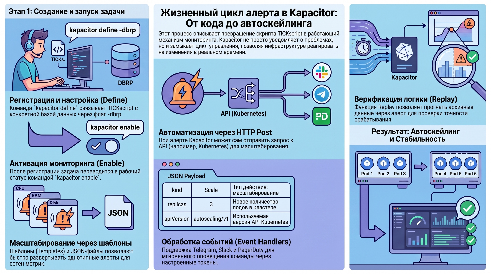

# Алертинг и обработка данных с помощью Kapacitor

### 1. Роль Kapacitor в архитектуре TICK-стека

Kapacitor занимает стратегическое положение в TICK-стеке (Telegraf, InfluxDB, Chronograf, Kapacitor), выступая в роли высокопроизводительного движка для обработки данных в реальном времени. В рамках конвейера мониторинга он функционирует как аналитический хаб, способный принимать потоковые метрики от Telegraf или запрашивать пакетные данные из InfluxDB для последующего анализа, трансформации и генерации управляющих воздействий. Согласно архитектурной схеме, Kapacitor является единственным компонентом, обеспечивающим замыкание цикла мониторинга через интеграцию с внешними Alerting Frameworks и системами автоматизации.



**Определение и функциональные преимущества:**  Kapacitor — это специализированный framework, решающий задачи создания алертов, выполнения ETL-процессов и детектирования аномалий. Гибкость системы обеспечивается языком TICKscript, который позволяет описывать сложные алгоритмы обработки, недоступные стандартным средствам визуализации. Ключевым архитектурным решением является поддержка двух режимов обработки:

* **Stream (потоковый):**  обеспечивает минимальную задержку (Low Latency) за счет обработки каждой точки в момент поступления, что создает нагрузку на вычислительные мощности Kapacitor.  
* **Batch (пакетный):**  снижает постоянную нагрузку на сеть и Kapacitor, запрашивая данные порциями из InfluxDB, однако это создает пиковую нагрузку на базу данных и увеличивает время реакции.

### 2. Развертывание и системное конфирирование



Обеспечение отказоустойчивости системы мониторинга начинается с выбора метода развертывания и прецизионной настройки конфигурационных файлов. Kapacitor поддерживает установку через пакетные менеджеры (например, `dpkg -i kapacitor.deb`) и Docker-контейнеры. После запуска через `systemctl start kapacitor` обязательным этапом является проверка состояния узла командой `kapacitor stats general`.

**Механизмы и области конфигурации:**  Управление параметрами осуществляется через флаги запуска, переменные окружения, HTTP API и файл `/etc/kapacitor/kapacitor.conf`. Критически важным является блок подключения к InfluxDB. На уровне архитектуры необходимо явно задавать параметры взаимодействия:

```
[[influxdb]]  
  enabled = true  
  default = true  
  name = "localhost"  
  urls = ["http://localhost:8086"]  
  username = "your_username"  
  password = "your_password"
```

Помимо базовых секций (Auth, HTTP, TLS, Logging, Task, Storage), конфигурация должна включать специализированные модули:  **Deadman**  (для контроля отсутствия поступления данных),  **Replay**  (для тестирования на исторических выборках) и  **Load**  (для управления загрузкой задач).

### 3. Динамический сбор данных: Discovery и Scraper

В современных облачных средах статическое описание целей сбора метрик неэффективно. Концепция  **Dynamic Data Scraping**  позволяет Kapacitor автоматически масштабировать область охвата мониторинга.

**Механизмы обнаружения (Discovery):**  Kapacitor включает модули для интеграции с Azure, AWS EC2, GCE, Kubernetes, Consul и DNS. Процесс обнаружения (Discover) находит целевые объекты (Targets), которые затем передаются модулю Scrape.

**Настройка Scraper и связь с Discovery:**  Для корректной работы системы необходимо обеспечить жесткую связь между модулями через идентификаторы. В блоке `[[scraper]]` параметр `discoverer-id` должен строго соответствовать значению id в блоке `[discovery.module]`. Пример для Kubernetes:

* **Discovery:**  `[discovery.kubernetes]` с параметрами `label-selector = "app=exporter"` и `port = 9100`.  
* **Scraper:**  `[[scraper]]` с `discoverer-id = "k8s-discovery"`, `type = "prometheus"` и m`etrics-path = "/metrics"`.

Такая связка позволяет автоматически собирать данные с новых подов, соответствующих селектору, и передавать их в конвейер TICKscript.

### 4. Основы языка TICKscript: Архитектура узлов и цепочек



TICKscript — это декларативный язык, построенный на концепции узлов (Nodes) и их связывания в цепочки ( **Chaining** ). Связывание осуществляется через символ точки (`.`), что определяет последовательный пайплайн обработки.

**Типология узлов:**

* `stream` / `batch`: определяют входной режим данных.  
* `from()`: точка входа, определяющая источник (measurement).  
* `window()`: задает временное окно (например, `period(10s)`).  
* `mean()`: агрегирующий узел для вычисления среднего.  
* `alert()` и `influxDBOut()`: узлы вывода и оповещения.

**Архитектурный пример скрипта:**  Полная структура сценария включает фильтрацию и управление метаданными при записи:

```
stream  
    |from()  
        .measurement('_kapacitor')  
        .where(lambda: "host" == 'your_kapacitor_host')  
    |window()  
        .period(10s)  
        .every(10s)  
    |mean('emitted')  
        .as('mean_emitted')  
    |influxDBOut()  
        .create()  
        .database('kapacitor_metrics')  
        .retentionPolicy('autogen')  
        .measurement('kapacitor_performance')  
        .tag('host', 'your_kapacitor_host')
```

Лямбда-выражения в узле where позволяют выполнять точечную фильтрацию потока, минимизируя объем обрабатываемых данных.

### 5. Управление жизненным циклом алертов и автоматизация



Процесс управления задачами в Kapacitor строго формализован. Регистрация задачи выполняется командой `kapacitor define`, где критически важно использовать флаг  **-dbrp**  (Database/Retention Policy) для указания контекста данных, а также флаги `-type` и `-tick`. Активация задачи происходит через kapacitor enable.

**Интеграция и Event Handlers:**  Система поддерживает множество каналов (Slack, PagerDuty, Telegram). Конфигурация Telegram-бота в `kapacitor.conf` требует указания `token`, `chat-id` и `parse-mode = "Markdown"`. Для массового развертывания алертов используются шаблоны (Templates), такие как `generic_mean_alert`, в которые передаются переменные через JSON-файлы.

**Автоматизация (Scale-out):**  Продвинутая эксплуатация Kapacitor подразумевает использование узла `httpPost` для реализации самовосстанавливающейся инфраструктуры. При превышении порога метрики Kapacitor отправляет JSON-запрос к API (например, Kubernetes):

```
{  
    "kind": "Scale",  
    "apiVersion": "autoscaling/v1",  
    "spec": { "replicas": 3 }  
}
```

Для верификации логики перед внедрением используется функция `replay`, позволяющая прогнать записанный трафик метрик (`recording-id`) через созданную задачу.

### 6. Заключение

Kapacitor позволяет не только детектировать отклонения, но и инициировать управляющее воздействие на инфраструктуру через внешние API. Ключевым навыком системного архитектора является проектирование цепочек TICKscript, которые эффективно балансируют между задержкой обработки (stream) и нагрузкой на ресурсы (batch), обеспечивая при этом глубокую интеграцию с механизмами Discovery и внешними обработчиками событий. Использование шаблонов и функций тестирования (replay) завершает формирование профессионального инструментария для построения надежных систем мониторинга.  
