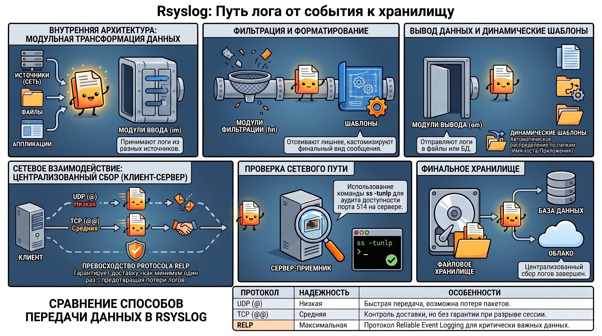

# Классическое логирование в Linux: архитектура, инструменты и методы управления

### 1. Концепция и иерархия системного журналирования

В современной архитектуре распределенных систем логирование выступает в качестве базового элемента стратегии Observability. Оно обеспечивает возможность реконструкции хронологии событий и проведения глубокого анализа состояния системы без внедрения ресурсоемких внешних стеков (таких как ELK или Loki). Локальное журналирование является первичным источником истины при деградации сетевых сервисов или потере связности с централизованными хранилищами.

#### **Структура директории /var/log**

Систематизация журналов в Linux-подобных ОС реализована через иерархию файлов в директории `/var/log`. На основе анализа \[SOURCE_IMAGE_18] классификация основных путей хранения представлена в следующей таблице:

| Файл / Путь | Назначение и тип собираемой информации |
| ------ | ------ |
| `/var/log/syslog` (`/var/log/messages`) | Неструктурированный агрегатор системных событий; глобальный журнал. |
| `/var/log/auth.log` (`/var/log/secure`) | События аутентификации, авторизации и инциденты безопасности. |
| `/var/log/dmesg` | Сообщения кольцевого буфера ядра (состояние оборудования и драйверов). |
| `/var/log/boot.log` | Протокол этапов загрузки операционной системы. |
| `/var/log/audit/audit.log` | Данные подсистемы аудита безопасности (auditd). |
| `/var/log/cron` | Отчеты планировщика задач (выполнение заданий crond). |
| `/var/log/anaconda.log` | Журнал процесса инсталляции операционной системы. |
| `/var/log/apache2` / `/var/log/nginx` | Протоколы доступа и ошибок соответствующих веб\-серверов. |
| `/var/log/mysql` | Журналы СУБД MySQL. |
| `/var/log/yum.log` / `/var/log/dnf.log` | История управления пакетами в Red Hat-подобных дистрибутивах. |
| `/var/log/dpkg.log` | История управления пакетами в Debian/Ubuntu-дистрибутивах. |
| `/var/log/emerge.log` | Журнал сборки ebuild-ов в дистрибутивах Gentoo. |

#### **Приоритеты и уровни журналирования**

Механизмы фильтрации базируются на классификации сообщений по категориям ( **Facilities** ) и уровням важности ( **Severities** ), согласно SOURCE\_IMAGE\_28.

* **Категории (Facilities):**  Kernel (0), User (1), Mail (2), Daemon (3), Auth (4/10), Syslog (5), Cron (9), Audit (13). Дополнительно предусмотрены категории Local 0–7 для прикладного ПО.  
* **Уровни важности (Severities):**  
  * **0. Emergency:**  Система неработоспособна.  
  * **1. Alert:**  Требуется немедленное реагирование.  
  * **2. Critical:**  Состояние критической ошибки.  
  * **3. Error:**  Ошибочное состояние приложения/сервиса.  
  * **4. Warning:**  Предупреждение о потенциальной проблеме.  
  * **5. Notice:**  Нормальное, но значимое событие.  
  * **6. Info:**  Информационное сообщение.  
  * **7. Debug:**  Подробная отладочная информация.

**Аналитический слой:**  Локальное хранение данных в текстовом формате обеспечивает высокую скорость доступа при первичной диагностике. Однако критическим ограничением является прямая зависимость от доступности дискового пространства: переполнение раздела `/var` способно инициировать отказ системных сервисов. Для масштабирования и обеспечения отказоустойчивости требуется переход к потоковой обработке данных средствами rsyslog.

### 2. Архитектура и функциональные возможности rsyslog

`rsyslog` функционирует как высокопроизводительный многопоточный процессор, позволяющий выстраивать распределенные сети сбора данных. Его архитектурная гибкость обеспечивается модульной структурой, трансформирующей сервис в полноценный брокер сообщений.



#### **Модульная структура rsyslog**

Согласно \[SOURCE_IMAGE_27], функциональность распределена по специализированным типам модулей:

* **im (Input Modules):**  Модули ввода для приема данных (`imtcp` для TCP, `imudp` для UDP, `imjournal` для интеграции с journald).  
* **om (Output Modules):**  Модули вывода в файлы, удаленные хосты или реляционные БД (MySQL, PostgreSQL).  
* **fm (Filter Modules):**  Модули фильтрации сообщений по заданным атрибутам.  
* **sm (String Generation/Message Modification):**  Модули для генерации строк и модификации сообщений (нормализация данных).

#### **Конфигурирование и шаблоны**

Основная конфигурация определяется в `/etc/rsyslog.conf` с возможностью подключения дополнительных правил через директиву `include`.

**Шаблоны (Templates)**  позволяют кастомизировать формат вывода:  
\# Пример шаблона для динамического распределения логов по хостам  
$template RemoteLogs,"/var/log/remote/%HOSTNAME%/%PROGRAMNAME%.log"  
\*.\* ?RemoteLogs

##### Алгоритм централизованного сбора логов

Организация сетевой передачи данных включает следующие этапы:

1. **Настройка сервера-приемника:**  
    * Активация модулей ввода (TCP/UDP) на порту 514\.  
    * Определение прав доступа к создаваемым файлам.  
    * Применение конфигурации: `systemctl restart rsyslog`.  
2. **Настройка клиента:**  
    * Создание правила пересылки: `*.* @@192.168.1.100:514` (для TCP) или `*.* @192.168.1.100:514` (для UDP).  
3. **Сетевой аудит:**  Проверка доступности сокета через `ss -tunlp | grep 514`.

**Аналитический слой:**  Ключевым преимуществом rsyslog перед упрощенными агентами (например, Promtail) является поддержка протокола  **RELP (Reliable Event Logging Protocol)** . В отличие от UDP/TCP, RELP гарантирует доставку сообщений уровня "at-least-once", предотвращая потерю данных при разрывах соединения, что критично для DevSecOps-аудита.

### 3. Автоматизация управления дисковым пространством через logrotate

Жизненный цикл лог-файлов требует строгой регламентации для обеспечения стабильности системы. Инструмент `logrotate` автоматизирует обслуживание архивов, предотвращая исчерпание инодов и дискового пространства.


#### **Механизмы ротации и сжатия**

Параметры конфигурации (\[SOURCE_IMAGE_33]) определяют политику хранения:

* **Периодичность:**  `daily`, `weekly`, `monthly`.  
* **Глубина архива:**  `rotate 7` (хранение 7 последних копий).  
* **Сжатие:**  `compress` (использование gzip).  
* **Отказоустойчивость:**  `missingok` (игнорирование отсутствующих файлов).

#### **Использование скриптов пре- и постротации**

Директивы prerotate и postrotate позволяют выполнять сервисные команды:  
```
postrotate  
    /usr/bin/systemctl kill \-s SIGHUP nginx.service \>/dev/null 2\>&1  
endscript
```

Сигнал `SIGHUP` заставляет демон переоткрыть дескрипторы файлов после переименования старого лога.

**Аналитический слой:**  В закрытых технологических контурах и на сертифицированном оборудовании (соответствие требованиям ФСТЭК/ФСБ) расширение дискового пространства зачастую административно невозможно. В таких условиях корректная настройка `logrotate` является нормативным требованием для обеспечения непрерывности эксплуатации.

### 4. Подсистема бинарного журналирования systemd-journald

`systemd-journald` внедряет бинарный формат хранения, что повышает производительность поиска и защищает целостность журналов от тривиального редактирования в текстовом редакторе.

#### **Конфигурация journald.conf**

Основные параметры демона (\[SOURCE_IMAGE_34]):

* **Storage:**  `persistent` (диск, /var/log/journal) или `volatile` (ОЗУ).  
* **SystemMaxUse:**  Жесткое ограничение объема данных на диске.  
* **Compress:**  Сжатие бинарных объектов.

#### **Анализ и фильтрация данных**

Утилита `journalctl` реализует эффективную выборку данных:

* `journalctl -u nginx.service` — фильтрация по юниту.  
* `journalctl --since "2023-10-10 00:00:00" --until "2023-10-10 12:00:00"` — временные интервалы.  
* `journalctl _UID=1000 -p err` — ошибки конкретного пользователя.

#### **Удаленное журналирование через systemd-journal-remote**

Для передачи бинарных данных используется связка:

1. **systemd-journal-upload:**  Отправляет данные по протоколу HTTP/HTTPS (стандартный порт 19532).  
2. **systemd-journal-remote:**  Принимает данные на стороне сервера. В лабораторных условиях допускается использование HTTP на порту 1532 для упрощения отладки.

**Аналитический слой:**  Бинарный поиск в journald радикально быстрее парсинга текста через `grep` при больших объемах данных. Системы rsyslog и journald дополняют друг друга: первая обеспечивает гибкость маршрутизации, вторая — производительность и нативную интеграцию с системными юнитами.

### 5. Мониторинг безопасности и подсистема auditd

Подсистема Audit работает на уровне системных вызовов (syscalls), обеспечивая глубокий мониторинг безопасности, недоступный стандартным демонам логирования.

#### **Правила аудита**

Правила описывают объекты наблюдения. Например, мониторинг файла паролей и использования sudo:
```
# Мониторинг записи в /etc/passwd  
auditctl -w /etc/passwd -p wa -k identity-modify  
# Мониторинг использования sudo  
auditctl -w /usr/bin/sudo -p x -k sudo-usage
```

Для персистентности правила должны быть внесены в `/etc/audit/rules.d/audit.rules`.

#### **Анализ и интерпретация**

Для работы с данными используются `ausearch` (поиск) и `aureport` (сводка).

**Аналитический слой:**  Сырые логи auditd содержат HEX-кодированные строки, численные UID и PID, что затрудняет ручную интерпретацию. Эффективная эксплуатация auditd требует интеграции с SIEM-системами для нормализации данных и их приведения к человекочитаемому виду.

### 6. Специализированные средства анализа: abrtd и kdump

Инструменты посмертного анализа (Post-mortem) позволяют диагностировать причины критических сбоев ПО и ядра.

* **abrtd (Automatic Bug Reporting Tool):**  Автоматизирует сбор дампов памяти (Core Dumps). Аналогом в Debian/Ubuntu системах выступают механизмы сбора дампов, позволяющие анализировать состояние процесса в момент аварийного завершения.  
* **kdump:**  Обеспечивает диагностику Kernel Panic. Механизм базируется на `kexec`, который при крахе основного ядра загружает вторичное ("dump-capture") ядро в зарезервированную область памяти. Это ядро создает снимок памяти (vmcore), доступный для анализа утилитой `crash`.

**Аналитический слой:**  Данные инструменты предоставляют фактологическую базу для устранения уязвимостей типа "отказ в обслуживании" (DoS) и дебага низкоуровневых модулей, где стандартные методы логирования оказываются неинформативными.

### 7. Итог

Освоение классического инструментария логирования Linux позволяет архитектору выстроить надежный эшелон мониторинга без зависимости от стороннего проприетарного или тяжеловесного ПО.

**Основные выводы:**

1. **Автономность и достаточность:**  Связка rsyslog, logrotate и journald закрывает полный цикл жизненного цикла журналов: сбор, фильтрацию, ротацию и централизацию.  
2. **Структурная логика:**  Система строится иерархически — от низкоуровневых вызовов ядра (auditd, kdump) до прикладных журналов, обрабатываемых rsyslog.  
3. **Безопасность:**  Подсистема аутентификации и аудита (`auditd`) является критически важным источником данных для обеспечения ИБ и расследования инцидентов.Логирование в Linux — это не просто запись текстовых данных, а глубоко интегрированная архитектурная подсистема, обеспечивающая прозрачность, управляемость и доказательную базу для всей ИТ-инфраструктуры.
