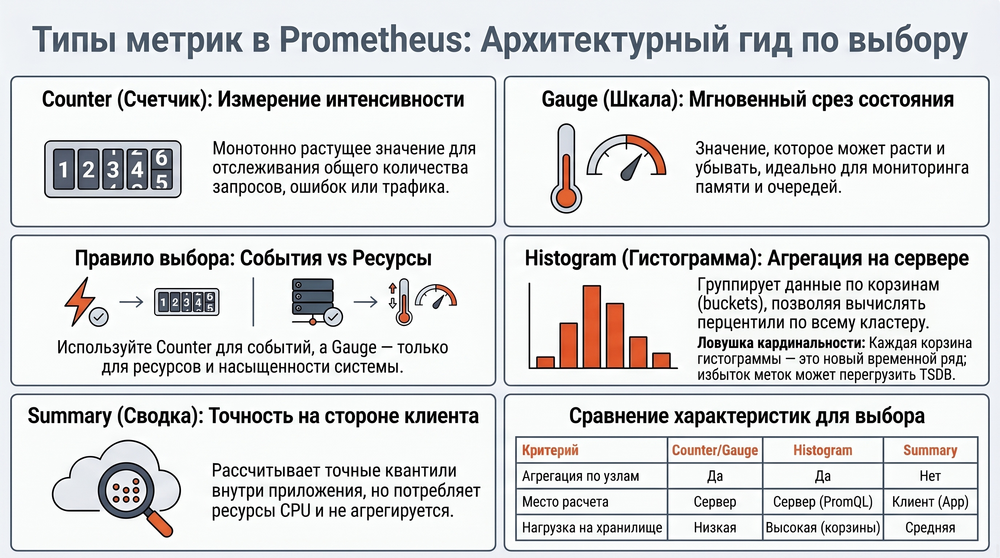
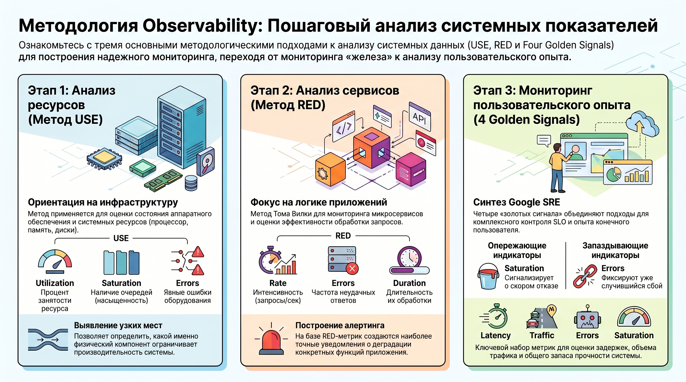
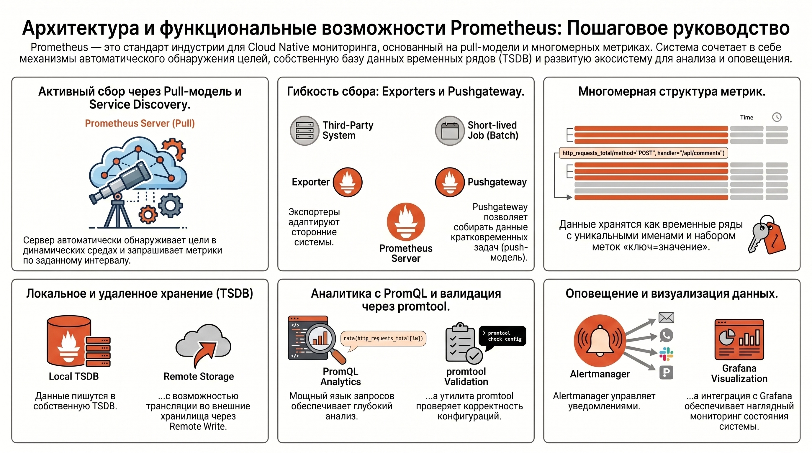

# Prometheus как эволюционный этап систем мониторинга: аналитический обзор

## 1. Теоретические основы и классификация метрик в ИТ-инфраструктуре

В современной парадигме проектирования распределенных систем метрики выступают фундаментальным инструментом обеспечения наблюдаемости (observability), предоставляя первичные данные для объективной оценки состояния программно-аппаратных комплексов. Стратегическая роль метрик заключается в трансформации динамических состояний системы в структурированное знание, необходимое для детерминированного управления производительностью и оперативного реагирования на инциденты.

### Определение и атрибутика метрик

Метрика дефинируется как количественное свойство системы, зафиксированное в динамике времени. Архитектурно она представляет собой многомерный объект, включающий уникальное название, набор меток (лейблов) в формате «ключ=значение» для глубокой детализации данных и непосредственно числовое значение. Эффективная обработка таких структур требует использования специализированных баз данных временных рядов (TSDB) и соблюдения строгой регулярности сбора данных через детерминированные интервалы, что критично для корректной аппроксимации показателей.

### Функциональная типология показателей

Для обеспечения комплексного анализа ИТ-ландшафта показатели систематизируются по четырем иерархическим уровням:

1. **Инфраструктурный уровень:** метрики операционной системы (CPU, RAM, состояние файловых систем, I/O), параметры сети и телеметрия контейнеризированных сред.
2. **Прикладной уровень:** показатели производительности (latency), интенсивность входящего потока (rps), коды ответов, объем баз данных и количество активных соединений.
3. **Бизнес-логика:** мониторинг транзакций, выручки и динамики регистраций. Данный слой критически важен для проверки бизнес-гипотез, анализа идей и установления корреляции между техническим состоянием системы и рыночной популярностью сервиса.
4. **Безопасность:** выявление аномальных локаций запросов, мониторинг ошибок аутентификации и индикация потенциальных векторов атак.

Системная классификация единичных показателей является пререквизитом для перехода к высокоуровневым методологиям анализа состояния сложных систем.

## 2. Методологические подходы к анализу производительности и надежности

Применение стандартизированных аналитических фреймворков позволяет унифицировать оценку надежности систем и минимизировать когнитивную нагрузку на инженерный персонал при принятии архитектурных решений.

### Модель Four Golden Signals (LTES)

Методология, разработанная в рамках Google SRE, выделяет четыре критических сигнала: задержку (Latency), трафик (Traffic), ошибки (Errors) и насыщенность (Saturation). Стратегическая ценность подхода заключается в концентрации на минимально достаточном наборе данных для оценки здоровья распределенной системы («If you can only measure four metrics, focus on these four»). При этом Latency, Traffic и Errors преимущественно описывают внешний пользовательский опыт, тогда как Saturation отражает внутренние пределы системы, указывая на степень заполнения ресурсов и прогнозируемую деградацию производительности.

### Специфика методов USE и RED

Для различных уровней абстракции системы применяются специализированные методы:

* **Метод USE (Utilization, Saturation, Errors):** предложен Бренданом Греггом для глубокого анализа ресурсов (процессоры, диски, шины данных). В рамках данного метода Utilization определяется как время, затраченное на выполнение задач, а Saturation — как количество задач в очереди на выполнение. Метод ориентирован на уровень ядра ОС и аппаратного обеспечения.
* **Метод RED (Rate, Errors, Duration):** адаптирован Томом Вилки для микросервисных архитектур и request-driven сервисов. Он фокусируется на интенсивности запросов (Rate), частоте отказов (Errors) и длительности (Duration), которая фиксирует время обработки каждого запроса, что критично для построения распределения (гистограмм). RED-метод позволяет оценивать взаимодействие сервисов вне зависимости от характеристик оборудования.

Практическая имплементация данных методологий требует развитого инструментария, наиболее эффективным представителем которого в Cloud Native экосистеме является Prometheus.

## 3. Архитектурные принципы и функциональные возможности системы Prometheus

Prometheus утвердился в качестве индустриального стандарта благодаря ориентации на глубокий «whitebox» мониторинг, позволяющий исследовать внутреннее состояние приложений, дополняя классические «blackbox» методы внешнего тестирования.

### Генезис и технологический стек системы

Система зародилась в 2012 году в SoundCloud, унаследовав ключевые концепции проекта Google Borgmon. Разработанный на языке Golang и поддерживаемый CNCF, Prometheus является полностью открытым решением (Apache 2 License). Его архитектурная ценность заключается в специализации на обработке многомерных временных рядов и обеспечении высокой доступности данных для инженерного анализа.

### Модели взаимодействия и экосистема компонентов

Архитектура Prometheus базируется на преимущественно pull-модели сбора данных, что обуславливает необходимость в развитых механизмах Service Discovery для автоматического обнаружения динамических целей в облачных средах. Для специфических сценариев, таких как кратковременные задачи, предусмотрена поддержка push-модели через Pushgateway. Ключевыми элементами экосистемы являются:

* **Экспортеры (Exporters):** специализированные агенты для трансляции метрик систем, не поддерживающих формат Prometheus нативно.
* **Alertmanager:** интеллектуальный компонент для агрегации, дедупликации и маршрутизации уведомлений.
* **promtool:** критически важная утилита для валидации синтаксиса конфигурационных файлов и корректности правил оповещений перед их применением.
* **Remote Storage:** возможность интеграции с внешними долгосрочными хранилищами через удаленные эндпоинты.

Гибкость конфигурации и мощность языка запросов PromQL превращают Prometheus в адаптивный инструмент для управления наблюдаемостью в масштабируемых инфраструктурах.

## 4. Итоги

Понимание многомерной структуры метрик в сочетании со стратегическим применением методологий LTES, USE и RED позволяет специалисту не только оперативно диагностировать деградацию ресурсов и сервисов, но и принимать обоснованные архитектурные решения. Овладение экосистемой Prometheus — от принципов pull-сбора и Service Discovery до использования инструментов валидации вроде promtool — обеспечивает создание прозрачной и надежной среды мониторинга, способной эффективно поддерживать процессы эксплуатации и проверку бизнес-гипотез в динамично развивающемся ИТ-ландшафте.
