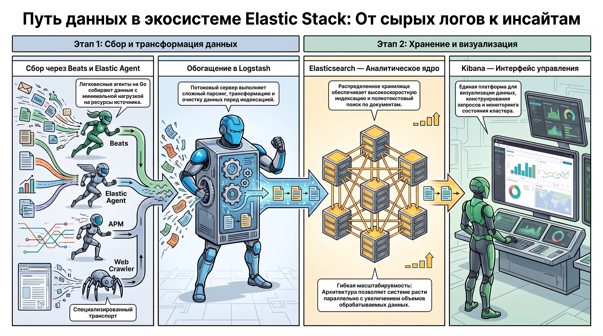
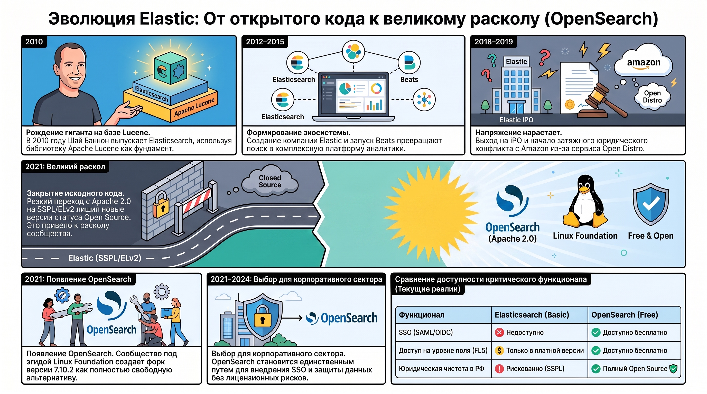
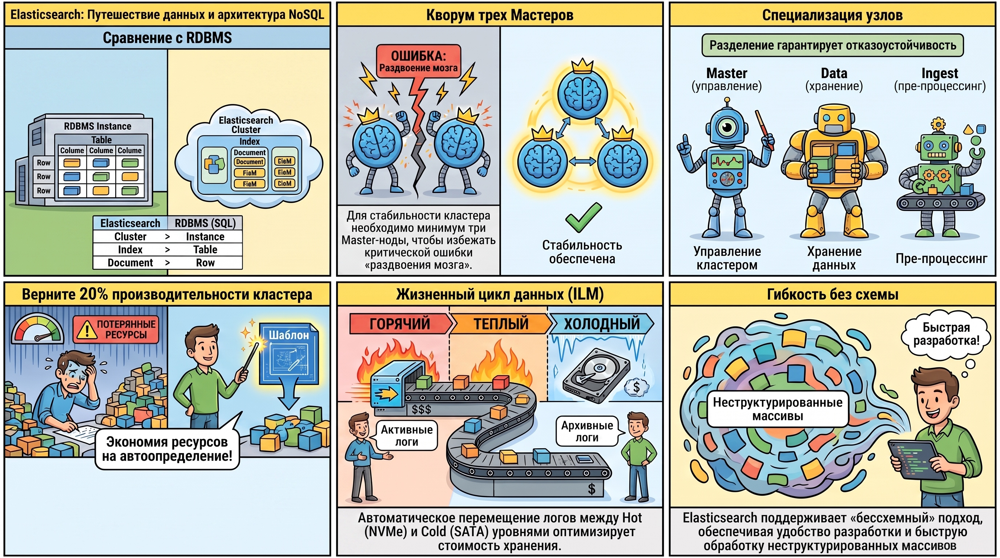
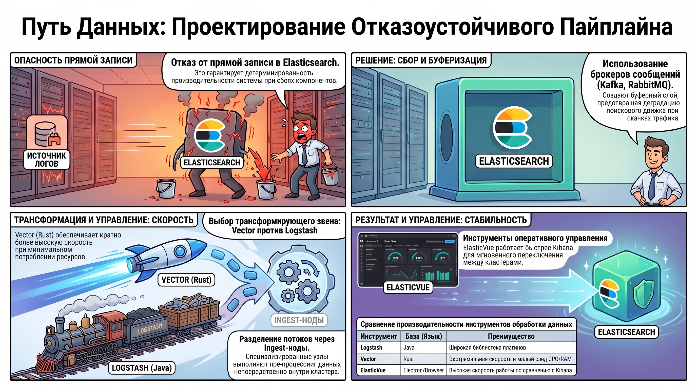

# Построение системы централизованного логирования на базе стека Elastic

### 1. Архитектура и функциональные компоненты экосистемы Elastic Stack

Экосистема Elastic Stack выступает фундаментом современного уровня наблюдаемости (observability), определяя показатели MTTR (Mean Time To Resolution) и общую устойчивость распределенных ИТ-систем. Стратегическая роль стека заключается в создании унифицированного слоя обработки данных, где разнородные потоки — логи, метрики и трейсы — агрегируются в едином масштабируемом пространстве для обеспечения детерминированного анализа состояния инфраструктуры.

#### **Основные компоненты и их специализация**

* **Elasticsearch:**  Распределенное документ-ориентированное хранилище. Обеспечивает высокоскоростную индексацию и полнотекстовый поиск, выполняя роль аналитического ядра системы.  
* **Kibana:**  Специализированная платформа визуализации и администрирования. Служит интерфейсом для конструирования сложных запросов, управления компонентами кластера и мониторинга данных.  
* **Beats:**  Семейство легковесных агентов-шипперов (написанных на Go), предназначенных для целевого сбора данных с минимальной утилизацией ресурсов источника (Filebeat, Metricbeat, Auditbeat).  
* **Logstash:**  Потоковый сервер обработки данных, реализующий сложные пайплайны парсинга, трансформации и обогащения информации перед ее финальной индексацией.

#### **Расширенные инструменты транспорта и сбора**

Для минимизации операционных затрат внедрен  **Elastic Agent**  — единое решение для управления флотом агентов, замещающее разрозненные инстансы Beats. Контроль производительности приложений реализуется через  **APM (Application Performance Monitoring)** , интегрирующий трейсы непосредственно в хранилище. Дополнительный охват данных обеспечивается специализированными коннекторами (Hadoop, Tableau) и инструментом  **Web Crawler** , позволяющим автоматизировать сбор контента для построения систем полнотекстового поиска или обучения AI-моделей (RAG-архитектуры).

**Вывод (So What?):**  Модульность компонентов позволяет проектировать адаптивные системы, где баланс между легковесностью сбора (Beats) и глубиной предобработки (Logstash) определяется конкретными требованиями к инфраструктуре. Такая архитектурная гибкость обеспечивает масштабируемость системы параллельно с ростом обрабатываемых объемов данных.

### 2. Генезис, лицензирование и рыночная диверсификация (OpenSearch)

Анализ исторического контекста и лицензионной политики является критическим этапом оценки долгосрочных эксплуатационных рисков. Изменения в правовом статусе ПО напрямую коррелируют с доступностью критического функционала в корпоративном секторе.

#### **Хронология развития и технологический фундамент**

Технологическим базисом Elasticsearch является библиотека  **Apache Lucene**  (передана в фонд Apache в 2001 г.). Ключевые вехи развития стека:

* **2010 г.:**  Релиз первой версии Elasticsearch Шаем Бэнноном.  
* **2012–2015 гг.:**  Формирование компании Elasticsearch BV (ныне Elastic) и выпуск семейства Beats.  
* **2018–2019 гг.:**  Выход на IPO и начало юридического конфликта с Amazon (анонс Open Distro).  
* **2021 г.:**  Резкая смена лицензии с Apache 2.0 на проприетарные SSPL и ELv2, что фактически закрыло статус open-source для новых версий.  
* **2024 г.:**  Объявление о добавлении лицензии AGPLv3 как попытка возврата к принципам свободного ПО.

#### **Лицензионный дрифт и возникновение форков**

Конфликт с Amazon привел к технологической диверсификации. В ответ на лицензионные ограничения Elastic, сообщество под эгидой Linux Foundation инициировало проект  **OpenSearch**  (форк версии 7.10.2). В отличие от Elasticsearch, OpenSearch развивается как полностью открытый проект без проприетарных надстроек.

**Вывод (So What?):**  Лицензионный дрифт 2021 года создал ситуацию, при которой юридический статус ПО определяет его техническую применимость. В условиях геополитических ограничений на российском рынке, легальное использование Platinum-функций Elasticsearch (SSO, DLS/FLS) становится невозможным, что делает OpenSearch единственным жизнеспособным путем для реализации защищенных корпоративных контуров без нарушения лицензионной чистоты.

### 3. Анализ моделей подписки и ограничений Basic-версии

Тип лицензии в экосистеме Elastic выступает инструментом функционального гейткипинга, ограничивающим возможности масштабирования и обеспечения безопасности в бесплатной версии.

#### **Сравнительный анализ Basic и Platinum/Enterprise**

|Критерий|Basic (Бесплатная)|Platinum / Enterprise (Платная)|
|---|---|---|
|Аутентификация|Локальная (база данных)|LDAP, Active Directory, PKI|
|Технологии SSO|Недоступны|SAML, OpenID Connect, Kerberos, JWT|
|Репликация|Только внутри кластера|Кросс-кластерная репликация (CCR)|
|Гранулярность доступа|На уровне индекса|На уровне документа (DLS) и поля (FLS)|
|Алертинг|Базовый функционал|Коннекторы (Webhook, Jira, ServiceNow)|

#### **Эксплуатационные ограничения бесплатной версии**

Использование Basic-версии в крупных организациях сопряжено с критическими недостатками:

1. **Административная избыточность:**  Отсутствие LDAP-интеграции вынуждает управлять учетными записями вручную, что неприемлемо при штате в сотни пользователей.  
2. **Дефицит безопасности:**  Невозможность скрытия чувствительных данных (например, PII или финансовых полей) внутри одного индекса ограничивает применение принципа наименьших привилегий.  
3. **Аналитический предел:**  Отсутствие узлов машинного обучения (ML) и нативного экспорта отчетов (PDF/PNG).

**Вывод (So What?):**  Приобретение платной подписки целесообразно лишь при необходимости интеграции в жесткие корпоративные стандарты безопасности. Однако в текущих реалиях ограничений эффективным решением является миграция на OpenSearch, который предоставляет функции SSO и DLS/FLS бесплатно, обеспечивая соответствие требованиям безопасности без дополнительных затрат.

### 4. Технологическая концепция Elasticsearch как базы данных

Elasticsearch классифицируется как NoSQL документ-ориентированная СУБД, архитектурно спроектированная для обработки неструктурированных массивов данных.

#### **Сопоставление с реляционной моделью (RDBMS)**

Для системного понимания структуры используется иерархия: Cluster (Instance), Index (Table), Document (Row), Field (Column). В отличие от RDBMS, Elasticsearch поддерживает «бессхемный» подход. Однако  **динамическая индексация** , обеспечивающая удобство разработки, создает значительную нагрузку: до  **20% производительности кластера**  может расходоваться на автоматическое распознавание типов данных библиотекой Lucene. Для высоконагруженных систем обязательным является использование статической индексации через шаблоны (templates).

#### **Ролевая модель узлов (Nodes) и отказоустойчивость**

Отказоустойчивость реализуется через шардирование и репликацию (аналогично RAID-массивам). Классификация нод:

* **Master Nodes:**  Управление состоянием кластера. В production-среде необходимо наличие  **минимум трех мастер-нод**  для обеспечения кворума и предотвращения сценариев «раздвоения мозга» (split-brain).  
* **Data Nodes:**  Хранение данных и выполнение операций поиска.  
* **Ingest Nodes:**  Пре-процессинг данных непосредственно в кластере.  
* **ML Nodes / Remote Client:**  Специализированные задачи аналитики и CCR.

**Вывод (So What?):**  Типизация нод в сочетании с механизмом  **ILM (Index Lifecycle Management)**  позволяет оптимизировать TCO (Total Cost of Ownership). Перемещение данных по уровням Hot/Warm/Cold/Frozen на носители с разной стоимостью (NVMe vs SATA) обеспечивает экономическую эффективность хранения исторических логов.

### 5. Проектирование пайплайнов доставки и обработки данных

Архитектурная надежность системы логирования зависит от исключения прямой записи в Elasticsearch, что предотвращает деградацию поискового движка при аномальных всплесках трафика.

#### **Архитектурные паттерны интеграции**

Оптимальная схема включает использование брокеров сообщений ( **Kafka** , RabbitMQ) как буферного слоя. Это декуплирует источники данных от хранилища. В качестве трансформирующих звеньев рассматриваются:

1. **Logstash:**  Многофункциональный инструмент на Java, обладающий широкой библиотекой плагинов, но высокой ресурсоемкостью.  
2. **Vector:**  Современная альтернатива на Rust, обеспечивающая кратно более высокую скорость обработки при минимальной утилизации CPU и памяти.

#### **Инструментарий администратора и интеграция**

Помимо Kibana, для оперативного управления используются:

* **REST API:**  Основной программный интерфейс.  
* **ElasticVue:**  Легковесное браузерное расширение или десктопное приложение (Electron), работающее значительно быстрее Kibana и позволяющее мгновенно переключаться между кластерами.  
* **Внешняя визуализация:**  Подключение через Grafana (исторически являющуюся форком Kibana 3\) или Apache Superset.

**Вывод (So What?):**  Построение отказоустойчивого контура требует внедрения промежуточной очереди (Kafka) и разделения потоков на чтение и запись через выделенные Ingest-ноды. Это гарантирует детерминированность производительности системы даже при критических сбоях инфраструктурных компонентов.

### 6. Рыночный контекст и векторы импортозамещения

Согласно рейтингу  **DB-Engines** , Elasticsearch удерживает лидерство среди поисковых движков, однако популярность OpenSearch демонстрирует стабильный восходящий тренд.

#### **Глобальный и локальный рейтинги**

В российском сегменте (по данным  *State of DevOps Russia* ) наблюдается фрагментация рынка. Elasticsearch/OpenSearch остаются доминирующими, но их доля размывается альтернативами:

* **Grafana Loki:**  Используется примерно в 50% случаев благодаря нативной интеграции с Grafana и удобству работы в Kubernetes.  
* **ClickHouse:**  Применяется для хранения логов из\-за экстремального коэффициента сжатия и внедрения функций полнотекстового поиска.  
* **VictoriaLogs:**  Новое высокопроизводительное решение от разработчиков VictoriaMetrics.

#### **Альтернативные решения**

Для оптимизации производительности возможен переход на движки, написанные на C++ ( **Manticore/Sphinx** ) или Rust ( **Quickwit** ), которые исключают накладные расходы Java-машины и обеспечивают более высокую плотность упаковки данных.

**Вывод (So What?):**  В условиях технологической изоляции неизбежен дрейф в сторону OpenSearch и специализированных систем (Loki, ClickHouse). Это требует от системного архитектора пересмотра традиционного Java-стека в пользу решений, обеспечивающих большую производительность на единицу аппаратных мощностей.

### Итоги

1. **Модульность как стратегия:**  Эффективность системы логирования определяется корректным выбором компонентов сбора и трансформации (Beats/Vector/Logstash), где каждый элемент оптимизирован под свою задачу в пайплайне.  
2. **Лицензионный комплаенс:**  Выбор между Elasticsearch и OpenSearch в современных реалиях диктуется не только техническими, но и юридическими факторами, где OpenSearch выступает единственным источником корпоративных функций безопасности в свободном доступе.  
3. **Архитектурная отказоустойчивость:**  Надежность промышленного кластера базируется на кворуме мастер-нод (минимум 3 узла) и использовании брокеров (Kafka) для декуплизации записи.  
4. **Оптимизация производительности:**  Переход от динамической к статической индексации позволяет вернуть до 20% ресурсов кластера, а использование ILM — радикально снизить стоимость хранения данных без потери их доступности.
