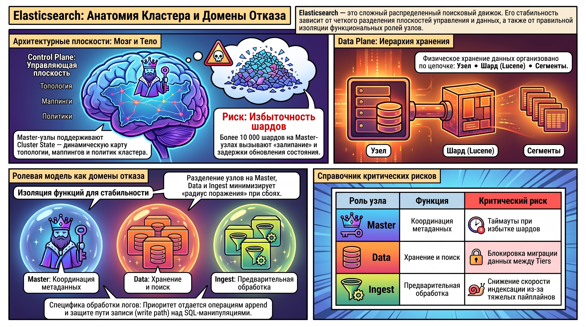
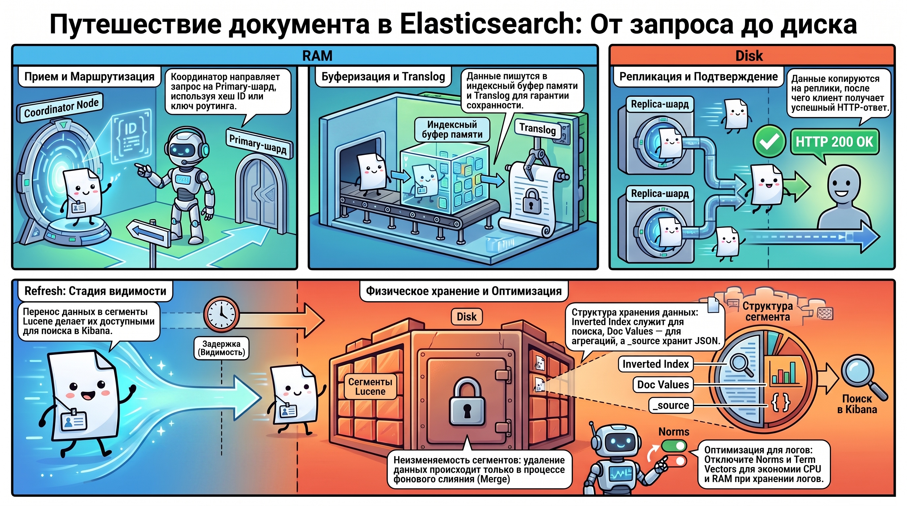
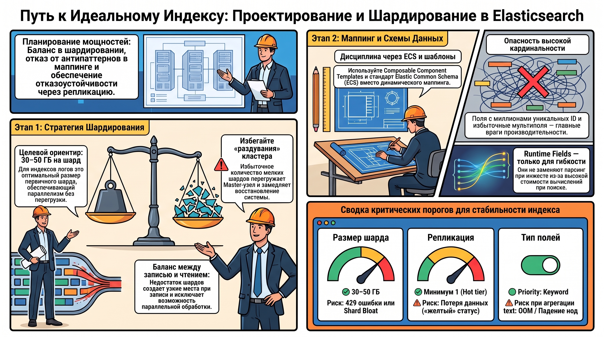
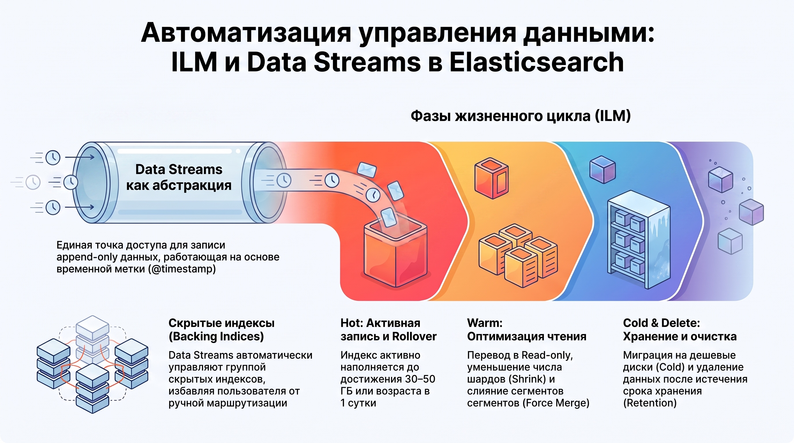
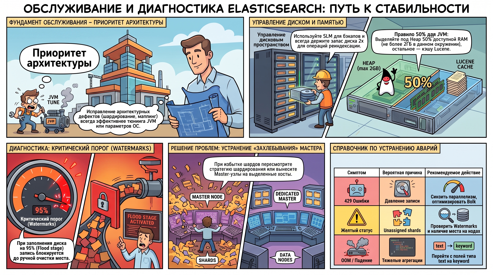

# Архитектура, управление и оптимизация Elasticsearch

Данный документ представляет собой системный анализ архитектурных принципов и стратегий эксплуатации Elasticsearch. Критически важно рассматривать Elasticsearch не как упрощенное хранилище JSON-объектов или «реляционную базу данных с полнотекстовым поиском», а как распределенный поисковый движок высокой сложности. Стабильность системы в условиях высокой нагрузки детерминируется глубоким пониманием разделения плоскостей управления (Control Plane) и данных (Data Plane), так как архитектурные дефекты невозможно нивелировать микро-настройками среды исполнения.

### 1. Архитектурная модель и функциональные компоненты кластера

#### **Управляющая плоскость (Control Plane)**

Центральным элементом управления является  **Cluster State**  — динамическая «карта» кластера, содержащая сведения о топологии узлов, маппингах индексов и политиках Index Lifecycle Management (ILM). Функции  **Master-узла**  (Cluster Manager) заключаются в поддержании консистентности этого состояния и принятии решений об аллокации шардов.

* **Системный риск:**  Избыточное количество шардов (свыше 10 000\) на недостаточно производительных Master-узлах ведет к росту задержек при обновлении Cluster State, что провоцирует «залипание» процессов перераспределения данных.

#### **Плоскость данных (Data Plane)**

Иерархия физического хранения выстроена по схеме:  **Узел → Шард (Primary/Replica) → Lucene → Сегменты** .

* **Primary-шарды**  обеспечивают первичную обработку операций записи.  
* **Реплики**  гарантируют отказоустойчивость и позволяют масштабировать производительность чтения. Данные распределяются по  **уровням хранения (Tiers)** : Hot (интенсивная запись), Warm (редкое обновление), Cold и Frozen (архивация на дешевых носителях).

#### **Специфика обработки логов**

В отличие от классических РСУБД, работа с логами характеризуется доминированием операций  **append** , временной природой данных (time-series) и критичностью пути записи (write path). Следовательно, архитектурное проектирование жизненного цикла данных здесь превалирует над привычными методами манипуляции данными через SQL.

#### **Ролевая модель узлов: Домен отказа**

Эффективное распределение ролей определяет устойчивость системы, где каждая роль представляет собой специфический  **домен отказа** :

* **Master:**  Координация метаданных. Риск: таймауты при избытке шардов.  
* **Data:**  Хранение и поиск. Риск: ошибки в настройке Tiers блокируют миграцию данных.  
* **Ingest:**  Предварительная обработка (Grok-парсинг). Риск: тяжелые пайплайны снижают общую скорость индексации.  
* **Coordinating:**  Распределение запросов. Риск: тяжелые агрегации создают критическое давление на Heap.  
* **Remote Cluster Client:**  Межкластерный поиск. Риск: чувствительность к сетевой латентности.

Корректная изоляция функций (например, вынос Master-узлов на выделенные хосты при «захлебывании» кластера) является фундаментом горизонтального масштабирования.

### 2. Жизненный цикл документа и механизмы физического хранения

Процесс попадания данных на диск характеризуется значительным разрывом между подтверждением приема запроса и фактической доступностью данных для поиска.

#### **Процесс записи документа (Write Path)**

Реконструкция пути записи включает 6 этапов:

1. **Прием запроса:**  Координатор принимает Bulk-запрос.  
2. **Маршрутизация:**  Определение Primary-шарда по хэшу ID или роутинг-ключу.  
3. **Буферизация:**  Запись в индексный буфер (память) и одновременно в  **Translog**  (обеспечение durability).  
4. **Репликация:**  Рассылка данных репликам и получение подтверждения. Возврат HTTP 200 клиенту на этом этапе  **не означает** , что документ зафиксирован в финальной layout-форме на диске.  
5. **Refresh:**  Перенос данных в searchable view (новые сегменты Lucene).  
    * *Corner Case:*  Установка refresh\_interval: \-1 для ускорения bulk-загрузки при игнорировании возврата значения в 1s приведет к тому, что Kibana останется пустой, несмотря на успешную запись.  
6. **Flush/Merge:**  Фоновая фиксация в Lucene и очистка транслога.

#### **Внутренняя структура Lucene и оптимизация**

* **Inverted Index:**  Карта термов для полнотекстового поиска.  
* **Doc Values:**  Колоночное хранение для агрегаций и сортировок.  
* **Stored Fields (_source):**  Исходный JSON.  
* **Аналитическая рекомендация:**  Для повышения производительности при работе с логами следует отключать  **Norms**  и  **Term Vectors** , так как они потребляют значительные ресурсы CPU/RAM и редко востребованы в задачах мониторинга. Тип `text` должен использоваться минимально, с приоритетом в пользу `keyword`.

#### **Неизменяемость сегментов и механизм Merge**

Сегменты Lucene  **иммутабельны** . Операции обновления или удаления реализуются через механизм  **Copy-on-Write**  (пометка старых данных удаленными и запись новых). Фактическое освобождение дискового пространства происходит исключительно в процессе слияния сегментов ( **Merge** ).

### 3. Проектирование индексов, маппинга и стратегий шардирования

Планирование мощностей (capacity planning) детерминирует производительность системы на протяжении всего срока эксплуатации.

#### **Шардирование и масштабирование**

Необходимо избегать экстремумов:

* **Избыточное шардирование:**  Раздувает Cluster State и замедляет восстановление.  
* **Недостаточное шардирование:**  Создает узкие места по записи и исключает параллелизм.  
* **Целевой ориентир:**  Для индексов логов оптимальный размер первичного шарда составляет  **30–50 ГБ** .

#### **Маппинг и схемы полей**

* **Антипаттерны:**  Динамический маппинг, высокая кардинальность полей (миллионы уникальных ID), избыточные мультиполя.  
* **Senior Architect's Warning:**  Использование  **Runtime Fields**  допустимо для гибкости чтения, однако они  **не являются заменой**  парсингу на этапе инжеста из-за высокой стоимости вычислений при поиске.  
* **Лучшие практики:**  Использование Composable Component Templates и соблюдение Elastic Common Schema (ECS).

#### **Репликация**

«Желтый» статус кластера часто вызван  **unassigned**  репликами из\-за нарушения порогов диска (watermarks). В продакшене для Hot-уровня использование минимум одной реплики является обязательным.

### 4. Автоматизация управления данными: ILM и Data Streams

Переход от ручного управления к автоматизированным политикам жизненного цикла является необходимым условием эксплуатации.

#### **Инструментарий Data Streams**

Data Streams обеспечивают абстракцию над скрытыми индексами (backing indices), работая с append-only данными на основе временной метки (`@timestamp`).

#### **Фазы Index Lifecycle Management (ILM)**

1. **Hot:**  Активная запись. Критерий  **Rollover**  — достижение размера  **30–50 ГБ**  или возраста в 1 сутки.  
2. **Warm:**  Read-only режим. Операции:  **Shrink**  (уменьшение числа шардов),  **Force Merge**  (оптимизация сегментов) и миграция на дешевые диски.  
3. **Cold/Frozen:**  Долгосрочное хранение, возможно использование Searchable Snapshots.  
4. **Delete:**  Удаление по достижении retention-периода.

### 5. Модели обеспечения безопасности кластера

Безопасность реализуется через эшелонированную защиту и принцип наименьших привилегий (Least Privilege).

#### **Уровни защиты**

* **TLS/Realms:**  Шифрование трафика и аутентификация (LDAP/AD).  
* **SSO/SAML:**  Является Enterprise-функцией в Elastic, в то время как в OpenSearch доступно в базовой версии.  
* **RBAC:**  Ролевой доступ. Агенты сбора данных (шипперы) должны иметь права только на create\_doc без права удаления.

#### **Гранулярная безопасность (DLS/FLS)**

Механизмы Document и Field Level Security позволяют ограничивать доступ к строкам и колонкам. Однако Senior SRE должен учитывать, что это создает  **ложное чувство безопасности**  и существенно усложняет дебаг запросов. Оптимальной стратегией является исключение чувствительных данных (PII) на уровне приложения до момента записи в логи.

### 6. Методология обслуживания, диагностики и тюнинга

Архитектурные исправления всегда имеют приоритет над тюнингом параметров JVM и ядра ОС.

#### **Резервное копирование и Watermarks**

* **SLM:**  Snapshot Lifecycle Management обеспечивает инкрементальные бэкапы. Операция `reindex` требует запаса диска в размере  **2x** .  
* **Watermarks:**  при достижении  **Flood stage**  (95% по умолчанию) индексы блокируются на запись. Блок снимается только  *после*  физической очистки места и срабатывания ротации ILM.

#### **Иерархия тюнинга и JVM**

При оптимизации HIPAA (Heap) следует придерживаться правила:  **50% RAM, но не более 2 ГБ**  (согласно специфике данного окружения), оставляя остальной объем для кэша Lucene.

#### **Диагностика типовых симптомов**

|Симптом|Вероятная причина|Рекомендуемое действие|
|---|---|---|
|Ошибки 429|Давление записи (Write pressure)|Снизить параллелизм воркеров, оптимизировать Bulk-размер.|
|Желтый статус|Unassigned shards|Проверить Watermarks; устранить дефицит места на Data-нодах.|
|OOM / Падение нод|Тяжелые агрегации на text полях|Перейти на keyword, проверить fielddata.|
|Захлебывающийся Master|Избыток шардов (Shard excess)|Пересмотреть стратегию шардирования; вынести Master на выделенные хосты.|

### 7. Итоговый синтез

Главным результатом освоения материала является переход от реактивного тюнинга к проактивному архитектурному проектированию.

1. **Приоритет архитектуры:**  Корректное шардирование (30–50 ГБ) и дисциплина маппинга (ECS) эффективнее любых настроек JVM.  
2. **Автоматизированный цикл:**  Внедрение ILM и Data Streams — единственный метод обеспечения экономической эффективности хранения и предсказуемости ресурсов.  
3. **Изоляция ролей:**  Разделение функций узлов (Master/Data/Ingest) минимизирует радиус поражения при сбоях и является ключом к масштабируемости.Соблюдение данных принципов формирует устойчивую, прозрачную и защищенную экосистему централизованного логирования.
