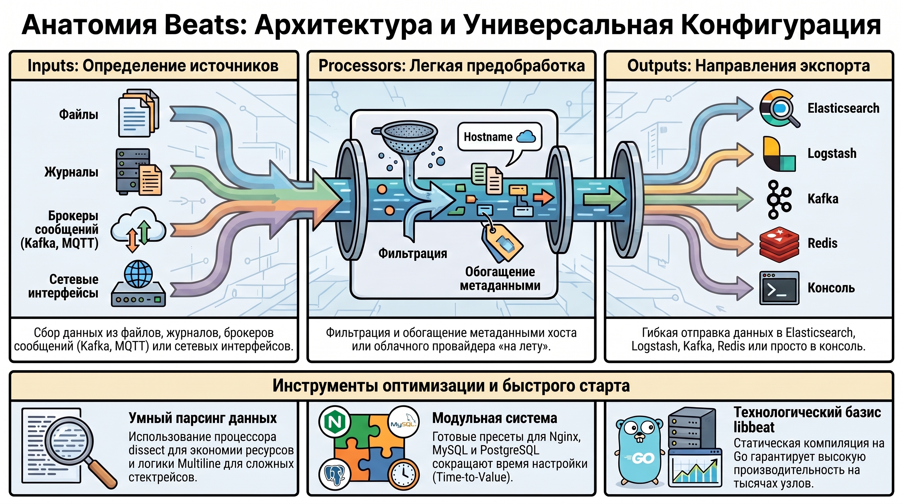
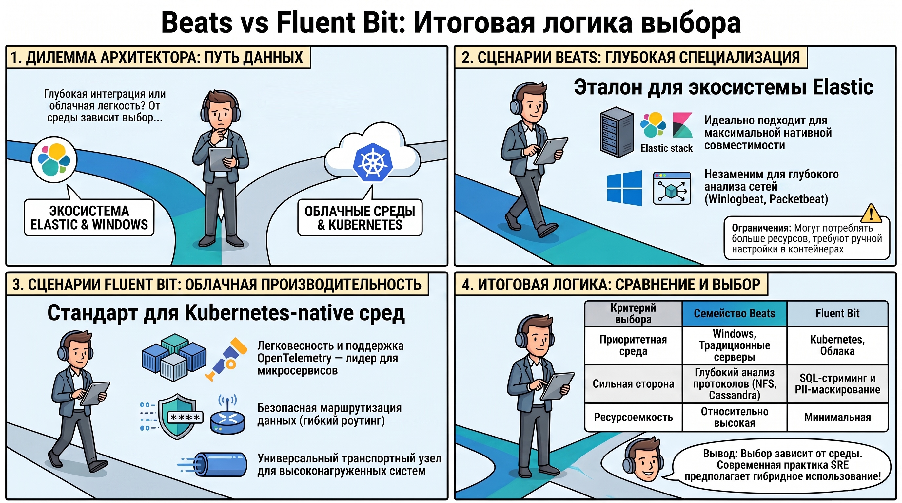

# Обзор инструментов доставки данных: Семейство семейства Beats и альтернатива Fluent Bit

В современной архитектуре наблюдаемости (Observability) критически важен этап эффективного сбора и транспортировки данных из разрозненных источников в централизованное хранилище. Семейство Beats представляет собой экосистему легковесных агентов (shippers), функционирующих как первичное звено сбора данных на стороне источника (Edge). Благодаря своей минималистичности они минимизируют нагрузку на вычислительные ресурсы инфраструктуры, обеспечивая при этом надежную передачу телеметрии в стек Elastic.

### 1. Концепция и роль Beats в архитектуре централизованного логирования

**Технологический базис и библиотека libbeat**  Beats — это специализированные инструменты доставки данных, написанные на языке Go. В их основе лежит единая библиотека `libbeat`, обеспечивающая унифицированные механизмы конфигурации, фильтрации и вывода для всех инструментов семейства. Использование Go позволяет агентам оставаться статически скомпилированными и высокопроизводительными, что является обязательным требованием при развертывании на тысячах узлов или в жестко ограниченных по ресурсам контейнерах.

**Место в ELK-стеке**  В классической архитектуре ELK (Elasticsearch, Logstash, Kibana) Beats выполняют роль «телеграфа», извлекающего данные и передающего их дальше по конвейеру. Существует два основных пути доставки:

1. **Прямая передача в Elasticsearch:**  оптимальна для стандартных логов и метрик, не требующих сложной трансформации перед индексацией.  
2. **Передача через Logstash:**  необходима, когда ресурсов встроенных процессоров Beats недостаточно для сложного обогащения данных, корреляции из внешних БД или многоуровневой маршрутизации.

С архитектурной точки зрения Beats — это надежное Edge-решение, которое гарантирует доставку даже при кратковременных сбоях сети за счет механизмов квитирования.

### 2. Архитектурные принципы и универсальная структура конфигурации

Стандартизация конфигураций — залог успешного управления парком из сотен агентов. Все Beats-агенты следуют трехсекционной модели конфигурации, что упрощает их автоматизацию через системы управления конфигурациями (Ansible, Puppet).

#### **Основные секции конфигурационного файла**

* **Inputs (Вводы):**  Определение источников данных — от файлов и системных журналов до брокеров сообщений (Kafka, MQTT) и сетевых интерфейсов.  
* **Processors (Процессоры):**  Легковесная предобработка «на лету» (фильтрация, добавление метаданных облачного провайдера или хоста).  
* **Outputs (Выводы):**  Направления экспорта (Elasticsearch, Logstash, Kafka, Redis, File, Console).

#### **Механизмы обработки данных и процессоры**

Встроенные процессоры позволяют структурировать данные еще до их отправки. Процессор `dissect` эффективно парсит строки по заданному шаблону, потребляя меньше ресурсов, чем регулярные выражения Grok. Особое внимание уделено логике  **Multiline**  для сбора многострочных сообщений (например, Java-стектрейсов). Настройка включает регулярное выражение (`pattern`), инверсию условия (`negate`) и логику объединения строк (`match`).

#### **Модульная система**

Для типовых сервисов (Nginx, MySQL, MongoDB, PostgreSQL, Redis) Beats предлагают готовые модули. Модуль «из коробки» содержит преднастроенные пути к логам и правила парсинга, позволяя архитектору сократить Time-to-Value при развертывании мониторинга стандартного ПО.

### 3. Функциональный анализ специализированных агентов Beats

Специализация инструментов позволяет использовать наиболее эффективные системные вызовы для каждого типа данных.

* **Filebeat — агрегация текстовых журналов.**  Основной инструмент для работы с файлами. Начиная с версии 7.16, вместо устаревшего ввода log настоятельно рекомендуется переход на filestream. Это более современный и производительный подход к обработке файловых дескрипторов, обеспечивающий стабильность при ротации логов.  
* **Metricbeat — мониторинг системных показателей.**  Сборщик метрик ОС (CPU, Memory, Network) и прикладных систем. Поддерживает широкий спектр наборов метрик для Redis, Zookeeper и других инфраструктурных компонентов.  
* **Packetbeat — анализ сетевого трафика.**  Сниффер реального времени, способный не просто перехватывать пакеты, а расшифровывать протоколы прикладного уровня и сопоставлять запросы с ответами.  
  * **Поддерживаемые протоколы:**  HTTP, DNS, MySQL, Redis, ICMP (v4/v6), TLS, MongoDB, Memcache.  
  * **Специфические протоколы для глубокого анализа:**  AMQP 0.9.1, Cassandra, Thrift-RPC, NFS и SIP/SDP.Для задач безопасности и контроля доступности используются узкоспециализированные решения.

### 4. Решения для аудита безопасности и контроля доступности

#### **Winlogbeat и Auditbeat: подходы к безопасности**

* **Winlogbeat:**  Использует Windows API для сбора журналов событий (Application, Security, System). Для оптимизации трафика архитектор может применять специфический синтаксис фильтрации Event ID. Например, использование знака «минус» позволяет исключать конкретные события из диапазона: `event_id: "4600-4800, -4735"` (включить диапазон, но исключить ID 4735).  
* **Auditbeat:**  Интегрируется с Linux Audit Framework для контроля действий пользователей и процессов. Модуль `file_integrity` незаменим для мониторинга изменений системных утилит. Однако с точки зрения SRE важно учитывать нюанс: при массовых апгрейдах системы этот модуль может генерировать избыточный «шум» в логах, фиксируя легитимные изменения сотен файлов, что требует предварительного планирования политик алертинга.

#### **Heartbeat — стратегия Synthetic Monitoring**

Heartbeat реализует концепцию внешнего мониторинга (Blackbox) и синтетических проверок. Он периодически опрашивает сервисы по ICMP, TCP и HTTP, проверяя не только доступность порта, но и корректность HTTP-ответов (например, ожидание кода 200). Инструмент также критически важен для проактивного мониторинга срока действия SSL/TLS-сертификатов.

### 5. Анализ Fluent Bit как высокопроизводительной альтернативы

Fluent Bit возник как ответ на требования высоконагруженных облачных и Kubernetes-сред, где потребление ресурсов агентом является критическим фактором.**Архитектурные отличия и возможности для Enterprise**  В отличие от Beats, Fluent Bit предлагает более гибкую конвейерную обработку: `Input -> Parser -> Filter -> Buffer -> Routing -> Output`. Ключевым преимуществом для архитекторов корпоративных систем является:

* **SQL-like стриминг:**  Возможность предварительной обработки данных на лету с использованием знакомого SQL-синтаксиса.  
* **Анонимизация данных (PII-masking):**  Встроенные механизмы маскирования чувствительной информации (номера карт, паспортов) до того, как данные покинут защищенный контур.

**Механизмы маршрутизации**  Fluent Bit превосходит Beats в гибкости маршрутизации данных по нескольким направлениям:

1. **Tag-based routing:**  Маршрутизация на основе меток (тегов), присвоенных событию на этапе ввода.  
2. **Conditional routing:**  Перенаправление потоков на основе глубокого анализа контента записи (например, только ошибки с определенным кодом отправляются в Slack, остальные — в архив).  
3. **Label-based matching:**  Использование метаданных плагинов для обеспечения стабильности маршрутов даже при динамической смене конфигураций.

### 6. Заключение: Итоговая логика выбора инструментов доставки данных

Выбор между Beats и Fluent Bit должен основываться на типе инфраструктуры и специфике задач:

* **Семейство Beats**  остается эталонным выбором для систем с глубокой интеграцией в стек Elastic. Winlogbeat незаменим для Windows-инфраструктур, а специализированные модули Packetbeat обеспечивают уникальную глубину анализа специфических протоколов (NFS, Cassandra). Однако стоит учитывать практическое наблюдение: Beats могут быть «капризными» в динамических контейнерных средах (например, в сложных инсталляциях типа Greenplum), требуя ручной настройки и более высокого потребления ресурсов.  
* **Fluent Bit**  — это стандарт де\-факто для Kubernetes-native сред и высокопроизводительных гетерогенных систем. Его легкость, поддержка OpenTelemetry и возможности PII-маскирования делают его идеальным универсальным транспортным узлом для облачных экосистем.

Итоговая концепция современной SRE-практики: используйте Beats для специализированного мониторинга ОС и сложного сетевого анализа, а Fluent Bit — как высокопроизводительный и гибкий роутер в распределенных микросервисных архитектурах.

