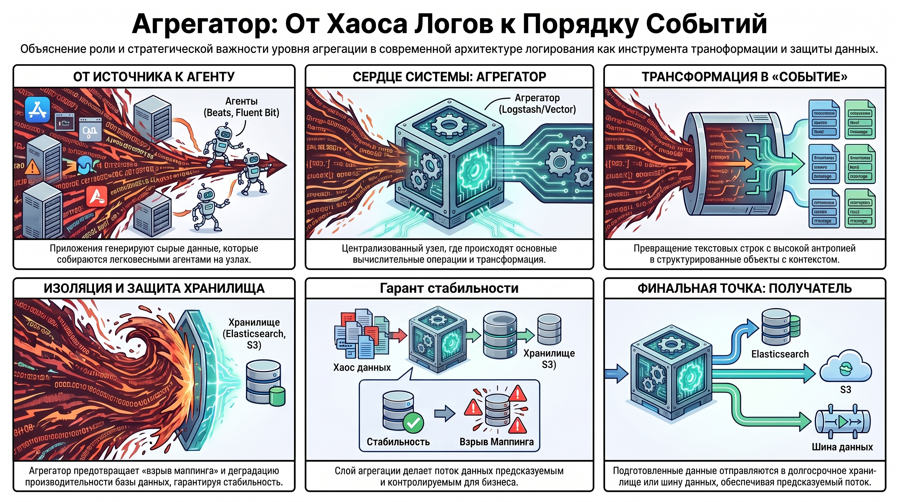
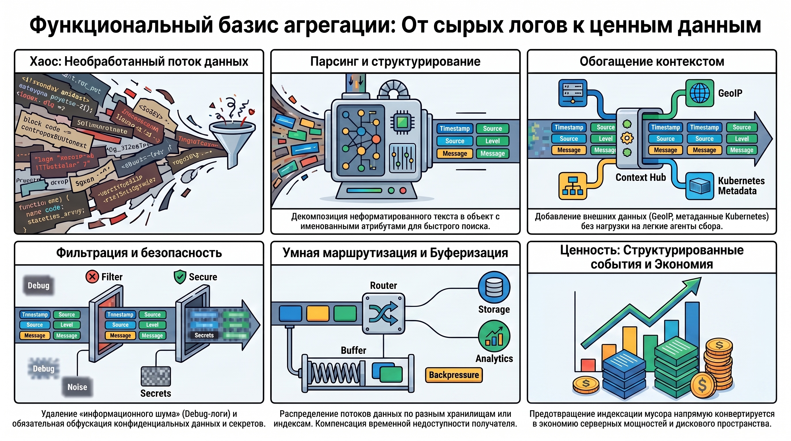
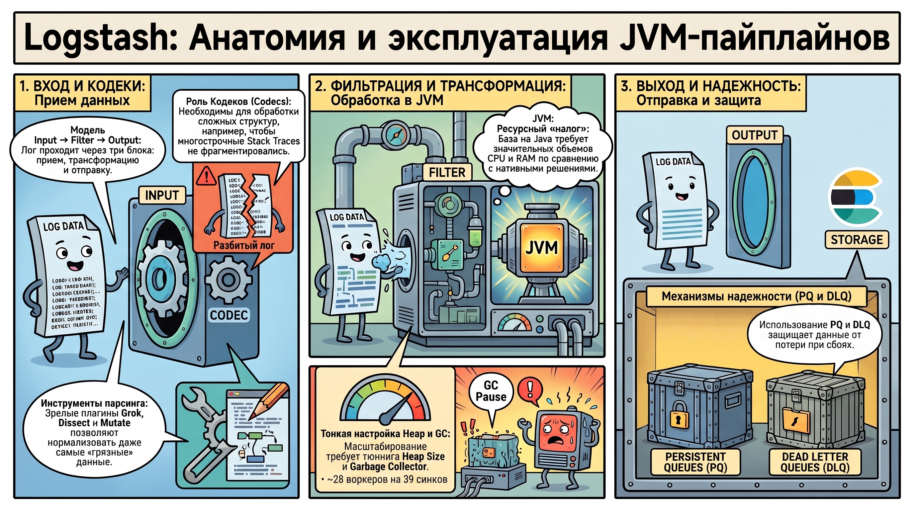
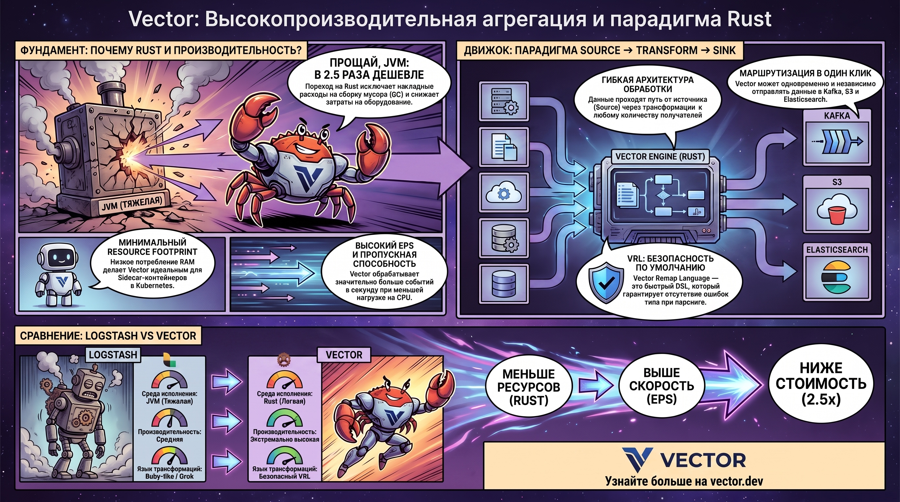
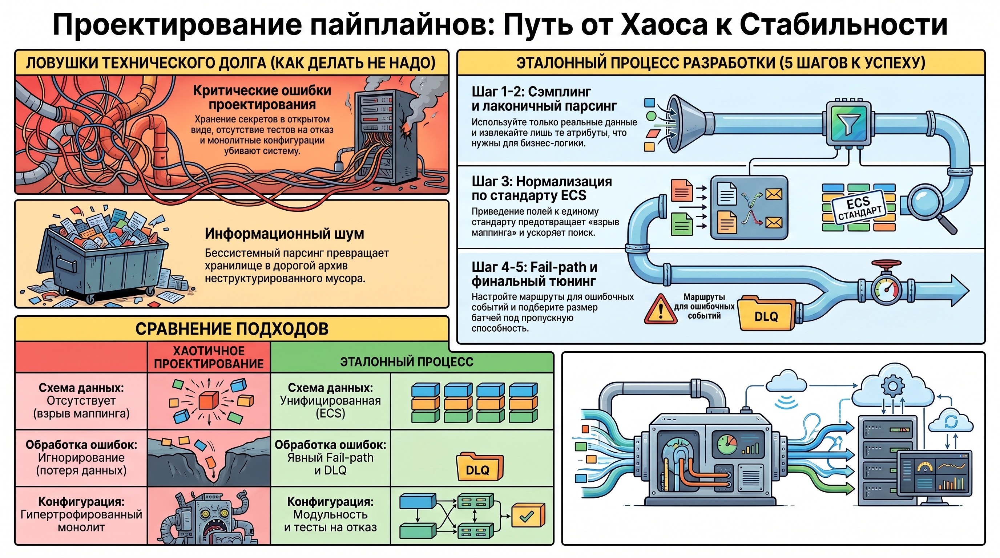

# Обзор систем агрегации сообщений: Logstash и Vector

### 1. Роль и место агрегатора в архитектуре централизованного логирования

В современной архитектуре систем наблюдаемости (Observability) уровень агрегации представляет собой критический промежуточный слой, обеспечивающий трансформацию неструктурированных потоков данных в ценный информационный актив. Стратегическое значение агрегатора заключается в переходе от простой трансляции «сырых логов» — текстовых строк с высокой энтропией — к формированию структурированного «события» (event). Данное событие является обогащенным объектом, обладающим необходимым контекстом для глубокого автоматизированного анализа.

Типовой жизненный цикл данных в промышленной среде описывается четырехкомпонентной моделью:

1. **Источник (Source):**  генерирует первичные данные (журналы приложений, системные события CoreDNS, stdout контейнеров).  
2. **Агент (Agent):**  легковесный компонент сбора на узлах (например, Beats или Vector в режиме агента).  
3. **Агрегатор (Aggregator):**  централизованный узел обработки (Logstash или Vector), выполняющий основные вычислительные операции.  
4. **Получатель (Sink):**  финальное хранилище или шина данных (Elasticsearch, S3, Kafka).

Выделение агрегации в обособленный уровень архитектуры продиктовано необходимостью изоляции хранилища от аномалий входного трафика. Прямая отправка нефильтрованных данных в хранилище (например, Elasticsearch) чревата деградацией его производительности вследствие «взрыва мэппинга» (mapping explosion) или перегрузки операциями парсинга. Таким образом, агрегатор выступает гарантом стабильности и предсказуемости всей системы.

### 2. Функциональный базис систем агрегации сообщений

Систематический перенос вычислительной нагрузки на слой агрегации является признанной методологией оптимизации совокупной стоимости владения (TCO) инфраструктурой. Рациональная предварительная обработка данных позволяет существенно сократить издержки на индексацию и долгосрочное хранение.

Ключевые функциональные задачи агрегатора включают:

* **Парсинг:**  декомпозиция неформатированного текста и извлечение именованных атрибутов.  
* **Обогащение:**  добавление внешнего контекста (GeoIP-данные, метаданные Kubernetes, преобразование кодов ошибок), что минимизирует нагрузку на легковесные агенты.  
* **Фильтрация:**  элиминация избыточных данных (Debug-логи) и обфускация конфиденциальной информации (Sensitive Data). Удаление секретов до момента индексации является не только вопросом производительности, но и требованием этики и безопасности.  
* **Маршрутизация (Routing):**  распределение потоков по специализированным индексам или различным типам хранилищ на основе заданных условий.  
* **Буферизация:**  использование механизмов компенсации временной недоступности получателя (Backpressure), предотвращающих потерю данных при сбоях в downstream-системах.

Качество реализации данных функций непосредственно определяет экономическую эффективность системы Observability: предотвращение индексации «информационного шума» напрямую конвертируется в экономию серверных ресурсов.

### 3. Logstash: Архитектура и специфика эксплуатации JVM-пайплайнов

Logstash представляет собой зрелый индустриальный стандарт, глубоко интегрированный в экосистему Elastic Stack. Архитектурно система базируется на виртуальной машине Java (JVM), что обуславливает как её исключительную гибкость, так и специфические эксплуатационные требования.

Конфигурационная модель Logstash оперирует тремя блоками:  **Input** ,  **Filter**  и  **Output** . Важным дополнением являются  **кодеки** , необходимые для обработки сложных структур, таких как Java Stack Traces; без применения соответствующих кодеков многострочные события ошибочно фрагментируются на уровне хранилища.

**Сильные стороны и инструментарий:**  Система обладает обширнейшей библиотекой плагинов и нативной поддержкой функций Elastic (ILM, Data Streams). Инструментарий парсинга (Grok, Dissect, Mutate) отличается высокой степенью зрелости и стабильности.**Эксплуатационные ограничения и тюнинг:**  Использование JVM накладывает высокие требования к CPU и RAM. При масштабировании высоконагруженных систем (высокий EPS) критически важен правильный тюнинг: настройка JVM Heap, параметров Garbage Collector и соблюдение оптимального соотношения воркеров к синкам (согласно практике, около 28:39 в специфических сценариях). Гипертрофированные конфигурационные файлы (тысячи строк кода) существенно затрудняют аудит и тестирование системы.

**Обеспечение надежности:**  В Logstash следует различать два уровня защиты:

1. **Persistent Queue (PQ):**  дисковая очередь, защищающая данные от потери при падении самого агрегатора или кратковременном отказе синка. Расчет емкости PQ проводится по формуле:  $EPS \times \text{Размер события} \times \text{Допустимое время простоя}$ .  
2. **DLQ/DLI (Dead Letter Queue/Index):**  механизмы обработки логических ошибок парсинга, позволяющие изолировать некорректные события для последующего анализа.

### 4. Vector: Высокопроизводительная агрегация и парадигма Rust

Vector — это современное решение, спроектированное на языке Rust, что позволяет исключить накладные расходы на среду исполнения и сборку мусора (GC). Изначально разработанный как  **Kubernetes-native**  инструмент, Vector одинаково эффективно функционирует в ролях легковесного агента и централизованного агрегатора.

В основе системы лежит модель Source → Transform → Sink. В отличие от Ruby-фильтров Logstash, Vector использует специализированный  **VRL (Vector Remap Language)** . Это «V-образный» предметно-ориентированный язык (DSL), обладающий строгими ограничениями для обеспечения безопасности и предсказуемости трансформаций.

**Аналитические преимущества:**

* **Экономическая эффективность:**  по верифицированным данным, переход на Vector позволяет снизить затраты на оборудование до 2.5 раз при сопоставимых нагрузках.  
* **Resource Footprint:**  минимальное потребление ресурсов делает Vector идеальным для Sidecar-контейнеров в Kubernetes.  
* **Мультисинк (Multisync):**  возможность одновременной и независимой маршрутизации данных в разнородные приемники (например, Kafka для обработки, S3 для архива и Elastic для оперативного поиска).

### 5. Сравнительный анализ и критерии выбора технологического стека

Выбор между Logstash и Vector определяется не только производительностью, но и целевым  **доменом отказа (failure domain)** , а также текущими компетенциями инженерной команды.

| Параметр | Logstash | Vector |
| ------ | ------ | ------ |
| **Среда исполнения** | JVM (требовательная к ресурсам) | Rust (минимальный footprint) |
| **Производительность** | Средняя (ограничена GC) | Экстремально высокая |
| **Transform DSL** | Ruby-like фильтры, Grok | Безопасный и быстрый VRL |
| **Семантика подтверждения (ACKs)** | Зрелая поддержка подтверждений | Нативная поддержка подтверждений |
| **Механизмы надежности** | Persistent Queue, DLQ/DLI | Disk-buffer, механизмы подтверждений |
| **Интеграция** | Elastic Native (Deep Integration) | Multi-backend, Kubernetes-native |

**Архитектурные рекомендации:**

* **Logstash остается оптимальным выбором** , если инфраструктура жестко завязана на специфические плагины Elastic Stack, EPS не превышает средних значений, а команда обладает глубокой экспертизой в тюнинге JVM.  
* **Vector является приоритетным** , когда система сталкивается с дефицитом ресурсов, сверхвысоким EPS или требует сложной мультиоблачной маршрутизации. Отсутствие семантики подтверждения (ACKs) в любой из систем критически затрудняет дебаг, поэтому её настройка обязательна для Tier-1 сервисов.

### 6. Методология проектирования пайплайнов и предотвращение деградации систем

Выбор инструмента вторичен по отношению к архитектурной дисциплине. Бессистемное проектирование пайплайнов неизбежно приводит к накоплению технического долга.

* Хранение секретов и паролей в открытом виде в конфигурациях.  
* Отсутствие тестов на отказ (fail-tests) и механизмов DLQ.  
* Игнорирование унифицированных схем данных.  
* Наличие гипертрофированных пайплайнов (монолитные конфигурации).

#### **Эталонный процесс разработки пайплайна:**  

1. **Сэмплинг:**  использование только реальных данных приложений для проектирования.  
2. **Минимально необходимый парсинг:**  извлечение лишь тех атрибутов, которые участвуют в бизнес-логике или поиске.  
3. **Нормализация (ECS):**  приведение полей к стандарту Elastic Common Schema. Снижение кардинальности данных на этом этапе — ключевой фактор предотвращения «взрыва мэппинга» и ускорения поиска в хранилище.  
4. **Проектирование Fail-path:**  явная настройка маршрутов для событий, не прошедших валидацию или парсинг.  
5. **Финальный тюнинг:**  подбор количества воркеров и размера батчей (Batch size) исходя из пропускной способности синка.

### 7. Заключение: Итоговая логика дисциплины агрегации

Ключевым результатом корректно спроектированного уровня агрегации является создание предсказуемого, контролируемого и этичного потока событий. Агрегатор — это точка принятия решений о качестве данных, определяющая жизнеспособность всей экосистемы Observability. Профессиональный подход к проектированию этого слоя гарантирует, что система останется инструментом быстрой диагностики инцидентов, а не превратится в дорогостоящий архив неструктурированного информационного шума.  
