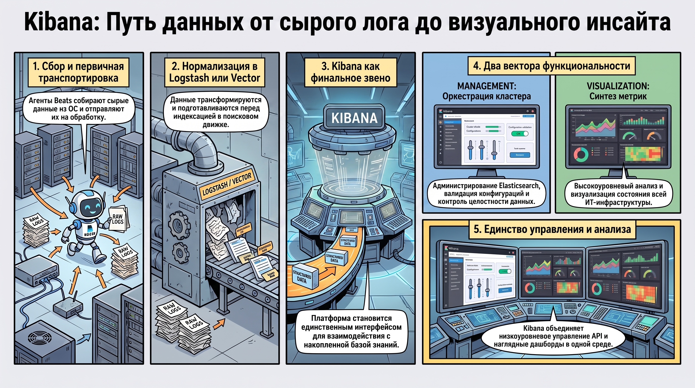
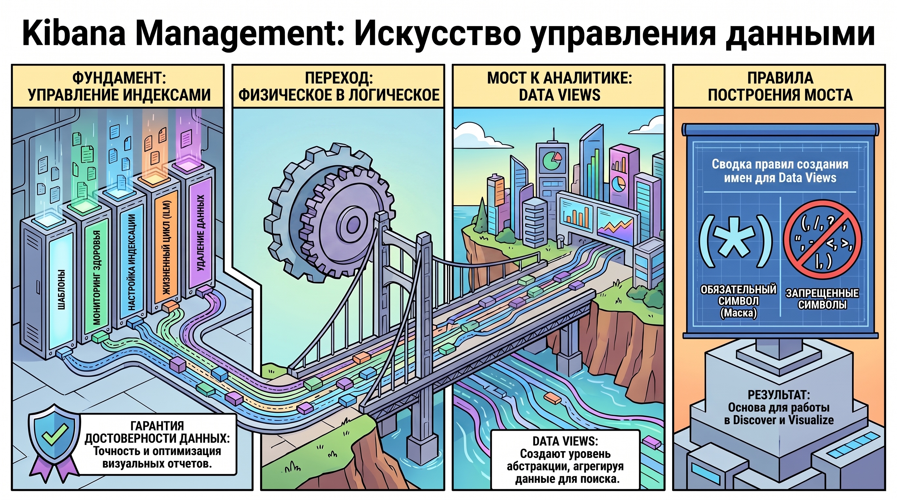
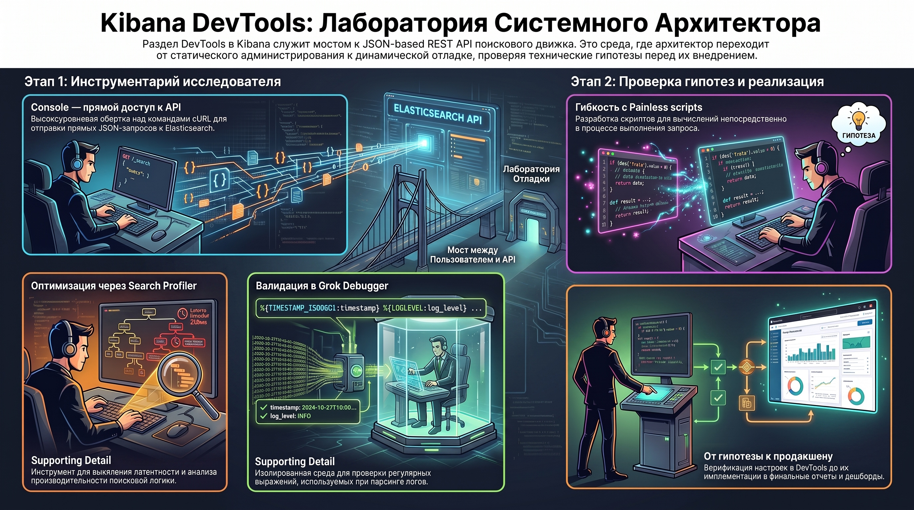
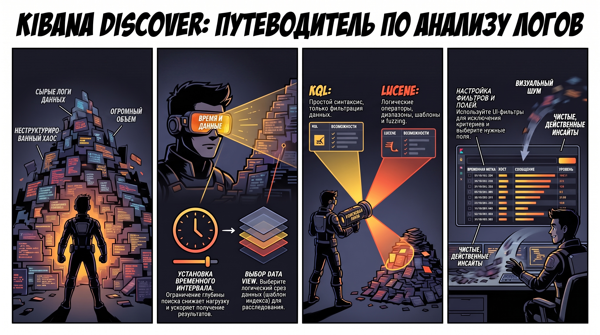
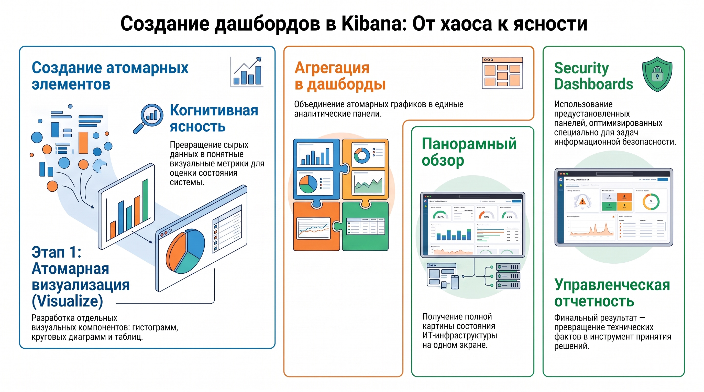

# Kibana как центральный интерфейс управления и визуализации в стеке Elastic

### 1. Роль и место Kibana в архитектуре систем логирования

В современной архитектуре Observability Kibana выступает не просто как графический компонент, а как единственная унифицированная плоскость оркестрации и визуализации данных для кластера Elasticsearch. Её стратегическая значимость заключается в обеспечении абстрагированного интерфейса взаимодействия с данными, где Kibana детерминирует логику представления информации, хранящейся в распределенном поисковом движке. Система реализует концепцию разделения уровней хранения и представления, становясь исключительным инструментом доступа к состоянию всей ИТ-инфраструктуры.

Функциональное назначение платформы структурировано по двум векторам:

* **Management (Управление):**  администрирование кластера Elasticsearch, валидация конфигураций и контроль целостности данных.  
* **Visualization (Визуализация):**  высокоуровневый анализ и синтез метрик на основе накопленной информации.

Согласно архитектурной карте Elastic Stack, Kibana является финальным звеном в цепочке обработки данных, которая включает следующие этапы:

1. **Источники (Sources):**  генерация сырых данных в операционных системах (преимущественно Linux).  
2. **Шипперы (Beats):**  использование специализированных агентов (Filebeat, Metricbeat, Heartbeat и др.) для первичного сбора и транспортировки.  
3. **Обработка (Processing):**  трансформация и нормализация данных с помощью Logstash или Vector перед их индексацией.

Результатом прохождения этой цепочки становится формирование структурированной базы знаний, управление которой осуществляется через специализированные инструменты администрирования Kibana.

### 2. Администрирование и управление данными (Management)

Раздел Management является критическим компонентом архитектуры, обеспечивающим жизненный цикл данных и их доступность. Правильная конфигурация этого раздела гарантирует, что визуальный слой будет оперировать достоверными и оптимизированными структурами.

Центральным механизмом управления является  **Index Management** , который позволяет реализовывать пять детерминированных операций:

1. Создание шаблонов индексов (Index Templates).  
2. Мониторинг текущего состояния и здоровья индексов.  
3. Тонкое редактирование настроек индексации.  
4. Оперативное удаление, закрытие или сброс индексов.  
5. Управление и модификация политик жизненного цикла (ILM policy).

**Data Views**  (ранее известные как Index Patterns) формируют уровень неразрушающей логической абстракции над физическими индексами. Они позволяют Kibana агрегировать данные из множества источников для единого поиска. При проектировании Data Views обязательным является использование масок со спецсимволом «звездочка» (`*`). Однако следует учитывать жесткие синтаксические ограничения: в именах Data Views запрещена эксплуатация символов `(`, `/`, `?`, `"`, `<`, `>`, `|`, `)`. Корректно настроенные Data Views являются фундаментом, на котором базируется вся последующая аналитическая работа в интерфейсах Discover и Visualize.

### 3. Среда разработки и отладки (DevTools)

Для системного архитектора  **DevTools**  представляет собой среду программного управления кластером. Этот раздел служит мостом к  **JSON-based REST API**  Elasticsearch, позволяя выполнять низкоуровневую диагностику и тонкую настройку поисковых механизмов, недоступную через стандартный графический интерфейс.

Инструментарий раздела включает:

* **Console:**  интерфейс для отправки прямых API-запросов, фактически являющийся высокоуровневой оберткой над командами `cURL`.  
* **Search Profiler:**  аналитический инструмент для оценки производительности запросов и выявления латентности в поисковой логике.  
* **Grok Debugger:**  изолированная среда для валидации и отладки регулярных выражений, используемых при парсинге логов.  
* **Painless scripts:**  функционал для разработки и тестирования скриптов на встроенном языке Elastic, позволяющий проводить вычисления непосредственно в процессе запроса.

Инструменты DevTools обеспечивают переход от статического администрирования к динамической отладке, позволяя архитектору верифицировать гипотезы до их имплементации в продуктивные отчеты.

### 4. Аналитический интерфейс Discover: поиск и фильтрация

Интерфейс  **Discover**  является первичной точкой входа для исследования сырых данных и расследования инцидентов. Это основной аналитический экран, где происходит первичная сепарация значимых событий из общего массива информации.

Эффективность поисковой выборки в Discover определяется пятью параметрами:

1. **Временной интервал:**  ограничение глубины поиска для оптимизации нагрузки на кластер.  
2. **Data View:**  выбор логического среза данных.  
3. **Конфигурация фильтров:**  использование UI-элементов для исключения или включения конкретных критериев.  
4. **Поисковая строка:**  поле для ввода запросов на языках KQL или Lucene.  
5. **Конфигурация полей:**  выбор конкретных атрибутов документа для табличного отображения.Точность первичной выборки в Discover критически важна, так как она задает контекст для всех последующих визуализаций и дашбордов.

### 5. Сравнительный анализ синтаксиса запросов: Lucene vs KQL

Для эффективного извлечения данных необходимо понимание различий между двумя доступными языками запросов.

| Характеристика | **Lucene** | **KQL (Kibana Query Language)** |
| ------ | ------ | ------ |
| **Природа** | Нативный синтаксис поискового движка. | Специализированный язык Kibana. |
| **Ключевые возможности** | Поиск по диапазонам, использование шаблонов, фуззинг (нечеткий поиск). | Упрощенный, человекочитаемый синтаксис. |
| **Архитектурный приоритет** | Поддержка акцентирования поиска (Boosting). | Нативная и интуитивная работа с вложенными объектами (nested fields). |
| **Особенности** | Строгая чувствительность к регистру и операторам. | Регистронезависимость логических операторов. |

Выбор синтаксиса определяется сложностью задачи: KQL является современным стандартом для повседневной аналитики за счет превосходной обработки вложенных структур, в то время как Lucene остается инструментом для специфических поисковых операций.

### 6. Инструменты визуализации и синтез отчетности (Dashboards)

Процесс трансформации данных в визуальные метрики завершает цикл обработки информации в Kibana, обеспечивая когнитивную ясность состояния сложных систем.

В Kibana реализовано четкое разделение:

* **Visualize:**  создание атомарных визуальных элементов (гистограмм, круговых диаграмм, таблиц).  
* **Dashboards:**  агрегация атомарных элементов в комплексные аналитические панели, обеспечивающие панорамный обзор состояния инфраструктуры.

Помимо кастомных панелей, архитектура Kibana поддерживает использование специализированных  **Security Dashboards** . Это предустановленные (Out-of-the-Box) среды мониторинга, оптимизированные для задач информационной безопасности. Kibana, таким образом, становится финальным звеном цепочки Observability, преобразуя разрозненные технические факты в структурированную управленческую отчетность.

### 7. Заключение

Kibana представляет собой интегрированную экосистему, объединяющую функции глубокого управления кластером через API и инструменты высокоуровневого анализа. Архитектурно грамотная эксплуатация платформы требует не только навыков визуализации, но и понимания механизмов абстрагирования данных через Data Views, владения синтаксисом REST API в DevTools и экспертного использования языков запросов (KQL/Lucene). Системный подход к освоению всех разделов — от Management до Dashboards — является обязательным условием для построения эффективной системы мониторинга и анализа данных в Elastic Stack.  
