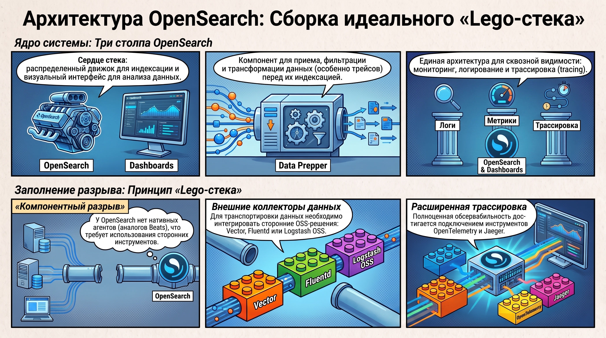
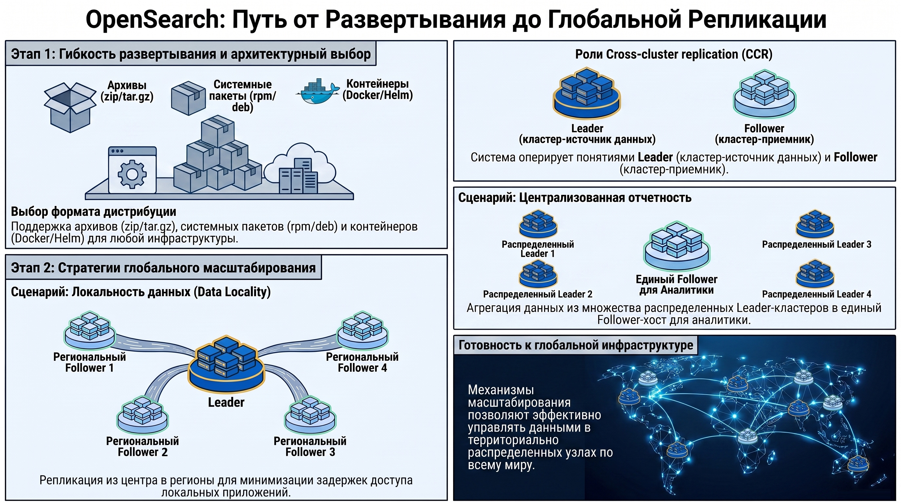

# Система централизованного логирования OpenSearch

### 1. Генезис и эволюция проекта OpenSearch

Проект OpenSearch представляет собой фундаментальную веху в эволюции инструментов обсервабильности, возникшую как стратегический ответ сообщества на изменение парадигмы лицензирования в сегменте систем поиска и анализа данных. Переход от экосистемы Elasticsearch к независимому форку был продиктован необходимостью устранения рисков вендор-лока и обеспечения гарантированной доступности кода под лицензией Apache 2.0 в условиях проприетарного дрейфа со стороны компании-разработчика.

#### **Хронология эволюции проекта (2015–2024 гг.):**

* **1 октября 2015:**  Официальный запуск Amazon Elasticsearch Service в девяти регионах, что ознаменовало начало масштабной коммерциализации поискового движка как облачного сервиса.  
* **14 июня 2018:**  Релиз Elastic Stack 6.3.0. Внедрение компонентов X-Pack в стандартные сборки под проприетарной Elastic License стало прецедентом ограничения свободы использования второстепенного функционала.  
* **11 марта 2019:**  Анонс Open Distro for Elasticsearch от Amazon при поддержке Netflix и Expedia Group. Проект позиционировался как полностью открытая (Open Source) надстройка, нивелирующая закрытость X-Pack.  
* **14 января 2021:**  Elastic объявляет о переходе на двойную схему лицензирования SSPL \+ Elastic License для версии 7.11 и выше, что фактически прекратило существование Elasticsearch как открытого ПО.  
* **12 апреля 2021:**  Формальное представление OpenSearch — форка версии 7.10.2 под лицензией Apache 2.0. Инициатива была поддержана такими корпорациями, как Red Hat, SAP, Capital One и Logz.io.  
* **12 июля 2021:**  Достижение стадии General Availability (GA) для OpenSearch и OpenSearch Dashboards.  
* **29 августа 2024:**  Elastic вводит лицензию AGPL в качестве третьей опции, пытаясь вернуть доверие сообщества после многолетней критики.

Ключевым аспектом легитимности OpenSearch стало завершение юридического конфликта между Elastic и Amazon. Судебное разбирательство подтвердило отсутствие неправомерного использования интеллектуальной собственности: было установлено, что методы и принципы, реализованные сообществом в OpenSearch, являются оригинальными и не имеют прослеживаемых связей (traceable connections) с кодом проприетарных компонентов X-Pack. Таким образом, проект доказал свою техническую и правовую независимость, что заложило фундамент для формирования текущей архитектуры стека.

### 2. Архитектура и компонентный состав OpenSearch Stack

Структурная организация экосистемы OpenSearch подчинена логике «триады обсервабильности»: мониторинг, логирование и трассировка (tracing). Архитектура системы спроектирована таким образом, чтобы обеспечить сквозную видимость в сложных распределенных средах.

**Ядро системы включает следующие компоненты:**

* **OpenSearch:**  Распределенный поисковый движок и аналитический бэкенд, отвечающий за индексацию и хранение данных.  
* **OpenSearch Dashboards:**  Централизованный интерфейс для визуализации метрик, анализа логов и управления состоянием кластера.  
* **Data Prepper:**  Выпущенный в 2021 году компонент для инжестинга, предназначенный для приема, фильтрации и преобразования данных перед индексацией (в частности, ориентированный на работу с трейсами).

С точки зрения DevOps-архитектора, критической особенностью OpenSearch является отсутствие нативных агентов сбора данных, эквивалентных Elastic Beats или Elastic Agent. Это создает «компонентный разрыв», требующий от инженеров сборки решения по принципу «Lego-стека». Для построения полной цепочки обсервабильности необходимо интегрировать сторонние OSS-инструменты:  **Vector** ,  **Fluentd**  или  **Logstash OSS**  для транспортировки данных, а также  **OpenTelemetry**  и  **Jaeger**  для реализации механизмов трассировки.

Данная модульность повышает гибкость решения в гетерогенных средах, но одновременно увеличивает требования к квалификации персонала, что важно учитывать при сопоставлении с альтернативными экосистемами.

### 3. Сравнительный анализ: OpenSearch Stack vs. Elastic Stack

Прямое сравнение данных платформ является императивом для организаций, стремящихся к оптимизации затрат на поддержку и исключению лицензионных рисков.

| Дискретный параметр | Elastic Stack | OpenSearch Stack |
| ------ | ------ | ------ |
| **Ядро системы** | Elasticsearch / Kibana | OpenSearch / OpenSearch Dashboards |
| **Инструменты инжестинга** | Logstash, Beats, Elastic Agent | Data Prepper, сторонние OSS (Vector, Fluentd) |
| **Лицензия** | SSPL / Elastic / AGPL (Source-available) | Apache 2.0 (Open Source) |
| **Модель поддержки** | Вендорская, сертификация Elastic | Community-driven, отсутствие сертификации |
| **Безопасность (RBAC/Document-level)** | Платные уровни (Platinum/Enterprise) | Включено в Apache 2.0 дистрибутив |
| **Нативные агенты сбора** | Присутствуют (экосистема Beats) | Отсутствуют (требуется интеграция сторонних) |

**Техническая оценка инструментов обработки данных:**  Data Prepper (2021) и Logstash (2012) используют Java в качестве языка разработки, однако Data Prepper демонстрирует превосходство в производительности до 50% при работе в условиях высоких нагрузок распределенных систем. Тем не менее, Data Prepper существенно уступает по зрелости экосистемы: он поддерживает лишь 15 источников (sources) и 6 стоков (sinks), в то время как Logstash предлагает более 57 коннекторов для каждого направления, что критично для сложных интеграционных сценариев.

**Корпоративный функционал:**  Стратегическим преимуществом OpenSearch является доступность функций корпоративного класса в базовой версии. Межкластерная репликация (CCR) и безопасность на уровне документов, которые в Elastic заблокированы за платными подписками, в OpenSearch являются частью свободного дистрибутива. Это подчеркивает расхождение траекторий проектов: Elastic ориентирован на монетизацию сервисов, в то время как OpenSearch фокусируется на техническом паритете в рамках открытой модели.

### 4. Технологическая реализация и форматы развертывания

Гибкость дистрибуции OpenSearch обеспечивает возможность внедрения системы в архитектуры любой сложности. Поддерживаются следующие форматы:

* **Архивные сборки:**  zip и tar.gz для кастомизированных установок.  
* **Системные пакеты:**  rpm и deb для интеграции в стандартные Linux-дистрибутивы.  
* **Контейнеризация и оркестрация:**  Официальные Docker-образы и Helm-чарты для сред Kubernetes.

Особое внимание в архитектуре уделено реализации  **Cross-cluster replication (CCR)** , которая оперирует понятиями  **Leader**  (кластер-источник) и  **Follower**  (кластер-приемник). На базе CCR реализуются два стратегических сценария:  

1. **Локальность данных (Data Locality):**  Репликация данных из центрального узла в региональные сегменты (например, Ирландия, Сингапур, Канада) для минимизации задержек при доступе локальных приложений.  
2. **Централизованная отчетность (Centralized Reporting):**  Агрегация данных из множества территориально распределенных Leader-кластеров в единый Follower-кластер для аналитики и визуализации.

Масштабируемость данных механизмов подтверждает готовность стека к эксплуатации в глобально распределенных инфраструктурах.

### 5. Итог

Освоение технологий OpenSearch позволяет констатировать переход индустрии от вендор-центричных моделей обсервабильности к платформе, управляемой сообществом. Ключевым результатом мастерства в данном материале является способность проектировать системы, обладающие техническим паритетом с Elasticsearch, но лишенные его лицензионных ограничений.

Несмотря на превосходство Data Prepper в производительности инжестинга, переход на OpenSearch сопряжен с увеличением «архитектурных накладных расходов» (Architectural Overhead). Необходимость самостоятельной интеграции сторонних коллекторов данных (Vector/Fluentd) взамен отсутствующих нативных агентов требует более глубокой экспертизы в сборке OSS-компонентов. Итоговым преимуществом остается получение функций уровня Platinum/Enterprise (безопасность, CCR) в рамках Apache 2.0, что обеспечивает долгосрочную стабильность и экономическую эффективность ИТ-инфраструктуры.  
