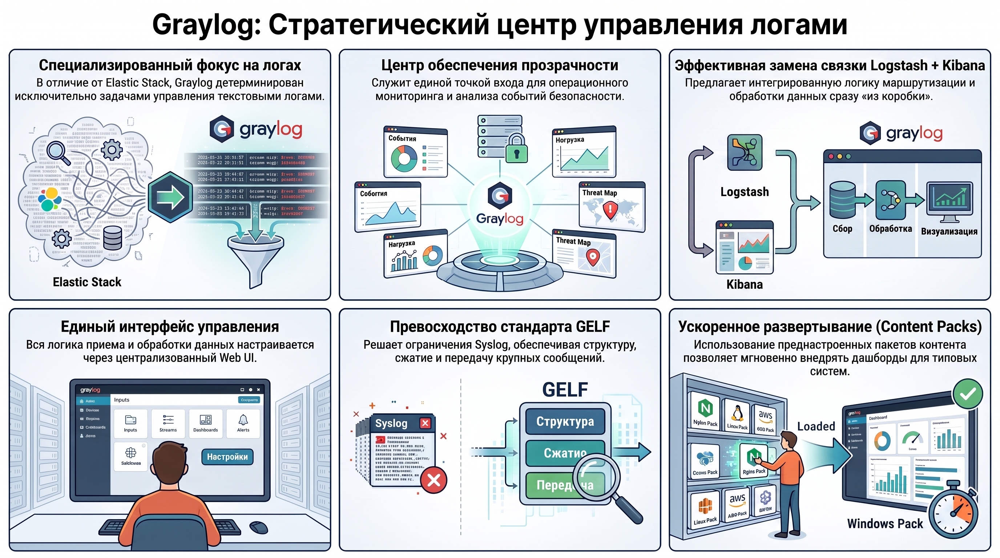
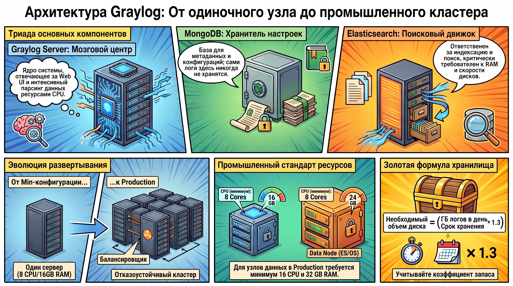
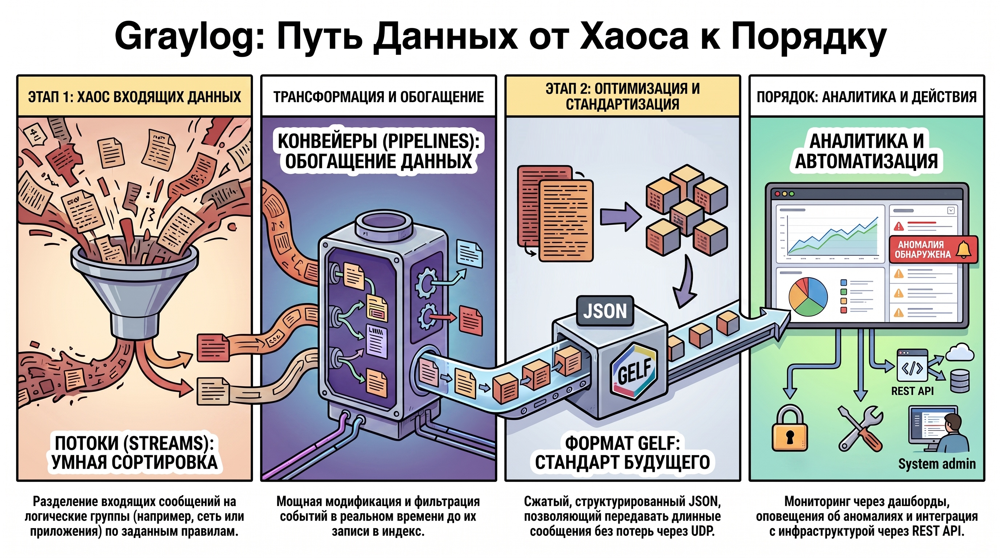
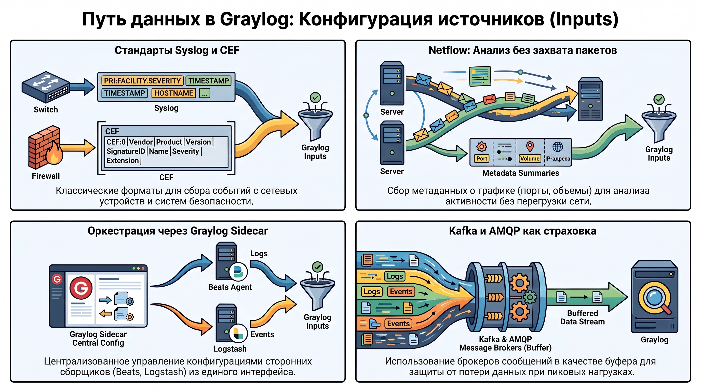
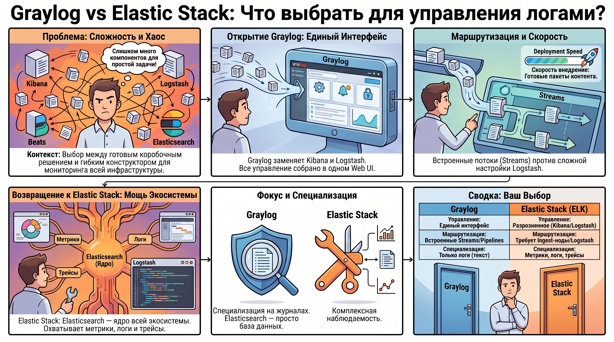

# Система централизованного логирования Graylog

### 1. Концептуальное определение и место Graylog в инфраструктуре наблюдаемости

Graylog — это специализированное Open Source решение промышленного класса, предназначенное для агрегации, индексации и глубокого анализа структурированных и неструктурированных данных журналов (логов). В современной парадигме ИТ-инфраструктуры Graylog выполняет стратегическую роль центрального узла обеспечения прозрачности систем (observability), предоставляя единую точку входа для мониторинга событий безопасности и операционной деятельности.

#### **Специфика функционального охвата**

В отличие от комплексных экосистем, таких как Elastic Stack или Grafana Stack, стремящихся охватить все три столпа наблюдаемости (метрики, логи, трассировки), Graylog позиционируется как «фокусный продукт». Его архитектура и пользовательский интерфейс детерминированы исключительно задачами управления логами. В то время как универсальные стеки требуют сложной настройки разрозненных компонентов, Graylog предлагает интегрированную логику маршрутизации и обработки текстовых событий «из коробки», выступая эффективной альтернативой связке Logstash и Kibana.

#### **Стратегические преимущества внедрения**

Ключевыми выгодами использования Graylog являются:

* **Централизация конфигураций:**  управление всей логикой приема и обработки данных осуществляется через единый Web UI.  
* **Стандартизация через GELF:**  использование специализированного формата Graylog Extended Log Format решает системные ограничения протокола Syslog (размер сообщений, отсутствие структуры).  
* **Ускорение развертывания:**  применение «пакетов контента» (Content Packs) позволяет оперативно внедрять преднастроенные наборы входов, потоков и дашбордов для типовых систем.

Эффективность эксплуатации Graylog напрямую коррелирует с пониманием его архитектурного устройства и корректным распределением системных ресурсов.

### 2. Архитектурная модель и системные компоненты

Проектирование отказоустойчивой системы логирования требует детального анализа компонентной базы. Graylog опирается на распределенную модель, где каждый элемент триады выполняет строго определенную функцию.

#### **Базовая триада компонентов**

1. **Graylog Server:**  ядро системы, обеспечивающее работу Web UI, REST API и логику обработки сообщений. Характеризуется интенсивным потреблением ресурсов CPU в процессе парсинга данных.  
2. **MongoDB:**  база данных для хранения метаданных (конфигурации, параметры потоков, данные пользователей, алерты). Непосредственно логи в MongoDB не сохраняются.  
3. **Elasticsearch / OpenSearch:**  поисковый движок, ответственный за индексацию, хранение и полнотекстовый поиск. Критичен к объему оперативной памяти (RAM) и производительности дисковой подсистемы (IOPS).

#### **Иерархия развертывания и технические требования**

Архитектура системы масштабируется от одиночного узла до территориально распределенного кластера:

* **Core Deployment Architecture (Минимальная конфигурация):**  Допустима установка всех компонентов на один сервер. Согласно техническим спецификациям, для Graylog Server требуется минимум 8 CPU / 16 GB RAM, в то время как для узла данных (Data Node) — 8 CPU / 24 GB RAM.  
* **Production конфигурация (Промышленная среда):**  Подразумевает кластеризацию на всех уровнях (Graylog Cluster, MongoDB Replica Set, Elasticsearch/OpenSearch Cluster). Для обеспечения высокой доступности внедряется балансировщик нагрузки (Load Balancer). В промышленной эксплуатации требования возрастают до 16 CPU и 32 GB RAM на узел данных.  
* **Расчет хранилища:**  Необходимый объем дискового пространства вычисляется по формуле: (`ГБ/день * Срок хранения * 1.3$$`).

Современные методы развертывания включают использование инсталляционных пакетов, систем управления конфигурациями, контейнеризацию и Helm-чарты для оркестрации в Kubernetes.

### 3. Функциональный инструментарий и механизмы обработки данных

Операционная эффективность Graylog обусловлена развитыми механизмами трансформации входящих потоков данных в структурированную информацию в реальном времени.

#### **Потоки (Streams) и конвейеры (Pipelines)**

* **Streams:**  механизм логической сегрегации сообщений на основе заданных правил (например, разделение логов приложений и сетевого оборудования).  
* **Pipelines:**  мощный инструмент для модификации, фильтрации и обогащения данных. Позволяет реализовывать сложную логику преобразования сообщений до их фиксации в индексе.

#### **Визуализация, оповещения и автоматизация**

* **Dashboards и Alerts:**  инструменты визуального анализа и оперативного реагирования на аномалии.  
* **REST API:**  критически важный интерфейс, позволяющий интегрировать Graylog в автоматизированные цепочки управления инфраструктурой (Infrastructure as Code).

#### **Формат GELF (Graylog Extended Log Format)**

GELF является стандартом обмена данными, предлагающим:

* Поддержку структурированного JSON.  
* Встроенное сжатие (GZIP/ZLIB) для экономии пропускной способности.  
* **Сегментацию (фрагментацию) сообщений:**  возможность передачи данных, превышающих стандартный размер UDP-пакета.

Эффективность этих инструментов детерминирована качеством настройки входных каналов данных.

### 4. Конфигурация источников данных (Inputs)

Стандартизация протоколов приема логов является фундаментом гибкой архитектуры наблюдаемости. Graylog поддерживает широкий спектр методов получения данных.

#### **Протоколы сетевого и системного уровня**

* **Syslog и CEF (Common Event Format):**  стандарты для сетевых устройств и систем информационной безопасности.  
* **Netflow:**  протокол сбора  **метаданных**  о сетевом трафике (порты, объемы, протоколы), обеспечивающий анализ сетевой активности без захвата самих пакетов.

#### **Агенты сбора и шины данных**

* **Graylog Sidecar:**  выступает в роли  **оркестратора**  конфигураций для сторонних сборщиков (Beats, Logstash), установленных на целевых серверах, обеспечивая централизованное управление агентами.  
* **Kafka и AMQP:**  интеграция с брокерами сообщений позволяет использовать Graylog в качестве потребителя (consumer), создавая необходимый буфер данных для обработки пиковых нагрузок и предотвращения потери событий.

### 5. Сравнительный анализ: Graylog vs Elastic Stack

Выбор между Graylog и Elastic Stack (ELK) — это выбор между специализированным инструментом и универсальной платформой обсервабилити.

#### **Функциональные и эксплуатационные различия**

|Характеристика|Graylog|Elastic Stack (ELK)|
|---|---|---|
|Управление|Единый интерфейс (настройки, алертинг, RBAC)|Разрозненное (Kibana, Logstash, API)|
|Маршрутизация|Встроенная логика Streams/Pipelines|Требует настройки Logstash или Ingest-нод|
|Observability|Фокус исключительно на логах|Полный охват (метрики, логи, трейсы)|
|Архитектура|Использует Elasticsearch как БД|Elasticsearch — основа всего стека|

#### **Сценарии применения**

Graylog является оптимальным решением для построения систем управления журналами, где критичны скорость настройки и удобство делегирования прав доступа. При этом следует учитывать, что Graylog не является альтернативой специализированным инструментам для работы с метриками (Prometheus) или распределенной трассировкой (Jaeger/Tempo). Это «фокусный продукт», заменяющий Kibana и Logstash в задачах анализа текстовых событий.

### 6. Заключение

Понимание архитектурного взаимодействия Graylog с MongoDB и поисковыми движками, умение настраивать сложные конвейеры обработки данных и оркестрировать конфигурации агентов сбора логов, помогают обеспечивать высокую операционную эффективность и прозрачность современной ИТ-инфраструктуры.  
