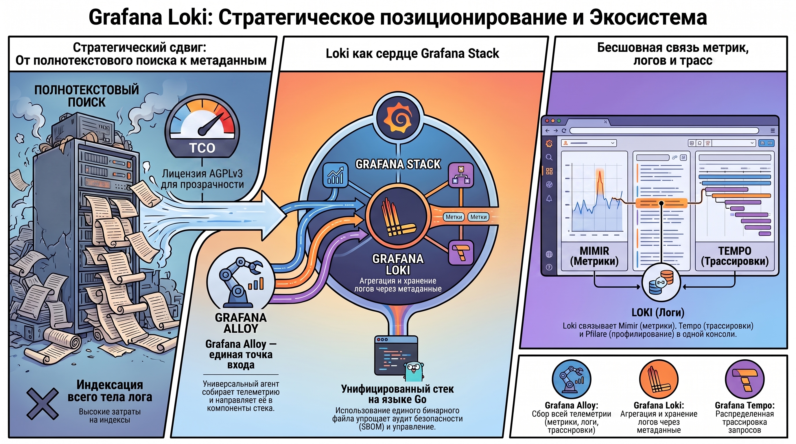
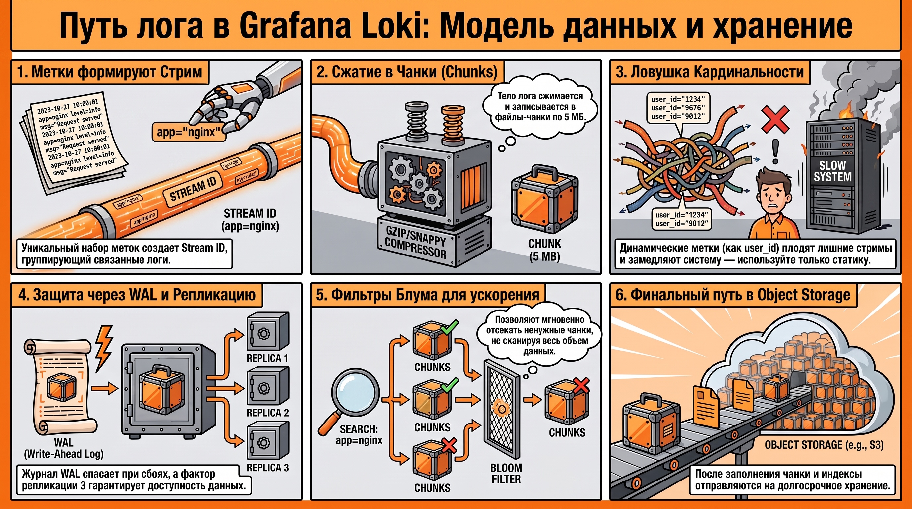
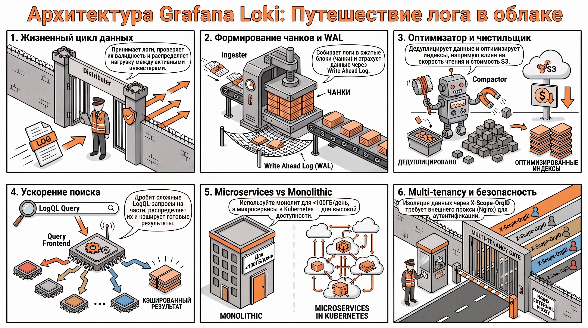
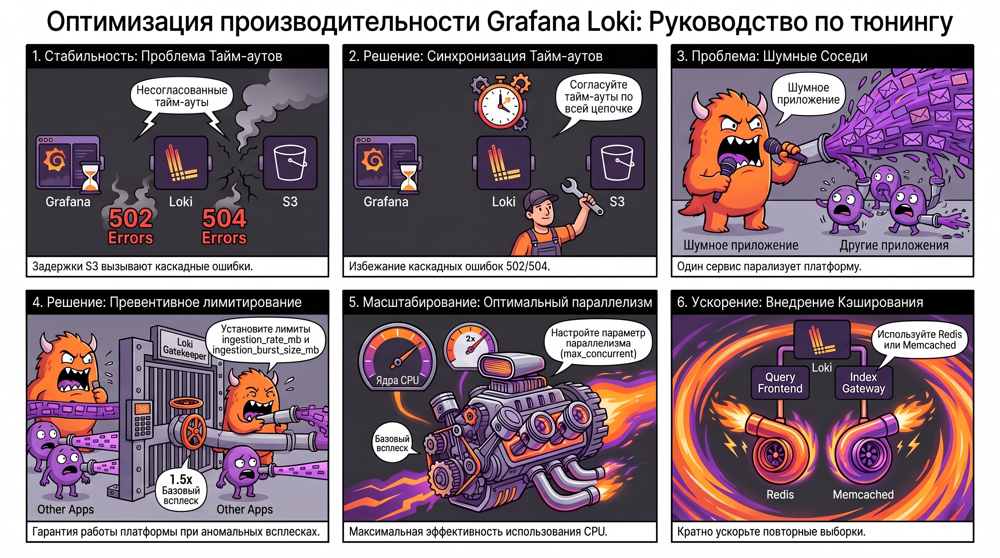
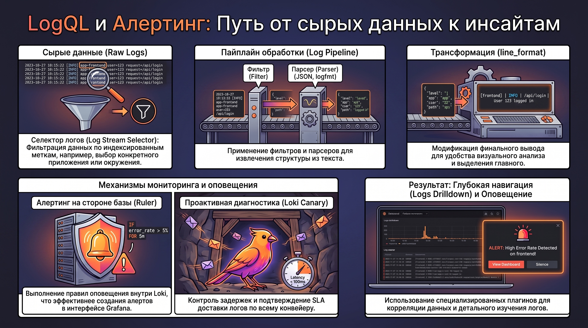

# Система управления логами Grafana Loki

### 1. Место Grafana Loki в экосистеме современных инструментов наблюдения

В современной практике Site Reliability Engineering (SRE) и системной архитектуры концепция Observability базируется на трех столпах: метриках, логах и трассировках. Grafana Stack представляет собой интегрированную платформу, где Grafana Loki выполняет стратегическую роль системы централизованного логирования. Loki спроектирована как экономически эффективная альтернатива полнотекстовым поисковым системам, заимствуя философию Prometheus: индексируются не сами сообщения, а лишь метаданные (лейблы), что обеспечивает бесшовную корреляцию журналов с метриками и трассировками.

#### **Обзор продуктов Grafana Stack**

Экосистема Grafana Labs состоит из модульных компонентов, каждый из которых специализируется на конкретном аспекте наблюдаемости:

| Инструмент | Категория (Pillar) | Функциональное назначение и роль |
| ------ | ------ | ------ |
| **Grafana** | Визуализация | Универсальный интерфейс и платформа для построения дашбордов. |
| **Loki** | Логи (Logs) | Масштабируемая система агрегации и хранения журналов. |
| **Mimir** | Метрики (Metrics) | Долгосрочное хранилище метрик с поддержкой Prometheus-запросов. |
| **Tempo** | Трассировки (Tracing) | Система распределенной трассировки запросов. |
| **Alloy** | Сбор данных (Agent) | Универсальный агент (OpenTelemetry-совместимый) для сбора телеметрии. |
| **Pyroscope** | Профилирование | Инструмент непрерывного профилирования (Continuous Profiling). |
| **K6** | Тестирование | Платформа для нагрузочного тестирования на базе JavaScript. |
| **Beyla** | Сбор данных (eBPF) | Автоматический сбор метрик и трасс без модификации кода через eBPF. |

#### **Правовые и эксплуатационные аспекты (Лицензирование)**

Переход Grafana Labs на лицензию  **AGPLv3**  (строгий copyleft) вместо пермиссивной  **Apache 2.0**  существенно изменил ландшафт использования продуктов. AGPLv3 требует раскрытия исходного кода модификаций при предоставлении сетевого доступа к ПО. С точки зрения системного архитектора, важным техническим нюансом является совместимость: лицензия AGPLv3 совместима с GPLv3, но  **несовместима с GPLv2** . Это накладывает обязательства на компании, встраивающие Loki в свои закрытые облачные платформы, однако гарантирует сообществу, что инновации останутся открытыми.

Переход от общего положения стека к внутреннему устройству требует понимания того, что эффективность Loki продиктована использованием «Prometheus-like» модели лейблов, которая напрямую диктует физическую структуру хранения данных на диске.

### 2. Концептуальная модель данных и механизмы хранения

Для эффективного тюнинга Loki инженер должен четко представлять структуру данных. В отличие от систем с обратным индексом, производительность Loki напрямую зависит от количества и кардинальности метаданных.

#### **Структура данных (Labels, Streams, Chunks)**

В Loki данные организованы в  **стримы (Streams)** . Идентификатор стрима формируется путем хеширования уникального набора  **лейблов (Labels)**  (например, `{app="web", env="prod"}`).

* **Индексация:**  Loki индексирует только лейблы. Это позволяет на порядки сократить объем индекса по сравнению с полнотекстовым поиском, снижая требования к RAM и стоимости хранения.  
* **Chunks:**  Строки логов внутри стрима сжимаются (Gzip или Snappy) и упаковываются в чанки — файлы-контейнеры, которые затем сбрасываются в объектное хранилище (S3/GCS) или файловую систему.

#### **Формат хранения и файловая структура**

В директории данных Loki (`./data`) компоненты организованы иерархически. На основе Source Context типичная структура включает:

* `meta.json`: Описание блока и метаданные.  
* `index`: Файлы индекса (оглавление) для поиска чанков по лейблам.  
* `chunks`: Сжатые файлы с телом логов.  
* `chunks_head`: Временное хранилище для активных чанков, находящихся в процессе наполнения.  
* `wal` (Write-Ahead Log): Журнал предварительной записи.  
* `checkpoint`: Механизм ротации WAL для обеспечения целостности данных при перезагрузках.  
* `tombstones`: Информация об удаленных записях для последующей очистки компактором.

#### **Мультитенантность**

Loki поддерживает изоляцию данных через HTTP-заголовок `X-Scope-OrgID`. Даже в одиночном режиме система использует идентификатор `fake`. Это критически важно для консистентности: значение тенанта (будь то реальное ID или `fake`) записывается непосредственно в индекс и чанки, обеспечивая унификацию формата данных независимо от активации режима мультитенантности.Выбранная модель данных, основанная на стримах, диктует жесткое разделение архитектуры на независимые пути обработки запросов и записи данных.

### 3. Архитектурная декомпозиция и режимы развертывания

Loki поставляется в виде единого бинарного файла, написанного на Go. Однако этот монолит внутри состоит из множества микросервисных компонентов, которые активируются через флаг `-target`.

#### **Функциональные компоненты системы**

##### *Path of Write (Путь записи)*

* **Distributor:**  Точка входа для логов. Проверяет лимиты (Rate Limiting) и распределяет данные по инджестерам, используя консистентное хеширование.  
* **Ingester:**  Ответственен за жизненный цикл чанков. Он принимает логи, сжимает их, индексирует в памяти и временно хранит в WAL перед финализацией в S3/FS.

##### *Path of Read (Путь чтения)*

* **Query Frontend:**  Принимает запросы, разбивает их на мелкие интервалы для параллельного выполнения и кэширует результаты.  
* **Query Scheduler:**  Осуществляет балансировку нагрузки, распределяя задачи между доступными кверерами.  
* **Querier:**  Выполняет физическую выборку данных. Он опрашивает инджестеры (на наличие «горячих» данных в памяти) и долгосрочное хранилище.

##### *Вспомогательные службы*

* **Index Gateway:**  Ускоряет работу с метаданными, кэшируя индексы.  
* **Compactor:**  Оптимизирует хранилище, объединяя мелкие чанки и удаляя данные согласно Retention policy.  
* **Ruler:**  Обрабатывает правила оповещений и записи.

#### **Эволюция масштабирования и High Availability**

Loki поддерживает три режима развертывания:  **Monolithic**  (все в одном),  **Simple Scalable**  (разделение на `target=read` и `target=write`) и  **Microservices** . Для обеспечения высокой доступности (HA) используется логика кворума: при факторе репликации (Replication Factor) равном 3 система может потерять 1 узел без деградации сервиса.

Правильно спроектированная архитектура является лишь каркасом, требующим точной настройки производительности.

### 4. Конфигурация и оптимизация производительности (Тюнинг)

Тюнинг Loki — это поиск компромисса между потреблением ресурсов CPU/IO и скоростью обработки запросов.

#### **Настройка параметров чанков и индексов**

Оптимальный размер чанка (`target_size`) составляет  **5 МБ** . Меньшие размеры приводят к чрезмерному количеству файлов, большие — к задержкам при чтении. Параметр `chunk_idle_period` определяет время закрытия чанка при отсутствии новых записей. При использовании объектного хранилища (S3) критически важным компонентом становится  **boltdb-shipper** , который управляет метаданными индекса и обеспечивает их эффективную передачу и хранение во внешнем сторадже.

#### **Управление лимитами (Rate Limiting) и Log Spikes**

Для предотвращения дестабилизации кластера при всплесках логов («Log Spikes») используются лимиты на уровне тенанта:

* `ingestion_rate_mb`: «Ватерлиния» или гарантированная пропускная способность.  
* `ingestion_burst_size_mb`: Лимит для поглощения кратковременных всплесков. Рекомендуемое значение —  **1.5x**  от `ingestion_rate_mb`.

#### **Обработка задержек и тайм-аутов**

Настройка тайм-аутов в цепочке  **Grafana -> Proxy (Nginx/HAProxy) -> Loki**  должна быть иерархической. Инкрементальное увеличение на каждом этапе (например,  **300s -> 310s -> 320s** ) гарантирует, что прокси-сервер не разорвет соединение раньше, чем Loki успеет отдать результат тяжелого запроса.

После применения настроек необходим непрерывный мониторинг, так как любое изменение параметров может сместить "бутылочное горлышко" системы.

### 5. Аналитический инструментарий: LogQL и Алертинг

LogQL является мощным интерфейсом, во многом идентичным PromQL, что снижает порог входа для SRE-инженеров.

#### **Синтаксис и операторы запросов**

Запросы включают селекторы лейблов (выбор стрима) и конвейер фильтров.

* **Парсинг:**  Оператор `| json` позволяет динамически извлекать поля из неструктурированного текста.  
* **Трансформация:**  Логи могут быть преобразованы в метрики (например, `rate({app="api"} |= "error" 5m)`), что позволяет визуализировать частоту ошибок на дашбордах.

#### **Организация оповещений (Alerting)**

Компонент  **Ruler**  выполняет LogQL-запросы по расписанию. Преимущество использования Ruler в связке с  **Alertmanager**  перед стандартным алертингом Grafana UI заключается в поддержке сложных механизмов подавления (Inhibition) и группировки уведомлений, что критично для предотвращения «алерт-фатига» (alert fatigue).

### 6. Инструменты эксплуатации и мониторинга системы

Верификация работоспособности кластера требует использования специализированных внешних утилит.

#### **Служебные утилиты CLI**

* `logcli` : Позволяет выполнять запросы напрямую из терминала, что удобно для автоматизации и CI/CD.  
* `loki-tool` : Используется для глубокого анализа эффективности индексов и верификации правил рулера.  
* `loki-canary` : Критически важная утилита для SRE. Она генерирует поток синтетических логов и проверяет их прохождение через всю цепочку (от инджеста до квериера), позволяя выявлять задержки и потери данных до того, как их заметят пользователи.

#### **Сбор данных через Grafana Alloy**

Универсальный агент  **Alloy**  заменяет собой разрозненные сборщики. Он поддерживает сбор данных из Docker-сокетов и выполняет  **relabeling**  — процесс динамического изменения лейблов (например, маппинг метаданных Docker в читаемые имена контейнеров), что обеспечивает чистоту стримов и оптимальную кардинальность индексов.

### 7. Заключение

Главным результатом изучения Grafana Loki является способность специалиста осознанно проектировать систему логирования, исходя из физической природы данных. Понимание того, как лейблы формируют стримы, а чанки распределяются по хранилищу, позволяет проводить точный тюнинг производительности (размеры чанков, лимиты записи, тайм-ауты). Владение LogQL и архитектурными паттернами (Path of Read/Write) дает возможность строить масштабируемые и отказоустойчивые системы наблюдения, способные эффективно обрабатывать терабайты журналов в высоконагруженных окружениях.  
