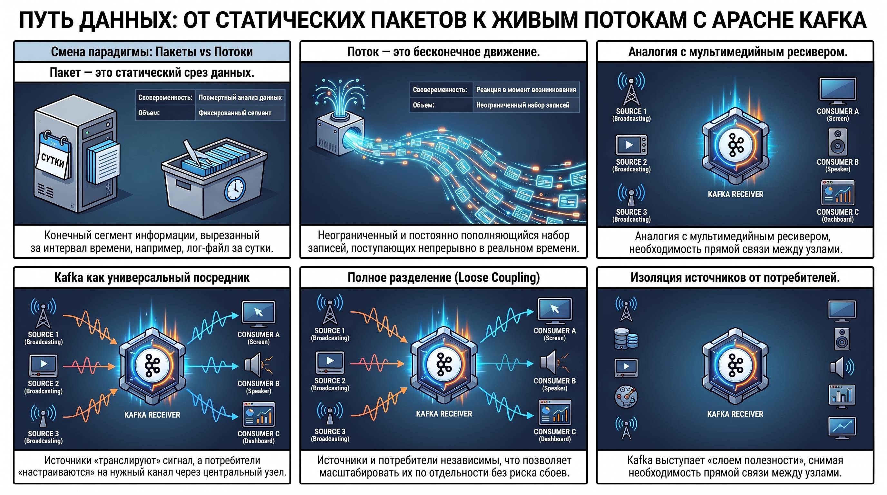
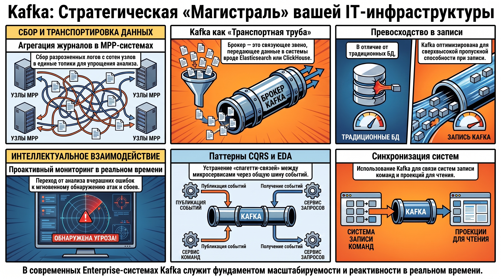
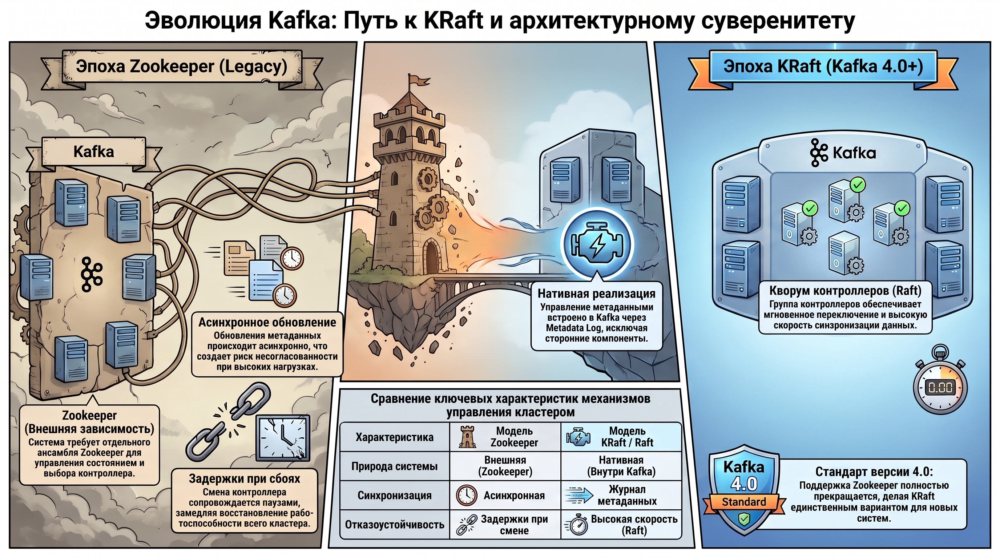
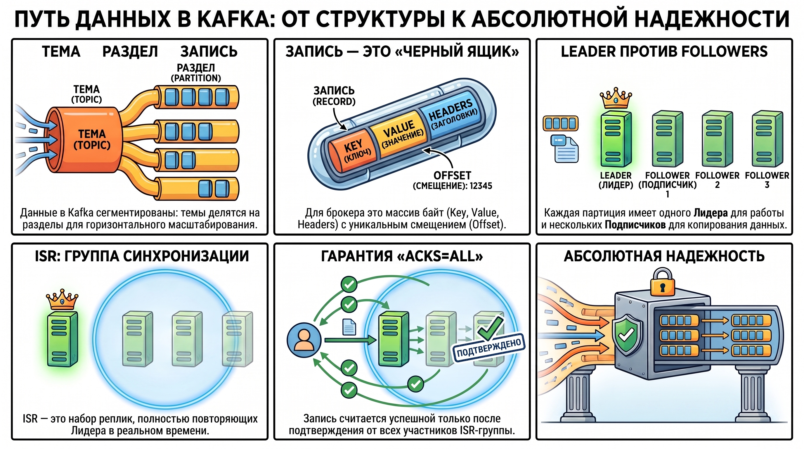
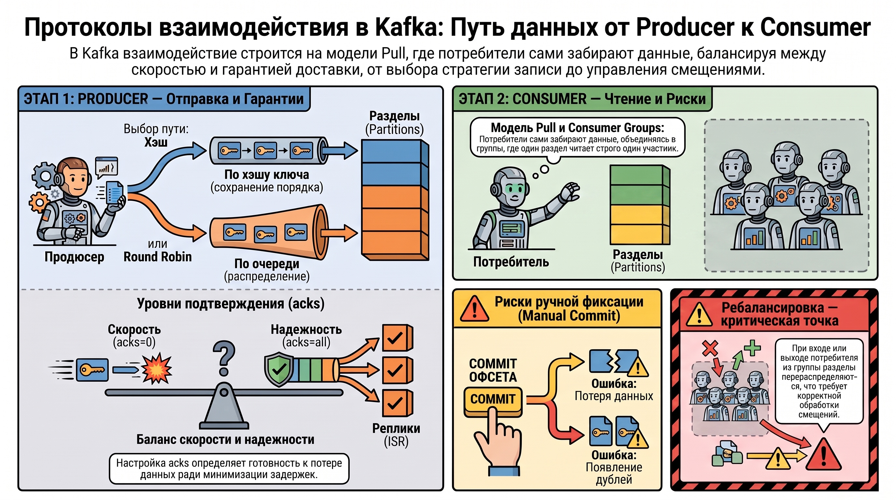
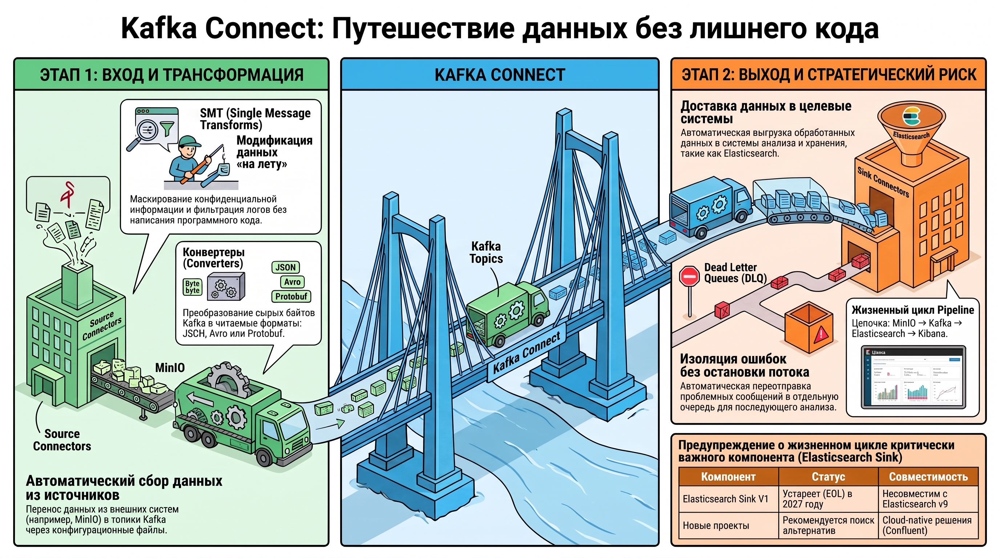

# Apache Kafka в архитектуре систем логирования и потоковой обработки

В современных высоконагруженных Enterprise-решениях наблюдается фундаментальный сдвиг: переход от периодической пакетной обработки (batch processing) к непрерывным потокам данных (stream processing). Архитектура, построенная вокруг Kafka, позволяет минимизировать задержки в анализе операционной информации, превращая логи из «посмертных артефактов» в топливо для систем проактивного мониторинга и принятия решений.

### 1. Концептуальные основы потоковой обработки данных

Стратегический переход к потоковой модели обусловлен необходимостью обработки событий в момент их возникновения. Для архитектора крайне важно различать базовые сущности системы:

* **Поток данных (Stream):**  Неограниченный, постоянно пополняющийся набор записей. Поток не имеет логического финала; данные поступают непрерывно.  
* **Пакет (Batch):**  Статический срез потока. По сути, это конечный сегмент данных, вырезанный за определенный интервал (например, лог-файл за прошлые сутки).

**Функциональная аналогия**  Кластер Kafka можно сравнить с  **бытовым мультимедийным ресивером** :  

* **Источники (Производители):**  Проигрыватели, антенны или приставки, генерирующие сигнал (данные).  
* **Потребители:**  Экран или динамики, воспроизводящие контент (обработка/визуализация).  
* **Kafka (Ресивер):**  Центральное звено, которое изолирует источники от потребителей. Производителю достаточно «транслировать» сигнал в шину, а потребителю — «настроиться» на нужный канал, не зная ничего о физической реализации источника.

**Синтез ценности**  Kafka формирует «слой полезности», обеспечивающий полную декаплинг-связность (loose coupling). Это позволяет независимо масштабировать генерацию логов и их последующий анализ, создавая гибкую и отказоустойчивую среду передачи данных.

### 2. Стратегические сценарии применения Kafka в IT-инфраструктуре

Брокеры сообщений являются фундаментом масштабируемости корпоративных систем. В отличие от традиционных БД, Kafka оптимизирована для сверхвысокой пропускной способности при записи.

* **Агрегация журналов в MPP-системах:**  В распределенных системах вроде Greenplum логи разрознены по сотням сегментных узлов. Kafka выступает централизованным транспортом, собирая журналы со всех хостов в единые топики для упрощения анализа и хранения.  
* **Проактивный мониторинг:**  Kafka позволяет перейти от фонового анализа («что сломалось вчера») к реакции в реальном времени. Например, анализ «на лету» позволяет мгновенно обнаруживать попытки несанкционированного доступа или зажигать алерты на дашбордах в момент возникновения ошибки.  
* **Архитектурные паттерны:**  
  * **CQRS (Command Query Responsibility Segregation):**  Kafka используется для синхронизации системы записи (команд) и проекций для чтения.  
  * **EDA (Event-Driven Architecture):**  В микросервисах Kafka устраняет спагетти-связи «point-to-point», организуя взаимодействие через общую шину событий.
  
Важно понимать: Kafka — это прежде всего  **транспортная труба** . Несмотря на возможность длительного хранения, она служит связующим звеном, передающим данные в специализированные системы (Elasticsearch, ClickHouse).

### 3. Техническая архитектура и эволюция механизмов консенсуса

Для обеспечения целостности данных в распределенной среде критически важен механизм консенсуса. В Kafka эта задача решается через разделение ролей:

* **Broker:**  Узел хранения данных и обслуживания клиентских запросов.  
* **Controller:**  Роль брокера, отвечающая за управление состоянием разделов и выбор ведущих реплик.

#### **Сравнительный анализ механизмов управления**

|Характеристика | Модель Zookeeper (Legacy) | Модель KRaft / Raft (Modern) |
| ------ | ------ | ------ |
| **Природа системы** | Внешняя зависимость (ансамбль ZK). | Нативная реализация внутри Kafka. |
| **Синхронизация** | Асинхронные обновления метаданных. | Журнал метаданных (Metadata Log). |
| **Отказоустойчивость** | Задержки при смене контроллера. | Кворум контроллеров (Raft), высокая скорость. |
| **Перспективы** | Поддерживается до версии 3.x. | **Единственный вариант в Kafka 4.0+.** |

**Архитектурное примечание:**  Версия Kafka 4.0 полностью удаляет поддержку Zookeeper. В Enterprise-инфраструктуре переход на KRaft устраняет «единую точку отказа» в виде внешней системы управления и значительно ускоряет восстановление кластера после сбоев контроллера.

### 4. Логическая структура данных: Темы, разделы и репликация

Внутренняя сегментация данных — ключ к горизонтальному масштабированию Kafka. Иерархия объектов строится следующим образом:  **Тема (Topic) → Раздел (Partition) → Запись (Record)**.

#### **Анатомия записи (Record)**

Для брокера Kafka запись является  **опаковым байтовым массивом (opaque byte array)** . Брокеру безразлично содержимое; схема данных (JSON, Avro, Protobuf) имеет значение только для клиента. Запись состоит из:

* **Key & Value:**  Наборы байт.  
* **Headers & Timestamp:**  Служебные метаданные.  
* **Offset:**  Неизменная, инкрементальная позиция записи в разделе.

#### **Обеспечение надежности и ISR**

Надежность гарантируется через Replication Factor. Каждая партиция имеет одну реплику  **Leader**  и несколько  **Followers** .

* **ISR (In-Sync Replicas):**  Это набор реплик, которые полностью синхронизированы с лидером.  
* При настройке `acks=all` (максимальная надежность), продюсер получит подтверждение только после того, как запись будет принята  **всеми членами ISR-группы** . Это исключает потерю данных при внезапном отказе лидера.

### 5. Протоколы взаимодействия: Producer и Consumer

Kafka использует модель  **Pull**  для потребителей, что позволяет клиентам читать данные с той скоростью, которую они способны выдержать, не опасаясь переполнения буферов.

#### **Producer: Баланс скорости и надежности**

Партиционирование происходит либо по хэшу ключа (гарантия порядка для одного ключа), либо через Round Robin (для пачек сообщений). Уровни подтверждения (`acks`) определяют риск: `acks=0` — максимальная скорость, `acks=1` — подтверждение только от лидера, `acks=all` — гарантия записи во все ISR.

#### **Consumer: Группы и риски ребалансировки**

Потребители объединяются в  **Consumer Groups**.

* **Правило архитектора:**  Один раздел может обрабатываться только одним потребителем в группе. Это «жесткий лимит» масштабирования: если потребителей больше, чем партиций, лишние узлы будут простаивать как «hot standbys».  
* **Риски Manual Commit:**  При использовании ручной фиксации офсетов критическим моментом является  **ребалансировка (Rebalance)**  (событие, когда потребитель покидает или входит в группу).  
  * **Пропуск данных:**  Если закоммитить офсет  *до*  фактической обработки и упасть во время выполнения.  
  * **Дубликаты:**  Если обработать данные, но не успеть закоммитить до того, как раздел будет отозван при ребалансировке и передан другому потребителю.

### 6. Конвейеры данных и экосистема Kafka Connect

Kafka Connect реализует концепцию Low-code интеграции (ETL/ELT). Это среда выполнения для коннекторов типов  **Source**  (из источника в Kafka) и  **Sink**  (из Kafka в цель).

**Преимущества платформы:**

* Автоматическое управление смещениями и Dead Letter Queues.  
* **Converters & SMT (Single Message Transforms):**  Поскольку брокер видит только байты, конвертеры на уровне Connect преобразуют их в структурированные форматы. С помощью SMT можно маскировать паспортные данные или фильтровать логи «на лету».

**Практическая реализация и стратегические риски:**  Типовая цепочка логирования:  *MinIO (через*  *`audit_kafka`*  *target) → Kafka Topic → Kafka Connect (Elasticsearch Sink) → Kibana*.

* **Enterprise-предупреждение:**  При планировании систем на базе Elasticsearch важно учитывать, что  **Elasticsearch Sink V1 объявлен устаревшим (EOL 2027)**  и несовместим с Elasticsearch v9. Для новых проектов следует рассматривать альтернативные пути интеграции или Cloud-native решения от Confluent.

### 7. Итог

* **Kafka как фундамент Observability:**  Система не является базой данных, а служит высокопроизводительной распределенной шиной для транспортировки потоков, обеспечивая изоляцию компонентов архитектуры.  
* **Технологический стек:**  Полный отказ от Zookeeper в версии 4.0 делает KRaft обязательным стандартом для новых инсталляций.  
* **Факторы стабильности:**  Стабильность систем логирования определяется балансом между количеством партиций (параллелизм), размером ISR (надежность) и корректной обработкой ребалансировок в потребителях.  
* **Экосистема:**  Kafka Connect минимизирует затраты на разработку кастомных клиентов, позволяя строить сложные конвейеры данных через конфигурационные файлы (JSON).
