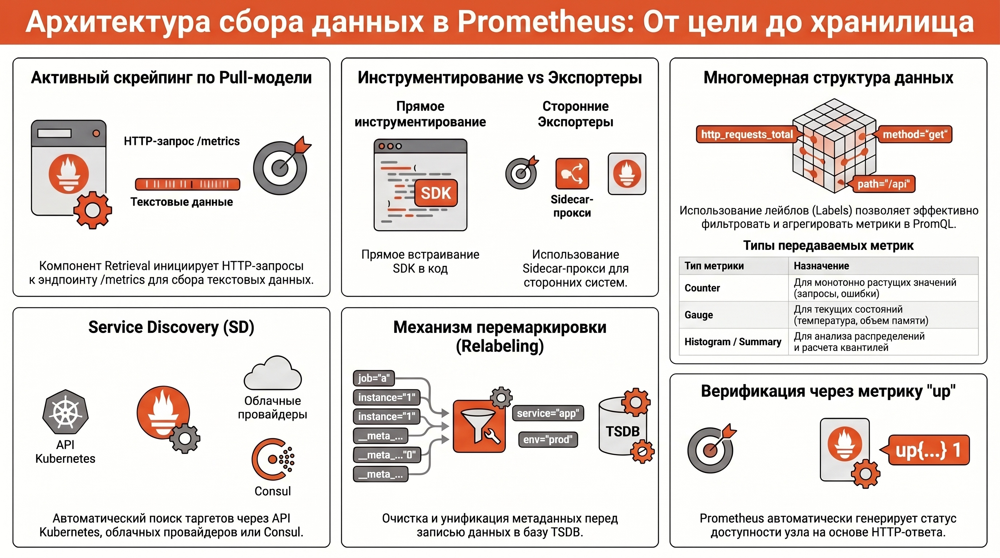
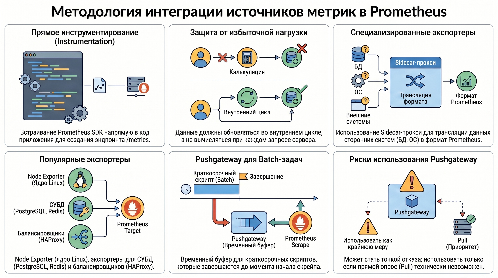
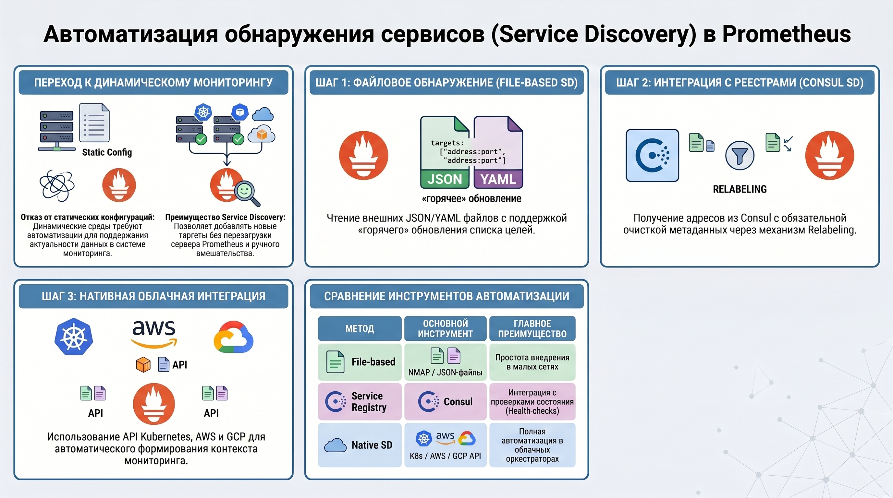

# Экосистема Prometheus — методы сбора данных и механизмы Service Discovery

### 1. Архитектурные принципы сбора метрик в Prometheus

Фундаментальную роль в архитектуре Prometheus играет компонент Retrieval, инициирующий процесс пополнения временных рядов (TSDB). Использование Pull-модели (инъекция телеметрии через опрос) является стратегическим решением для обеспечения детерминированности нагрузки на систему мониторинга. Это позволяет серверу самостоятельно контролировать интенсивность входящего трафика, предотвращая каскадные отказы хранилища при всплесках активности на целевых узлах.

* **Механизм скрейпинга (Scraping):** Телеметрия извлекается путем периодического опроса эндпоинтов по протоколам HTTP/HTTPS. Типовой ресурс `/metrics` представляет собой текстовую экспозицию, где каждая метрика снабжена метаданными `HELP` (описание) и `TYPE` (тип данных), а также полезной нагрузкой, включающей имя метрики, лейблы и актуальное значение.
* **Конфигурация параметров опроса:** Настройка таргетов в секции `scrape_configs` базируется на соотношении `scrape_interval` (периодичность) и `scrape_timeout` (время ожидания). Критическое архитектурное правило гласит: Timeout должен быть строго меньше Interval. Несоблюдение этого условия (Timeout \ge Interval) провоцирует «наложение скрейпов» (scrape overlapping) — состояние гонки, при котором TSDB не может дифференцировать задержавшийся ответ от нового цикла опроса, что приводит к пропускам данных и нарушению целостности временных рядов.
* **Слой влияния (So What?):** Для оптимизации производительности в крупномасштабных средах рекомендуется использовать параметры фильтрации `collect[]` и `exclude[]`, позволяющие запрашивать только необходимые коллекции метрик. Выбор интервалов опроса (от 10–15 сек для критических систем до 60+ сек для фоновых задач) напрямую определяет объем хранимых данных и точность выявления микро-всплесков (micro-bursts).

### 2. Методы экспозиции метрик: инструменты и подходы

Выбор метода получения данных определяется архитектурой целевой системы. Это обеспечивает возможность извлечения высококардинальной прикладной телеметрии непосредственно из среды выполнения или через изолированные агенты-посредники.

* **Инструментирование (Instrumentation):** Метод встраивания клиентских библиотек (SDK) в исходный код.
  * **Официально поддерживаемые SDK:** Go, Java/Scala, Python, Ruby и Rust.
  * **Сторонние реализации:** C#, Node.js, PHP, C++, .NET, Perl и другие. Инструментирование обеспечивает максимальную глубину наблюдаемости (observability), позволяя экспонировать внутренние состояния бизнес-логики.
* **Экспортеры (Exporters):** Выполняют роль адаптеров для систем, не поддерживающих формат Prometheus нативно.
  * **Node Exporter:** Стандарт для сбора метрик ОС (порт 9100). В контейнеризированных средах использование флага path.rootfs обязательно для корректной маппинга файловых систем хоста.
  * **Custom Exporters:** Реализация специфических эндпоинтов (например, на Python) требует строгой инициализации типов данных: Counter (монотонно растущий), Gauge (произвольное значение), Histogram или Summary.
* **Специфика пакетной обработки (Batch Jobs):**
  * **Pushgateway:** Предназначен для сервисных краткосрочных задач. Метрики регистрируются через Job/Instance.
  * **Textfile Collector (Node Exporter):** Критически важная альтернатива Pushgateway для задач уровня узла (например, cron-скрипты). Использование Textfile Collector предпочтительнее для метрик, жестко привязанных к конкретной машине, так как это сохраняет консистентность лейблов узла без усложнения архитектуры промежуточными шлюзами.
* **Слой влияния (So What?):** Выбор между Sidecar-паттерном (экспортер в отдельном контейнере) и прямым инструментированием — это баланс между универсальностью и потреблением ресурсов. Прямое встраивание SDK эффективнее, но требует синхронизации жизненных циклов приложения и системы мониторинга.

### 3. Механизмы Service Discovery (SD)

Service Discovery устраняет ограничение статической конфигурации, обеспечивая масштабируемость в динамических облачных инфраструктурах. Это позволяет автоматически актуализировать список целей мониторинга, минимизируя человеческий фактор.

* **Файловое обнаружение (File-based SD):** Механизм мониторинга внешних JSON/YAML файлов. Prometheus отслеживает изменения файлов в реальном времени, обновляя таргеты без перезагрузки сервера (SIGHUP), что позволяет интегрировать систему с любыми внешними базами инвентаризации (CMDB).
* **Интеграция с HashiCorp Consul:**
  * **Архитектурная логика:** Регистрация сервисов осуществляется через Consul HTTP API. В инфраструктурах на базе systemd это реализуется через параметры `ExecStartPost` (регистрация при запуске) и `ExecStop` (удаление при штатной остановке), что предотвращает ложные срабатывания алертов.
  * **Параметры секции** `consul_sd_configs`: Позволяют фильтровать таргеты по тегам (`services`, `tags`), обеспечивая логическое разделение сред (Prod/Stage).
* **Перемаркировка (Relabeling):** Процесс трансформации служебных мета-лейблов (например, `__meta_consul_service`, `__meta_consul_tags`, `__meta_consul_service_id`) в пользовательские атрибуты. Это критически важно для обеспечения чистоты данных и стандартизации именования в рамках всей организации.
* **Слой влияния (So What?):** Внедрение SD является обязательным условием для управления инфраструктурами объемом 700+ узлов. Автоматизация сокращает время обнаружения новых инстансов с минут до секунд, превращая мониторинг в адаптивную систему.

### 4. Аналитическая обработка данных и статистическая корректность

Сбор телеметрии требует аналитической дисциплины при визуализации, чтобы избежать ложных интерпретаций состояния систем.

* **Трансформация меток в Grafana:** Для метрик-индикаторов (где значение всегда "1", а полезная нагрузка — в лейблах, например, версия ПО) применяется функция `max` с группировкой по меткам. В интерфейсе Grafana используется трансформация `Organize fields` для сокрытия технических колонок (`Time`, `Value`), что позволяет формировать инвентарные таблицы.
* **Математическая ловушка усреднения перцентилей:** Усреднение значений p99 из TSDB является грубой математической ошибкой (fallacy of averaging ratios).
  * ***Пример:*** Если в первом интервале было 1 млрд запросов с задержкой 1 мс (p99 = 1 мс), а во втором — 100 запросов с задержкой 1000 мс (p99 = 1000 мс), то среднее значение (1 + 1000) / 2 = 500 мс будет абсолютно недостоверным. Истинный p99 для совокупной выборки останется близким к 1 мс.
* **Альтернативные подходы:** Для корректного анализа «хвостов» распределения (long tail latency) необходимо использовать гистограммы и тепловые карты (Heatmaps). Они сохраняют структуру распределения, позволяя видеть реальную плотность запросов за пределами целевых порогов SLA.
* **Слой влияния (So What?):** Принятие бизнес-решений на основе усредненных перцентилей создает иллюзию стабильности при наличии критических деградаций, затрагивающих малую, но важную часть пользовательского трафика.

### 5. Итоги

1. Сквозная логика сбора данных: Процесс выстроен как иерархия от экспозиции (SDK/Exporters) до автоматизированного обнаружения (SD) и последующей телеметрии через HTTP-скрейпинг.
2. Consul как "Источник истины": В динамических средах регистрация через HTTP API Consul обеспечивает актуальность мониторинга без ручного вмешательства.
3. Разделение ответственности методов экспозиции: Использование Pushgateway допустимо только для сервисных задач; для машинных cron-задач приоритетным является Node Exporter Textfile Collector для сохранения контекста узла.
4. Аналитическая строгость: Корректный мониторинг производительности требует отказа от усреднения квантилей в пользу гистограммного анализа распределений, что минимизирует риски пропуска аномалий в "длинном хвосте".
