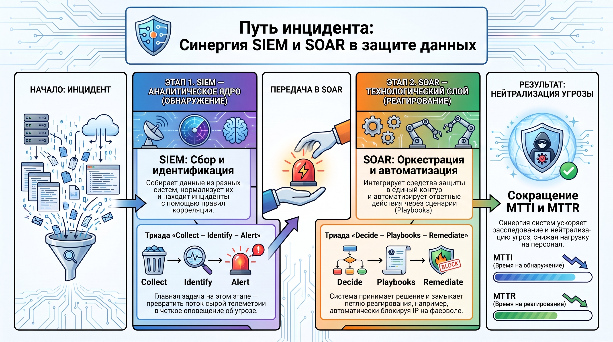
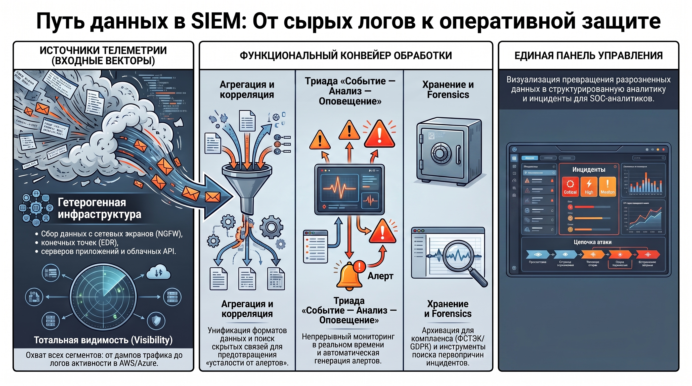
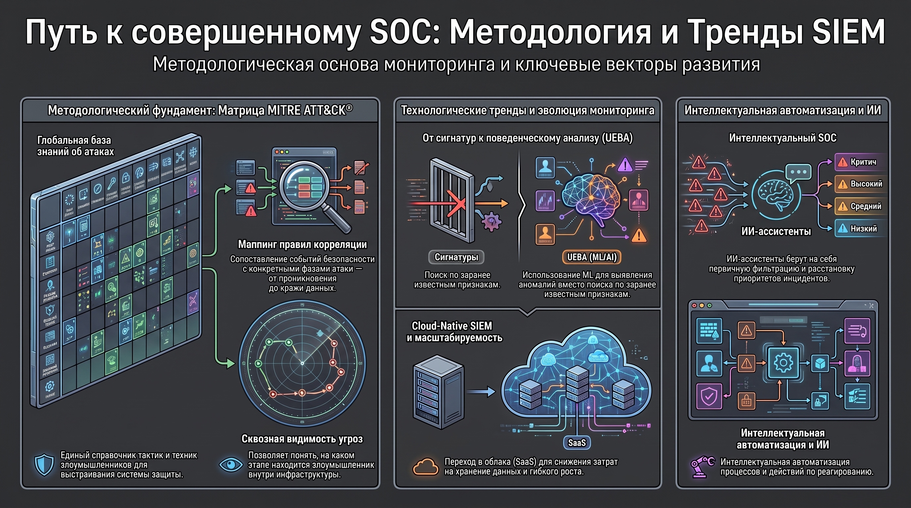
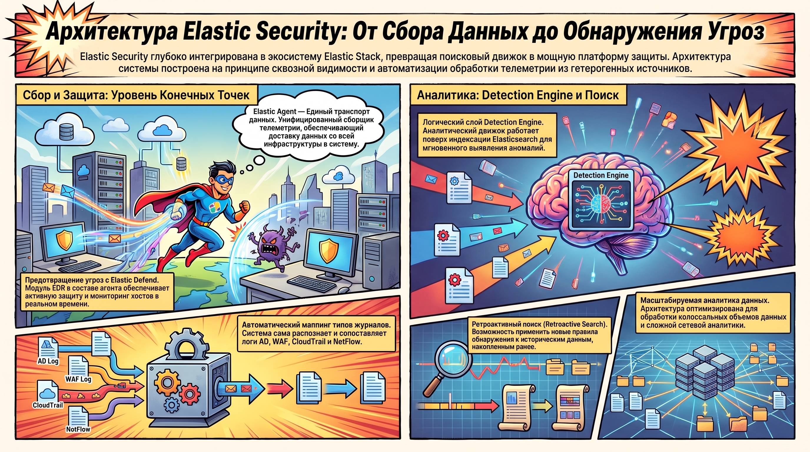
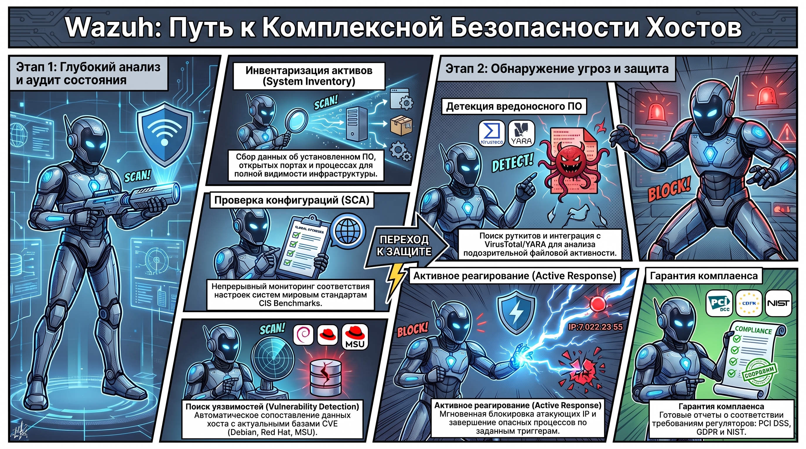

# Введение в SIEM-системы и прикладные решения мониторинга (Wazuh, Elastic Security)

### 1. Концептуальный базис: SIEM и SOAR в современной архитектуре ИБ

В современной архитектуре информационной безопасности переход от разрозненного мониторинга к централизованному управлению событиями обусловлен необходимостью обеспечения сквозной наблюдаемости ( **Observability** ) гетерогенной инфраструктуры. Централизация требуется для реализации корреляции кросс-стековой телеметрии и сокращения метрик среднего времени расследования ( **MTTI** ) в условиях высокой плотности информационных потоков.

#### **Дефиниции систем**

Для структурирования защитных механизмов используются два сопряженных класса систем:

* **SIEM (Security Information and Event Management):**  аналитическое ядро, предназначенное для сбора информации, нормализации данных и идентификации инцидентов на основе правил корреляции.  
* **SOAR (Security Orchestration, Automation and Response):**  технологический слой, обеспечивающий автоматизацию процессов реагирования и интеграцию средств защиты в единый управляемый контур.

#### **Взаимодополняемость технологий**

Синергия этих систем формирует законченный жизненный цикл инцидента. В то время как SIEM фокусируется на этапах сбора ( **Collect** ), идентификации ( **Identify** ) и генерации оповещений ( **Alert** ), SOAR расширяет функционал до уровня принятия решений ( **Decide** ) и исполнения сценариев ( **Playbooks** ). Ключевая ценность SOAR заключается в оркестрации внешних, в том числе неспецифических для ИБ систем (например, автоматическое изменение правил на межсетевых экранах через API), что позволяет эффективно замыкать петлю реагирования ( **Remediate** ).

Интеграция SIEM и SOAR закладывает фундамент для оперативного обнаружения и нейтрализации угроз, трансформируя пассивное накопление журналов в активную систему противодействия.

### 2. Функциональная модель и источники данных SIEM-систем

Архитектурно SIEM представляет собой иерархическую систему конвейерной обработки данных. Релевантность выходной аналитики детерминирована качеством входных векторов — векторов телеметрии, охватывающих все сегменты инфраструктуры.

#### **Классификация источников данных**

Для достижения полной видимости (Visibility) необходима ингестия данных из следующих категорий источников:

* **Сетевой уровень:**  Межсетевые экраны (NGFW), телеметрия NetFlow, дампы трафика (Full Packet Capture).  
* **Уровень обнаружения вторжений:**  IDS/IPS (сетевые и хостовые).  
* **Конечные точки:**  Антивирусное ПО, EDR-агенты, системные журналы (Event Logs, Syslog).  
* **Инфраструктурные сервисы:**  Серверы приложений, СУБД, службы каталогов (AD/LDAP).  
* **Облачный сегмент:**  Логи API-активности (AWS CloudTrail, Azure Monitor) и SaaS-приложений.

#### **Иерархия ключевых функций**

Процесс обработки событий структурирован следующим образом:

1. **Агрегация и нормализация:**  Сбор логов из гетерогенных источников и приведение их к унифицированному формату.  
2. **Корреляция событий:**  Аналитическая фильтрация и выявление неявных связей. Корреляция является критическим барьером, предотвращающим «усталость от алертов» ( **Alert Fatigue** ), которая выступает основным деструктивным фактором в работе SOC.  
3. **Real-time мониторинг:**  Непрерывная триада «событие–анализ–оповещение».  
4. **Долгосрочное хранение:**  Архивация данных для ретроспективного анализа и обеспечения комплаенса (GDPR, PCI DSS, требования ФСТЭК).  
5. **Forensics и Incident Response:**  Инструментарий для поиска первопричин (Root Cause Analysis).

Использование SIEM позволяет реализовать концепцию «единой панели управления» ( **Single Pane of Glass** ), что критически важно для сокращения метрик MTTD (время обнаружения) и MTTR (время реагирования).

### 3. Методологические основы и технологические тренды

Стандартизация знаний об атаках является обязательным условием для разработки эффективных правил обнаружения.

#### **База знаний MITRE ATT\&CK®**

Методологическим эталоном выступает матрица  **MITRE ATT\&CK**  — глобальная база тактик и техник злоумышленников. В архитектуре мониторинга она используется как справочная модель для маппинга правил корреляции, позволяя сопоставлять единичные события с конкретными фазами кибератаки (от Initial Access до Exfiltration).

#### **Векторы технологического развития**

* **ML и поведенческий анализ (UEBA):**  Переход от сигнатурного детекта к профилированию нормального поведения сущностей для выявления аномалий.  
* **Cloud-Native SIEM (SaaS):**  Масштабируемые облачные платформы, минимизирующие капитальные затраты на инфраструктуру хранения.  
* **Интеллектуальная автоматизация:**  Внедрение ИИ-ассистентов для первичной фильтрации и приоритизации инцидентов.

### 4. Сравнительный анализ SIEM-решений: локальный и глобальный контекст

Выбор архитектурного решения требует баланса между технологическим совершенством, геополитическими рисками и регуляторными требованиями.

#### **Российский сегмент SIEM**

В условиях импортозамещения и необходимости защиты объектов критической информационной инфраструктуры ( **КИИ** ) приоритет отдается отечественным вендорам:

* **MaxPatrol SIEM**  (Positive Technologies)  
* **KUMA**  (Kaspersky Unified Monitoring and Analysis Platform)  
* **Solar SIEM**  (ГК «Солар»)  
* **UserGate SIEM**  
* **R-Vision SIEM**

#### **Критическая оценка**

**Преимущества:**  Сертификация  **ФСТЭК России**  является императивным требованием для государственных ИС и КИИ. Наличие предустановленных правил (Out-of-the-box), адаптированных под требования локальных регуляторов, существенно ускоряет ввод системы в эксплуатацию.

**Ограничения:**  Высокая стоимость владения и специфический фокус на локальный рынок, что иногда затрудняет интеграцию с глобальными облачными сервисами первого эшелона.

### 5. Архитектурные особенности Elastic Security

**Elastic Security**  глубоко интегрирована в экосистему Elastic Stack, превращая поисковый движок в аналитическую платформу защиты.

#### **Компонентная база**

* **Elastic Agent:**  Единый унифицированный сборщик телеметрии, выполняющий роль транспорта данных.  
* **Elastic Defend:**  Модуль EDR, обеспечивающий защиту конечных точек в реальном времени.  
* **Elastic Endpoint:**  Специализированный компонент в составе агента, отвечающий за непосредственный мониторинг и предотвращение угроз на хосте.  
* **Detection Engine:**  Логический слой, функционирующий поверх индексации Elasticsearch. Он позволяет проводить  **ретроактивный поиск**  — применение новых правил обнаружения к историческим данным, накопленным до момента создания правила.

Архитектура поддерживает автоматический маппинг типов журналов (AD, WAF, CloudTrail, NetFlow), что минимизирует трудозатраты на конфигурирование правил детекции.

### 6. Прикладной анализ функциональных модулей Wazuh

Wazuh позиционируется как комплексное решение, сочетающее возможности SIEM, HIDS (Host-based IDS) и управления уязвимостями.

#### **Анализ ключевых модулей**

* **Security Configuration Assessment (SCA):**  Мониторинг соответствия конфигураций стандартам  **CIS Benchmarks**  и внутренним политикам.  
* **Vulnerability Detection:**  Идентификация уязвимостей путем сопоставления инвентаризационных данных с актуальными CVE-фидами (включая  **Canonical, Debian, Red Hat, MSU** ).  
* **System Inventory:**  Модуль инвентаризации активов, отслеживающий установленное ПО, открытые порты, активные процессы и сетевые интерфейсы.  
* **Malware Detection:**  Механизмы rootcheck для поиска руткитов и глубокая интеграция с VirusTotal/YARA для анализа файловой активности.  
* **Active Response:**  Модуль автоматизированного противодействия (блокировка IP, завершение процессов) по триггерам высокой критичности.

Wazuh также предоставляет нативную поддержку мониторинга контейнерных сред (Docker) и облачных инфраструктур, обеспечивая визуализацию комплаенса по стандартам PCI DSS, GDPR и NIST.

### 7. Итог

**Результирующая матрица выбора:**

1. **Масштабируемая аналитика (Elastic Security):**  Оптимальна при необходимости обработки колоссальных объемов данных и сложной аналитики сетевого уровня. Сильной стороной является гибкость Detection Engine и возможности ретроактивного поиска.  
2. **Глубина хостового мониторинга (Wazuh):**  Идеальное решение для детального контроля состояния конечных точек, управления уязвимостями и контроля конфигураций (Asset Management).  
3. **Регуляторный комплаенс (Отечественные SIEM):**  Безальтернативный выбор для организаций, подпадающих под действие ФЗ-187 (КИИ) и требующих сертификации ФСТЭК.

Архитектор должен рассматривать выбор инструмента не как поиск универсального средства, а как проектирование системы, соответствующей специфике угроз и масштабу защищаемой инфраструктуры.
