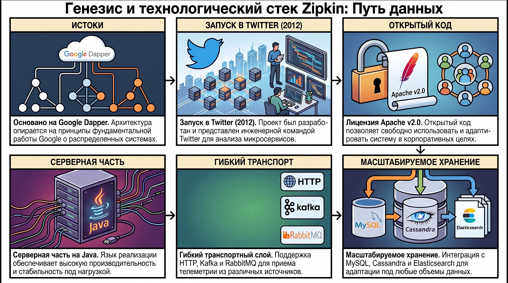
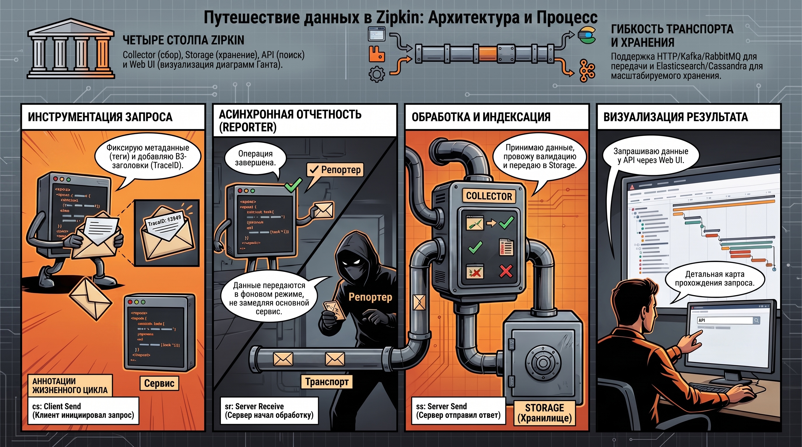
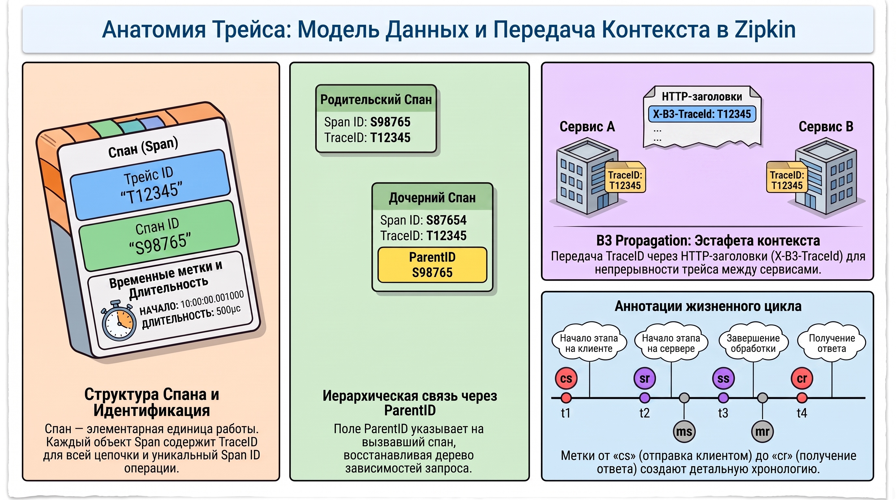
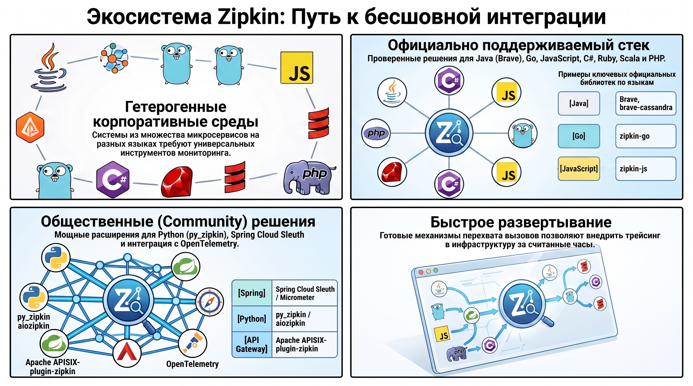
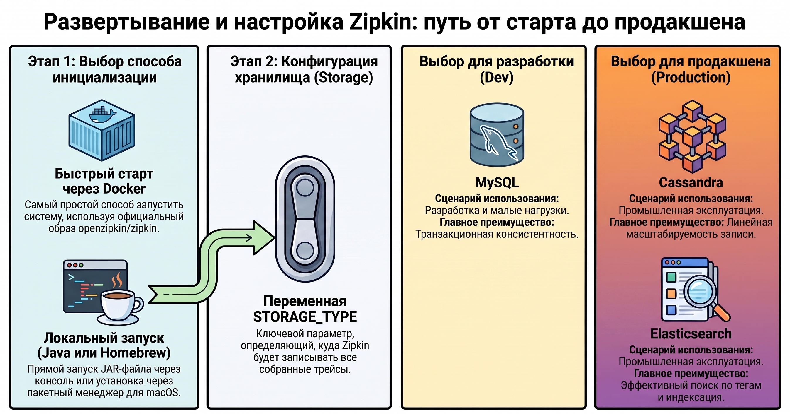

# Проектирование и внедрение систем распределенного трейсинга на примере Zipkin

### 1. Генезис и технологический стек системы Zipkin

В условиях современной микросервисной архитектуры распределенный трейсинг эволюционировал из вспомогательного инструмента в стратегический компонент методологии Observability. Высокая степень связности и эфемерность узлов в распределенных системах делают невозможным эффективный анализ инцидентов без визуализации полного пути запроса. Zipkin выступает в качестве фундаментального решения этой задачи, предоставляя стандартизированную инфраструктуру для агрегации телеметрии и обеспечивая прозрачность взаимодействия в гетерогенных средах.

#### **1.1. История возникновения и правовой статус**

Система Zipkin обладает выраженной технологической преемственностью и прозрачным юридическим статусом:

* **Разработчик и дата запуска:**  Проект представлен инженерной командой Twitter в 2012 году.  
* **Теоретическая база:**  Архитектура системы опирается на принципы, изложенные в фундаментальной работе Google — «Dapper, a Large-Scale Distributed Systems Tracing Infrastructure».  
* **Правовой статус:**  Исходный код распространяется под лицензией  **Apache v2.0** , что допускает его неограниченное использование в корпоративных контурах.

#### **1.2. Технологический базис и поддерживаемые протоколы**

Технологический стек Zipkin спроектирован с приоритетом на гибкость интеграции и производительность:

* **Язык реализации:**  Серверная часть разработана на  **Java** , что обеспечивает стабильную работу под нагрузкой и широкие возможности профилирования.  
* **Транспортный слой:**  Система поддерживает разнообразные механизмы приема данных, включая  **HTTP** ,  **Kafka**  и  **RabbitMQ** .  
* **Подсистемы хранения:**  Поддерживается интеграция с  **MySQL** ,  **Cassandra**  и  **Elasticsearch**.

Гибкость выбора между механизмами транспортировки и хранения позволяет адаптировать систему как для малых инсталляций, так и для глобально распределенных кластеров. Выбор конкретного технологического стека напрямую определяет внутреннюю архитектурную организацию и возможности масштабирования системы.

### 2. Архитектурная модель и функциональные компоненты

Масштабируемость процесса сбора и анализа трейсов в Zipkin достигается за счет строгой модульной структуры. Такое разделение ответственности позволяет независимо масштабировать компоненты приема и визуализации данных в зависимости от текущей нагрузки.

#### **2.1. Функциональные блоки системы**

На основе архитектурной схемы Zipkin выделяются четыре базовых компонента:

1. **Collector:**  Осуществляет прием данных из транспортного слоя, их валидацию и индексацию.  
2. **Storage:**  Абстрактный интерфейс персистентности, обеспечивающий корректную запись спанов в выбранную БД.  
3. **API (Search/Query Service):**  Сервис для извлечения и фильтрации трейсов по TraceID и метаданным.  
4. **Web UI:**  Интерфейс визуализации, предоставляющий временную диаграмму (Gantt chart) прохождения запроса.

Важной архитектурной особенностью является способность системы фиксировать взаимодействие с  **Non-instrumented servers**. Это позволяет визуализировать вызовы к внешним API или ненастроенным узлам, сохраняя целостность топологии запроса, хотя и с меньшей детализацией на стороне целевого сервиса.

#### **2.2. Процесс передачи и обработки данных**

Путь данных от клиентского кода к хранилищу жестко регламентирован для минимизации влияния на бизнес-логику. Процесс инструментации (Trace Instrumentation) следует четкому алгоритму:

1. **Record tags:**  Фиксация метаданных операции.  
2. **Add trace headers:**  Обогащение запроса идентификаторами трейса.  
3. **Record timestamp:**  Фиксация времени начала операции.  
4. **Invoke request:**  Непосредственный вызов целевого сервиса.  
5. **Record duration:**  Расчет и фиксация длительности после получения ответа.

Инструментарий клиента ( **Reporter** ) осуществляет  **асинхронную передачу данных**  (Asynchronously report span) через слой  **Transport**. Данный подход гарантирует, что задержки в работе Collector или транспортной шины не приведут к деградации производительности основного приложения. Архитектурная надежность этой схемы подкрепляется строгой спецификацией модели передаваемых данных.

### 3. Спецификация модели данных и механизмы контекстной передачи

Стандартизация метаданных является залогом когнитивной ясности при анализе сложных распределенных каскадов. Модель данных Zipkin построена вокруг понятия спана как элементарной единицы работы.

#### **3.1. Структура спана и идентификация трейса**

Каждый объект данных (Span) содержит набор обязательных полей:

* **TraceID:**  Глобальный 64 или 128-битный идентификатор всей цепочки вызовов.  
* **Id (Span ID):**  Уникальный идентификатор текущей операции.  
* **ParentID:**  Идентификатор вызвавшего спана (отсутствует у корневого элемента).  
* **Name:**  Описание операции (например, GET /api/v1/data).  
* **Timestamp и Duration:**  Метрики времени начала и продолжительности (в микросекундах).

Для обеспечения непрерывности трейса между микросервисами используется механизм  **B3 Propagation**. Он определяет передачу контекста через HTTP-заголовки, такие как  **X-B3-TraceId**  и  **X-B3-SpanId**, что позволяет принимающей стороне восстановить иерархическую связь.

#### **3.2. Типология аннотаций жизненного цикла запроса**

Для детальной фиксации критических этапов обработки Zipkin использует систему стандартизированных аннотаций:

| Код | Определение | Техническая роль в жизненном цикле |
| ------ | ------ | ------ |
| **cs** | Client Send | Начало спана: клиент инициировал запрос. |
| **sr** | Server Receive | Сервер получил запрос и начинает обработку. |
| **ss** | Server Send | Сервер завершил работу и отправил ответ. |
| **cr** | Client Receive | Завершение спана: ответ получен клиентом. |
| **ms** | Message Send | Продюсер отправил сообщение в очередь (асинхронно). |
| **mr** | Message Receive | Консюмер получил сообщение из очереди. |

Данная модель данных поддерживается обширным набором инструментов, обеспечивающих бесшовную интеграцию в программный код.

### 4. Экосистема клиентских библиотек и интеграция

Широта поддержки различных языков программирования является ключевым фактором применимости Zipkin в гетерогенных корпоративных средах.

#### **4.1. Официально поддерживаемый и общественный инструментарий**

Библиотеки классифицируются по уровню поддержки и стабильности:

**Официально поддерживаемые (Supported):**

* **Java:**  Brave, brave-cassandra  
* **Go:**  zipkin-go  
* **JavaScript:**  zipkin-js  
* **C\#:**  Zipkin4net  
* **Ruby:**  zipkin-ruby  
* **Scala:**  zipkin-finagle  
* **PHP:**  zipkin-php

**Общественные решения (Community supported):**  

* **Java:**  Spring Cloud Sleuth, Micrometer Tracing, Wingtips, kafka-interceptor-zipkin  
* **Go:**  zipkin-go-opentracing, zipkintracing, zipkin-go-sql  
* **Python:**  py_zipkin, pyramid_zipkin, swagger_zipkin, aiozipkin  
* **PHP:**  zipkin-php-opentracing, zipkin-instrumentation-symfony  
* **Другие:**  Apache APISIX-plugin-zipkin, решения на базе OpenTelemetry.

Развитая экосистема позволяет быстро развернуть систему мониторинга в существующей инфраструктуре, используя готовые механизмы перехвата вызовов.

### 5. Методология развертывания и конфигурации хранилищ

Выбор стратегии развертывания и типа хранилища является критическим архитектурным решением, определяющим надежность всей системы Observability.

#### **5.1. Способы инициализации системы**

Zipkin предлагает несколько стандартных методов запуска:

* **Docker:**  
* **Java (Quickstart):**  
* **Homebrew:**

#### **5.2. Конфигурация подсистем хранения**

Режим персистентности управляется через переменную `STORAGE_TYPE`. С точки зрения архитектуры, выбор БД — это баланс между простотой и масштабируемостью:

* **MySQL:**  Оправдан для сред разработки или малых нагрузок, где важна транзакционная консистентность.  
* **Cassandra / Elasticsearch:**  Являются индустриальным стандартом для  **Production** . Cassandra обеспечивает линейную масштабируемость записи, а Elasticsearch — эффективный полнотекстовый поиск по тегам и индексацию больших объемов трейсов.

Пример конфигурации для промышленной эксплуатации: `STORAGE_TYPE=elasticsearch`, `ES_NODES=http://es-cluster:9200`.

### 6. Итог

Внедрение Zipkin позволяет значительно минимизировать среднее время диагностики (MTTD) за счет использования стандартизированной модели данных и механизмов контекстной передачи B3. Благодаря асинхронной архитектуре сбора данных и широкой поддержке библиотек, система обеспечивает глубокую наблюдаемость без внесения значительных накладных расходов в работу бизнес-сервисов.  
