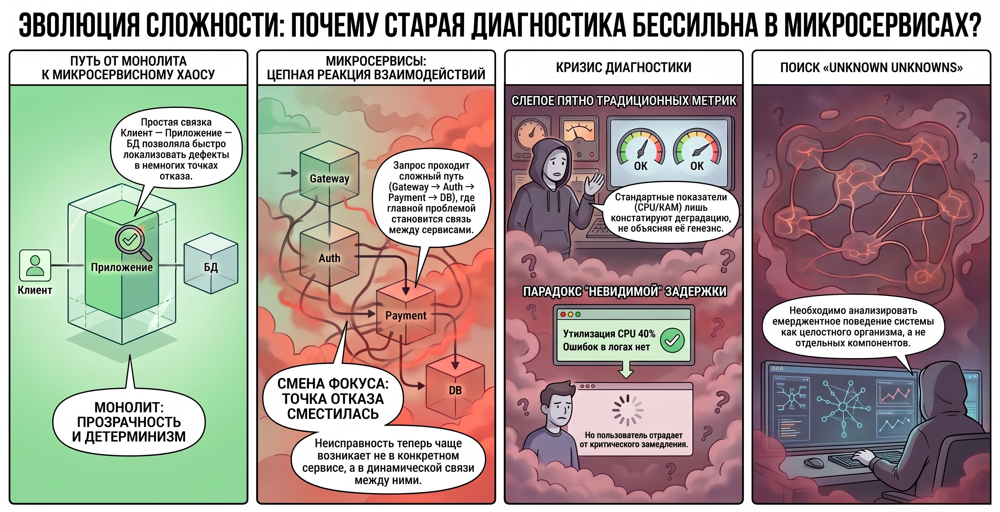
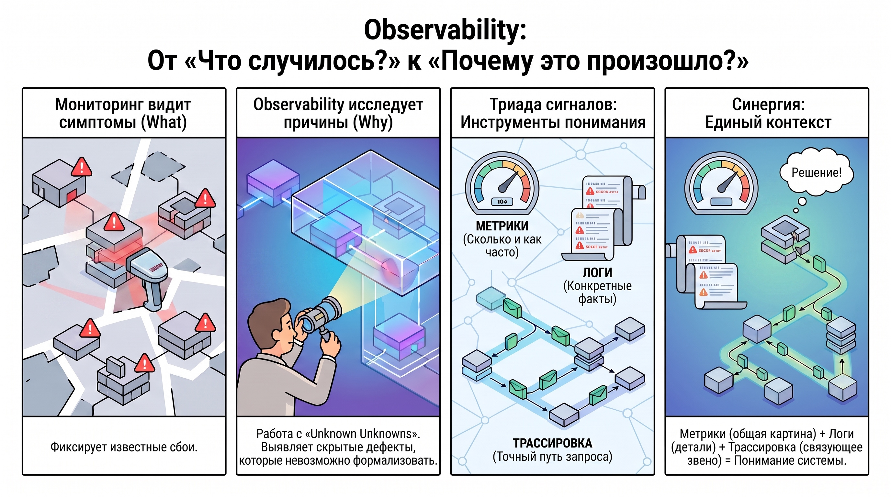
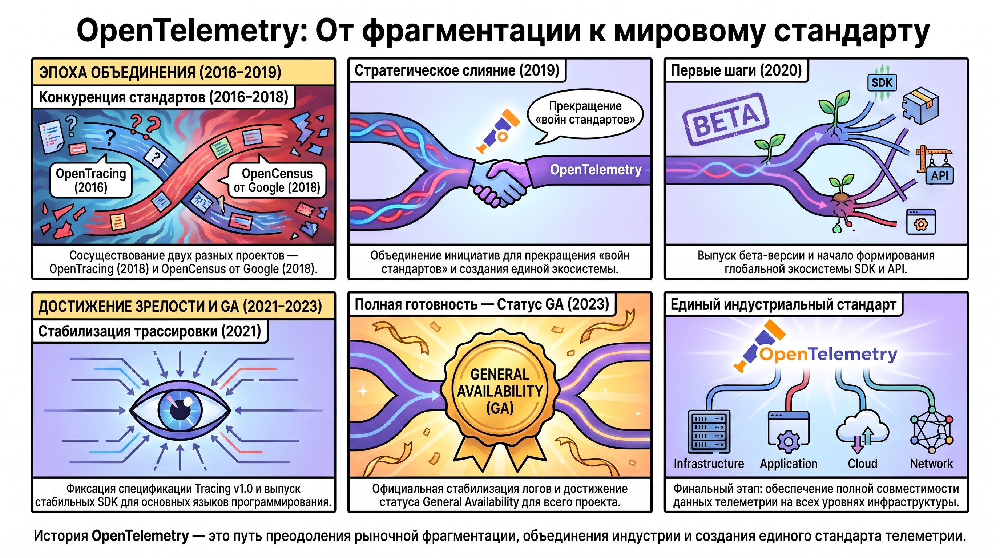
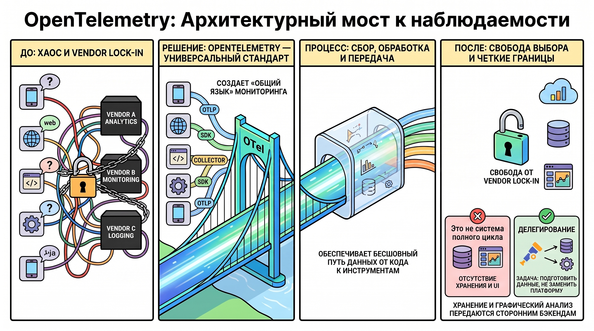

# OpenTelemetry и архитектура систем распределенного трейсинга

### 1. Проблематика диагностики современных распределенных ИТ-систем

Стремительная эволюция ИТ-ландшафта диктует необходимость перехода к качественно иным методам системной диагностики. В условиях, когда архитектурная сложность растет экспоненциально, традиционные реактивные подходы к мониторингу перестают обеспечивать необходимый уровень прозрачности, превращая поиск неисправностей в процесс с низкой предсказуемостью результата.

#### **Смена архитектурных парадигм и деградация эффективности классического мониторинга**

Классическая парадигма «Монолита» (структурная связка Client — App — DB) характеризовалась высокой степенью детерминированности: локализация дефектов была быстрой в силу минимального количества точек отказа и прозрачности межкомпонентных связей. Современная микросервисная модель эксплуатации радикально меняет ситуацию. Транзитный запрос теперь инициирует сложную цепочку взаимодействий через множество распределенных узлов: Gateway → Auth → User → Payment → Notify → DB. В такой среде «точкой отказа» чаще становится не конкретный сервис, а динамическая связь между ними, что делает классические методы наблюдения за изолированными компонентами нерелевантными.

#### **Критические дефициты диагностических данных**

Фундаментальная проблема заключается в невозможности идентифицировать латентные задержки («Unknown Unknowns») с помощью стандартного инструментария. Метрики агрегированного уровня (CPU/RAM) и статус-коды 5xx лишь констатируют факт деградации, но не объясняют её генезис. Типичный сценарий — утилизация CPU на уровне 40%, отсутствие явных ошибок в логах, но при этом критическое замедление времени отклика для пользователя. В распределенной среде без специализированных контекстных данных невозможно определить, где именно локализован дефект: в сетевом уровне, в неоптимальном запросе к БД, в ожидании внешнего API или в некорректной логике очередей и механизмов повторных попыток (retries/timeouts).

Для сохранения управляемости систем необходим стратегический переход от простого мониторинга состояния отдельных компонентов к анализу эмерджентного поведения системы как целостного организма.

### 2. Концептуальные основы Observability: Сигналы и критерии

Теоретический фундамент Observability (наблюдаемости) базируется на расширении классического мониторинга до уровня многомерного анализа, позволяющего выводить внутреннее состояние системы на основе её внешних данных.

#### **Дифференциация мониторинга и Observability**

Различия между подходами носят качественный характер и могут быть систематизированы по следующим академическим критериям:

* **Фокус анализа:**  Традиционный мониторинг сосредоточен на жизнеспособности отдельных компонентов (сервер, сервис). Observability анализирует поведение системы в целом и её эмерджентные свойства.  
* **Вектор исследования:**  Мониторинг отвечает на вопрос «Что случилось?» ( **What** ), фиксируя инцидент. Observability отвечает на вопрос «Почему это случилось?» ( **Why** ), выявляя причинно-следственные связи.  
* **Категория проблем:**  Мониторинг эффективно справляется с известными типами сбоев ( **Known Knowns** ), тогда как Observability предназначена для выявления и исследования непредвиденных аномалий ( **Unknown Unknowns** ), которые невозможно формализовать заранее.

#### **Триада сигналов телеметрии**

Для реализации концепции наблюдения события в нескольких «измерениях» используется стандартизированная триада сигналов:

1. **Metrics (Метрики):**  Количественные показатели (числа, тренды). Отвечают на вопрос «Сколько и как часто?», позволяя отслеживать динамику ресурсов.  
2. **Logs (Логи):**  Событийный контекст (события, ошибки). Фиксируют атомарные факты и дискретные аномалии: «Что именно произошло?».  
3. **Tracing (Трассировка):**  Контекстуализированный путь прохождения запроса. Показывает «Где именно?» возникла проблема в цепочке распределенной системы.

Подводя итог, Observability представляет собой методологию многомерного наблюдения, где Metrics дают верхнеуровневую картину, Logs — детализацию инцидентов, а Tracing связывает их в единый контекст выполнения.

### 3. Генезис и эволюция проекта OpenTelemetry

История OpenTelemetry — это путь индустриальной консолидации, направленный на устранение фрагментации рынка диагностического ПО и предотвращение «войн стандартов» между вендорами.

#### **Историческая ретроспектива и объединение стандартов**

Ключевой вехой стал 2019 год, когда произошло слияние двух конкурирующих инициатив: OpenTracing (запущен в 2016 г.) и OpenCensus (проект Google, 2018 г.). Это слияние имело стратегическое значение для отрасли, так как позволило избежать дальнейшей сегментации инструментов и создало единый, вендоронезависимый стандарт сбора данных. В 2020 году была представлена первая бета-версия, ставшая отправной точкой для формирования экосистемы SDK и API.

#### **Текущий статус и стабилизация протоколов**

Проект прошел через серию этапов достижения зрелости:

* **2021 год:**  Спецификация Tracing v1.0 официально закреплена, что гарантировало стабильность протокола для промышленного использования. Одновременно были выпущены стабильные SDK для основного стека языков (Java, .NET, Python, Go, Node.js).  
* **2023 год:**  На конференции  **KubeCon+CloudNativeCon NA 2023**  было объявлено о стабилизации Logs и достижении статуса  **General Availability (GA)**  для всего проекта.

Этот момент ознаменовал завершение формирования единого индустриального стандарта, обеспечивающего полную интероперабельность данных телеметрии на всех уровнях инфраструктуры.

### 4. Архитектурные принципы и границы применимости OpenTelemetry

В архитектуре современного Observability-стека OpenTelemetry занимает роль универсального связующего звена, обеспечивая прозрачную передачу данных от приложения к аналитическим платформам.

#### **Целеполагание и технологический охват**

OpenTelemetry — это набор протоколов, API и инструментов (SDK, Collector), создающих «стандартный язык» для систем мониторинга. Центральным элементом является протокол  **OTLP**  (OpenTelemetry Protocol), который обеспечивает бесшовную интероперабельность. Ключевая ценность для архитектора заключается в защите от vendor lock-in: разработчик может внедрять инструменты наблюдения, сохраняя полную независимость от конкретных вендоров аналитических бэкендов или языков программирования.

#### **Архитектурные ограничения и функциональное разделение**

жно четко понимать границы применимости: OpenTelemetry  **не является полноценной системой мониторинга**  полного цикла. В её архитектуре намеренно отсутствуют механизмы для:

1. **Хранения данных (Backend):**  OTel не отвечает за долговременную базу данных телеметрии.  
2. **Визуализации:**  OTel не содержит инструментов для построения дашбордов или графического анализа.

Задача OpenTelemetry — сбор, первичная обработка и стандартизированная передача сигналов. Хранение и визуализация делегируются специализированным внешним инструментам. Таким образом, проект выступает в качестве универсального интерфейса, гарантирующего чистоту и совместимость данных.

### 5. Итог

Внедрение OpenTelemetry радикально решает проблему диагностики «Unknown Unknowns» в современных распределенных системах. Путем жесткой стандартизации сбора и передачи трех типов сигналов —  **Metrics (числа и тренды), Logs (события и ошибки) и Tracing (путь запроса)**  — проект создает фундамент для глубокой аналитики без привязки к конкретному вендору или языку разработки. Главный результат использования данного подхода заключается в переходе от фрагментарного наблюдения за узлами к целостному пониманию поведения системы, что позволяет специалистам фокусироваться на поиске истинных причин деградации (Why), а не на борьбе с несовместимостью диагностических инструментов.  
