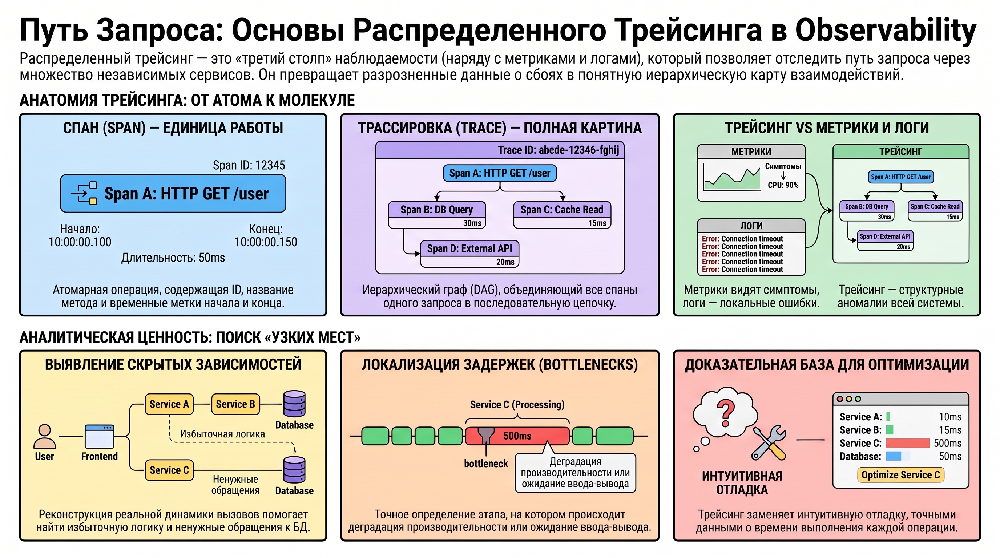
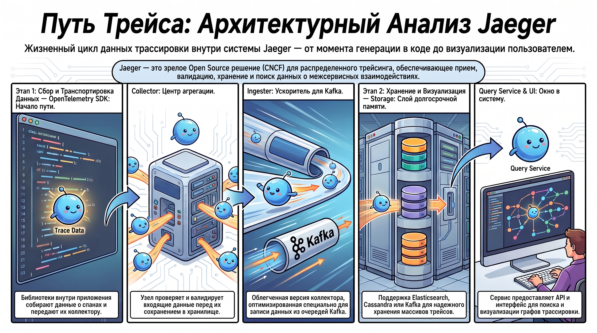
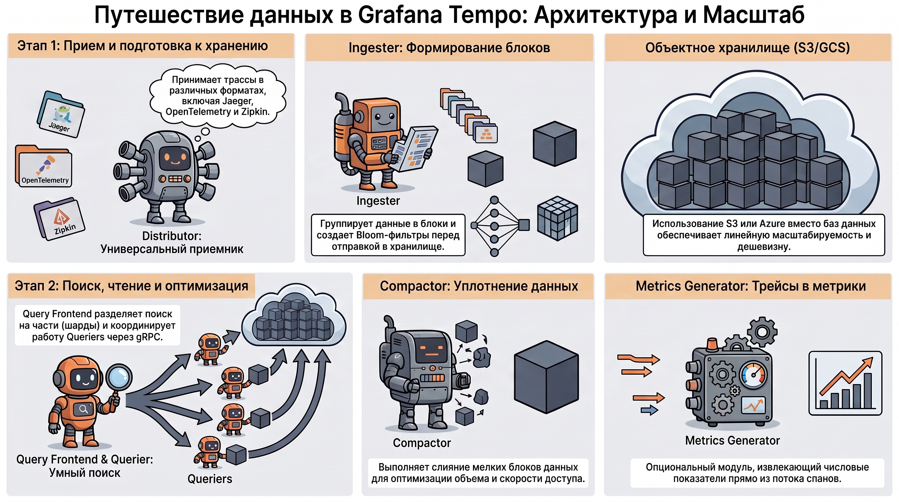

# Системы распределенного трейсинга: Jaeger и Grafana Tempo

### 1. Концептуальные основы распределенного трейсинга в парадигме Observability

В современной микросервисной архитектуре распределенный трейсинг занимает стратегическое положение, являясь одним из «трех столпов» (pillars) наблюдаемости систем наряду с метриками и структурированным логированием. Его внедрение обеспечивает прозрачность сложных межсервисных взаимодействий: если метрики сигнализируют о деградации, а логи локализуют ошибку в контексте одного узла, то трейсинг позволяет реконструировать полный путь запроса, выявляя структурные аномалии и неявные зависимости в распределенной среде.

#### **Определение и терминологический аппарат**

Распределенный трейсинг — это метод мониторинга, предназначенный для отслеживания пути запросов через гетерогенные системы, обеспечивающий понимание последовательности обработки и локализацию проблемных областей. Технология оперирует следующими формализованными сущностями:

* **Span (Спан):** Атомарная единица работы или операция внутри системы. Согласно спецификациям, спан включает обязательные атрибуты:
  * Название сервиса;
  * Уникальный идентификатор (ID) и ID родительского спана (Parent ID);
  * Название вызываемого метода;
  * Временные метки начала и окончания (Time stamps), используемые для прецизионного расчета длительности операции.
* **Трассировка (Trace):** Иерархическая совокупность спанов, связанных логической последовательностью. Математически трассировка представляет собой направленный ациклический граф (DAG), описывающий прохождение запроса через все компоненты инфраструктуры.

Переход от концептуального описания к прикладному анализу позволяет трансформировать сырые данные в доказательную базу для оптимизации производительности.

### 2. Функциональные задачи и аналитическая ценность трассировки

Применение трейсинга переводит процесс отладки из плоскости интуитивного поиска в область доказательного анализа, предоставляя детальную визуализацию каждого системного вызова.

#### **Идентификация и устранение деградации производительности**

Трейсинг позволяет выявлять «узкие места» (bottlenecks) в дереве выполнения:

* **Последовательные вызовы:** Обнаружение избыточных цепочек запросов (например, к геокодингу или БД), требующих оптимизации.
* **Задержки ввода-вывода:** Локализация ожиданий при сетевых транзакциях или операциях с дисковой подсистемой.
* **Вычислительная сложность:** Выявление ресурсоемких задач (парсинг, CPU-intensive операции).
* **Детекция избыточной логики:** Трейсинг позволяет идентифицировать участки кода, которые не влияют на конечный результат и могут быть удалены или переведены в отложенный режим выполнения.

#### **Визуализация и документация системных взаимодействий**

Трассировка реконструирует реальную динамику вызовов, заменяя статическую документацию. Анализ трейса может выявить неоптимальные сценарии, например: сервис WS обращается к R, затем к V; сервис V загружает данные из R, обращается к P, который снова вызывает R; при этом V может проигнорировать полученный результат и уйти в сервис J, продолжая фоновые вычисления после возврата ответа в WS. Подобная прозрачность критична в условиях, когда код скрыт за множеством абстракций и распределен по независимым репозиториям.

#### **Сбор данных и генерация метрик**

Для ретроспективного анализа трейсы обогащаются контекстом: ID пользователя, правами доступа и специфическими ошибками. Кроме того, агрегированные данные трассировки служат фундаментом для генерации производных аналитических метрик, позволяющих оценивать общее состояние здоровья системы.

### 3. Технологические вызовы и ограничения при внедрении

Внедрение систем трассировки сопряжено с необходимостью балансировки между глубиной анализа и эксплуатационными затратами.

#### **Инфраструктурные и эксплуатационные барьеры**

* **Критический объем данных:** Трейсинг генерирует массивы информации, требующие значительных ресурсов для записи и хранения.
* **Фрагментарность покрытия:** Отсутствие инструментации в одном звене разрывает общую картину, лишая анализ системной полноты.
* **Управление контекстом:** Необходимость обеспечения сквозной передачи идентификаторов через все слои архитектуры.
* **Динамика стандартов:** Сфера характеризуется быстро меняющимися стандартами и различиями в вендорских реализациях.

В данном контексте развитие **OpenTelemetry** выступает не просто как внедрение нового инструмента, а как стратегический буфер, минимизирующий риски за счет унификации механизмов сбора данных перед их передачей в системы анализа, такие как Jaeger или Grafana Tempo.

### 4. Архитектурный анализ системы Jaeger

Jaeger является зрелым Open Source решением, входящим в CNCF. Его архитектура построена на специализированных компонентах, обеспечивающих полный жизненный цикл данных трассировки.

#### **Компонентная структура и поток данных**

* **OpenTelemetry SDK:** Библиотеки в составе приложения, отвечающие за первичный сбор и передачу данных.
* **Collector:** Узел агрегации и валидации данных перед их персистентным сохранением.
* **Storage:** Слой хранения, поддерживающий Elasticsearch, Cassandra и Kafka.
* **Query Service:** Сервис доступа к данным, предоставляющий API и пользовательский интерфейс для визуализации.
* **Ingester:** Специализированный компонент для работы в Kafka-ориентированных конвейерах. С технической точки зрения Ingester является **усеченной (stripped-down) версией Collector** , поддерживающей Kafka как единственный источник данных, что оптимизирует производительность при записи в Storage.

### 5. Архитектурный анализ и особенности Grafana Tempo

Grafana Tempo позиционируется как высокомасштабируемое решение, ориентированное на минимизацию стоимости хранения при огромных объемах данных за счет использования объектных хранилищ.

#### **Функциональные блоки архитектуры Tempo**

* **Distributor:** Точка приема трасс в различных форматах (Jaeger, OpenTelemetry, Zipkin).
* **Ingester:** Группирует данные в блоки, формирует индексы и фильтры Bloom перед передачей в бэкенд.
* **Query Frontend:** Интеллектуальный слой, разделяющий пространство поиска (Block ID) на шарды. Он предоставляет HTTP-эндпоинт GET /api/traces/ и управляет очередями запросов.
* **Querier:** Механизм поиска, обрабатывающий запросы из Ingester или долгосрочного хранилища. Queriers подключаются к Query Frontend через высокопроизводительный протокол **gRPC**.
* **Compactor:** Выполняет слияние и уплотнение блоков для оптимизации Storage.
* **Metrics Generator:** Опциональный модуль для экстракции метрик из потока спанов.

Ключевым преимуществом Tempo является использование **Object Storage (S3, GCS, Azure)** в качестве бэкенда, что обеспечивает линейную масштабируемость и экономическую эффективность по сравнению с индекс-зависимыми хранилищами Jaeger.

### 6. Экосистема инструментов и рыночный контекст

Рынок инструментов трассировки представлен сосуществованием открытых проектов и коммерческих платформ:

1. **Open Source проекты:** OpenTelemetry (стандарт), Jaeger, Zipkin, Grafana Tempo, Skywalking.
2. **Коммерческие решения:** New Relic, Instana, Dynatrace, AppDynamics, предоставляющие расширенную автоматизацию.
3. **Интегрированные стеки:** **Elastic APM** , обеспечивающий бесшовную корреляцию трейсов и логов внутри Elastic Stack.

### 7. Итог

Системное понимание распределенного трейсинга позволяет декомпозировать сложные межсервисные взаимодействия в прозрачные аналитические модели. Ключевым результатом освоения материала является способность обоснованного выбора между архитектурными подходами: традиционным, ориентированным на поиск и индексацию в Jaeger, и современным объектно-ориентированным масштабированием в Grafana Tempo. Использование стандартов OpenTelemetry в качестве стратегического фундамента позволяет строить гибкие системы мониторинга, устойчивые к изменениям технологического ландшафта в высоконагруженных средах.
