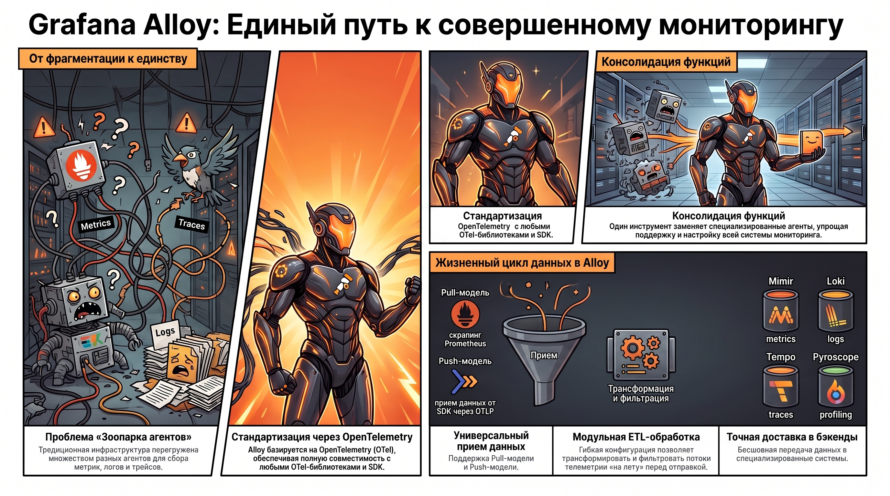
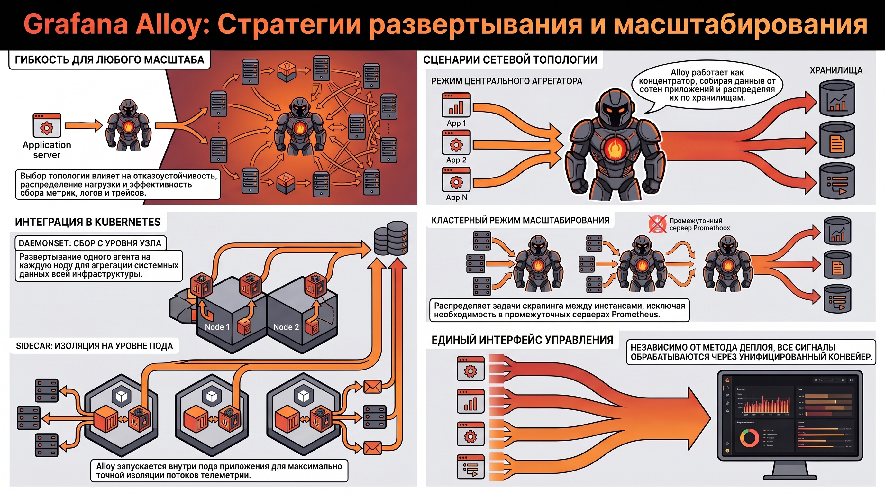
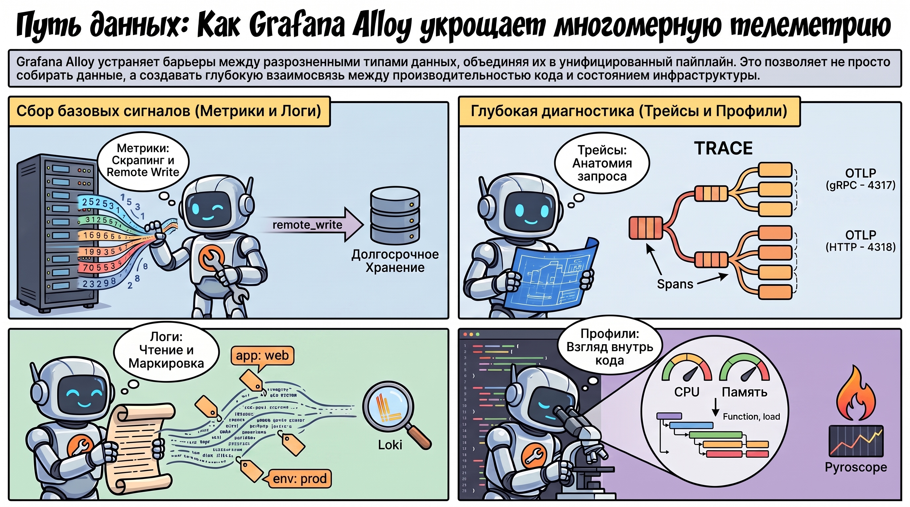
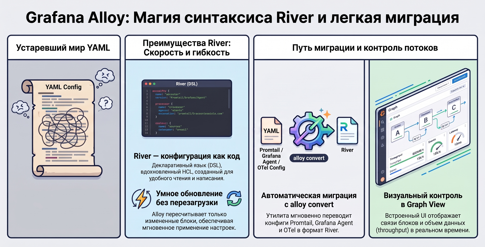
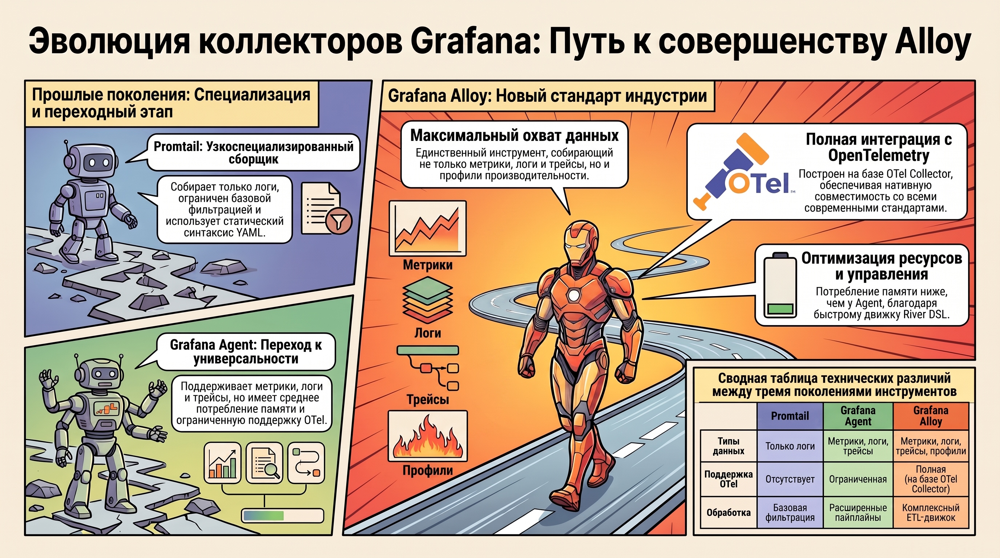
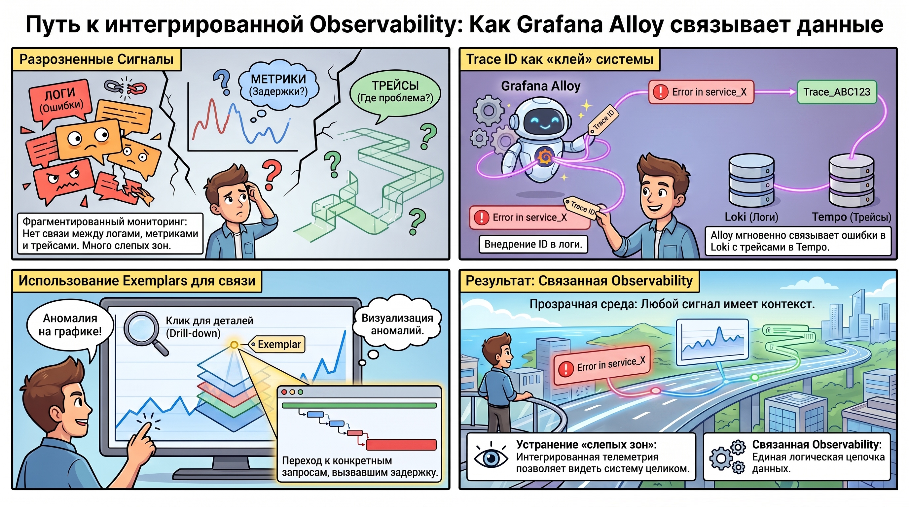

# Grafana Alloy как универсальный коллектор данных

### 1. Концепция Grafana Alloy: Роль и место в экосистеме мониторинга

Современная ИТ-инфраструктура страдает от избыточной фрагментации: для сбора метрик, логов и трейсов часто приходится поддерживать зоопарк разрозненных агентов. Grafana Alloy — это стратегический ответ на этот вызов. Являясь специализированным дистрибутивом (форком) OpenTelemetry Collector, Alloy консолидирует функции сбора данных в рамках единого, высокопроизводительного инструмента.

#### **Ключевые характеристики Alloy в стеке Grafana:**

* **Стандартизация:**  Полная нативная интеграция с OpenTelemetry (OTel) обеспечивает совместимость с любыми OTel-библиотеками и SDK.  
* **Универсальность приема:**  Прием данных от внешних источников (SDK, экспортеры) и поддержка классических протоколов Prometheus.  
* **Целевые системы-приемники:**  Alloy спроектирован для бесшовной передачи данных в специализированные бэкенды: Mimir (метрики), Loki (логи), Tempo (трейсы) и Pyroscope (непрерывное профилирование).

Эта универсальность базируется на модульной архитектуре, которая позволяет гибко конфигурировать ETL-процессы под конкретные нужды системы.

### 2. Архитектурная модель и функциональные блоки

В основе Alloy лежит логика ETL-конвейера (Extract, Transform, Load). Гибкость обеспечивается иерархической структурой блоков, где каждый компонент выполняет строго определенную задачу по обработке телеметрии.

#### **Функциональные блоки конвейера:**

* **Приемники (Receivers/Discovery):**  Alloy уникален тем, что объединяет  **Push-модель**  (прием данных от SDK через OTLP) и  **Pull-модель**  (активный скрапинг экспортеров). Поддерживается широкий спектр источников: от OTLP и Prometheus до энтерпрайз-решений, таких как Kafka, AWS S3, Cloudflare, системные логи и объекты Kubernetes.  
* **Процессоры (Processors):**  Критическое звено трансформации данных «на лету». Здесь происходит фильтрация (`filter`), агрегация в пакеты (`batch`), ограничение потребления ресурсов (`memory_limiter`) и глубокая трансформация структуры данных (`transform`).  
* **Экспортеры (Exporters):**  Отвечают за выгрузку в целевые бэкенды. Поддерживаются протоколы OTLP, Prometheus Remote Write, Kafka и специфические интерфейсы Grafana Stack (Loki, Tempo, Mimir, Pyroscope).

Эффективность данной архитектуры максимизируется при правильном выборе топологии развертывания в зависимости от масштаба инфраструктуры.

### 3. Варианты деплоя и эксплуатационные режимы

Выбор метода развертывания определяет отказоустойчивость и способность системы мониторинга к масштабированию. Alloy поддерживает гибкие сценарии интеграции в инфраструктуру.

#### **Основные топологии:**

* **Агрегатор данных:**  Работа в качестве центрального концентратора, собирающего телеметрию от сотен приложений и распределяющего ее по хранилищам.  
* **Кластерный режим:**  Позволяет распределять нагрузку (например, задачи скрапинга метрик) между несколькими инстансами Alloy. Это позволяет собирать данные напрямую с экспортеров, полностью исключая необходимость в промежуточных серверах Prometheus.  
* **Daemon/Sidecar:**  В Kubernetes Alloy развертывается как `DaemonSet` для сбора данных со всей ноды или как `Sidecar` внутри пода приложения для изоляции потоков телеметрии.

Вне зависимости от метода деплоя, управление всеми типами сигналов происходит через единый интерфейс, обеспечивающий обработку многомерных данных.

### 4. Обработка многомерных сигналов телеметрии

Alloy устраняет барьеры между разными типами данных, используя унифицированный пайплайн. Особую ценность представляет поддержка профилирования, что позволяет диагностировать производительность кода на глубоком уровне.

#### **Специфика обработки сигналов:**

* **Метрики:**  Скрапинг данных и передача через `remote_write`.  
* **Логи:**  Чтение файлов и передача в Loki с использованием меток (labeling) для быстрой индексации.  
* **Трейсы:**  Прием данных через SDK по протоколу OTLP (порты  **4317 для gRPC**  и  **4318 для HTTP** ). Важно понимать иерархию: Trace — это вся история запроса, состоящая из Spans — отдельных операций внутри него.  
* **Профили:**  Интеграция с Pyroscope для анализа нагрузки на CPU и память на уровне функций приложения.

Для управления такими сложными потоками данных Alloy использует специализированный язык конфигурации, обеспечивающий высокую скорость работы контроллера.

### 5. Конфигурационная среда: Синтаксис River и миграция

Переход от статичного YAML к Domain Specific Language (DSL) под названием  **River**  стал важным шагом для повышения гибкости систем. River вдохновлен синтаксисом HCL (HashiCorp) и нацелен на читаемость и производительность.

#### **Характеристики River:**

* **Производительность:**  River работает быстро, так как контроллер Alloy переоценивает только те компоненты, в которых произошли изменения, не перезагружая весь агент целиком.  
* **Инструментарий миграции:**  Команда `alloy convert` упрощает переход, автоматически переводя конфигурации из форматов Promtail, Grafana Agent и стандартного OTel Collector в River.  
* **Визуализация (UI):**  Встроенный графический интерфейс предоставляет  **Graph view** , где в реальном времени отображаются потоки данных и объем сообщений (throughput), проходящих через каждый блок конвейера.

Это технологическое преимущество делает Alloy предпочтительным выбором по сравнению с его предшественниками.

### 6. Сравнительный технический анализ: Alloy vs. Предшественники

Alloy является логическим развитием Grafana Agent и заменой для узкоспециализированного Promtail.

| Критерий | Promtail | Grafana Agent | Grafana Alloy |
| ------ | ------ | ------ | ------ |
| **Типы данных** | Только логи | Метрики, логи, трейсы | Метрики, логи, трейсы, профили |
| **Конфигурация** | YAML | YAML (Static) / River (Flow) | **River DSL** |
| **Поддержка OTel** | Отсутствует | Ограниченная | **Полная (на базе OTel Collector)** |
| **Memory Footprint** | Очень низкий | Средний | **Оптимизированный (ниже Agent)** |
| **Обработка данных** | Базовая фильтрация | Расширенная (пайплайны) | **Комплексный ETL-движок** |  

Благодаря использованию движка OpenTelemetry, Alloy предоставляет наиболее глубокие возможности трансформации данных, сохраняя при этом легкость развертывания.

### 7. Методология построения интегрированной Observability

Главная цель внедрения Alloy — достижение «связанности» (correlation) данных. Изолированные сигналы дают лишь фрагментарную картину, тогда как интегрированная телеметрия позволяет видеть систему целиком.

#### **Механизмы корреляции:**

* **Trace ID как «клей»:**  Ключевым этапом является внедрение разработчиками Trace ID в логи. Это позволяет через Alloy мгновенно переходить от записи об ошибке в Loki к конкретному спану в Tempo.  
* **Связка «Метрики — Трейсы»:**  Использование  **Exemplars**  позволяет визуализировать аномалии на графиках и выполнять drill-down (углубление) до конкретных трасс запросов, вызвавших всплеск задержки.  
* **Самомониторинг:**  Контроль состояния самого коллектора Alloy осуществляется через эндпоинт `/metrics`, что позволяет отслеживать производительность ETL-конвейера в дашбордах Grafana.

### Итог

Переход к Alloy устраняет фрагментацию агентов, заменяя устаревшие Promtail и Grafana Agent. Использование синтаксиса River и движка OpenTelemetry позволяет выстраивать глубокую корреляцию между метриками, логами, трейсами и профилями, создавая прозрачную и управляемую среду мониторинга для сложных распределенных систем.  
