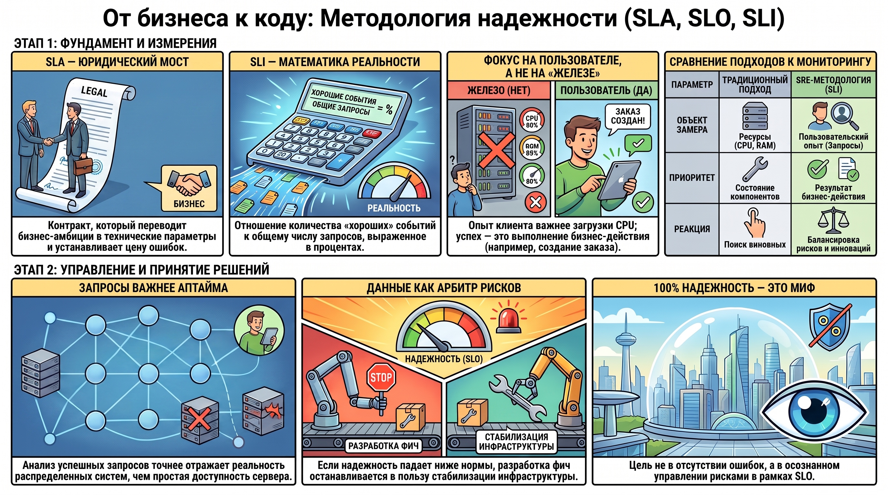
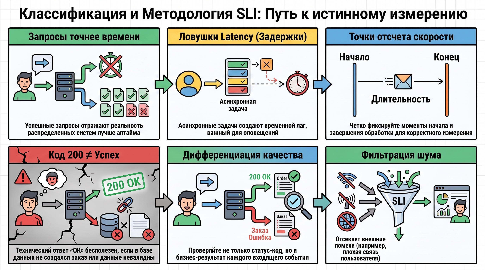

# Проектирование и управление уровнем обслуживания: методология SLI, SLO и SLA

В современной ИТ-архитектуре Соглашение об уровне обслуживания (SLA) выступает не просто юридическим артефактом, а стратегическим мостом, соединяющим амбиции бизнеса с технологической реальностью. Для SRE-специалиста SLA — это своего рода «мир бюрократии», который необходимо дешифровать и перевести на строгий язык инженерных метрик. Через механизмы явных и неявных контрактов SLA задает экономические рамки ответственности: здесь надежность системы перестает быть абстракцией и обретает цену в виде штрафных санкций.

### 1. Соглашение об уровне обслуживания (SLA) как инструмент управления бизнес-обязательствами

SLA представляет собой формализованный контракт (явный или неявный) с потребителями сервиса, фиксирующий обязательства по качеству обслуживания. Если проводить аналогию, понятную инженеру, то SLA — это эквивалент контракта на взаимодействие с API, но перенесенный в юридическую и финансовую плоскость.

#### **1.1. Структурные элементы и правовая природа SLA**

SLA — это внешнее обещание, нарушение которого влечет за собой прямые убытки. Ключевыми элементами соглашения являются:

* **Описание предоставляемых услуг:**  детальный перечень сервисов и функций.  
* **Уровень доступности и отказоустойчивости:**  целевые показатели аптайма (например, 99.9%).  
* **Метрики качества:**  объективные параметры оценки работоспособности.  
* **Время реакции и устранения инцидентов:**  регламентированные окна для восстановления сервиса.  
* **Обязанности сторон:**  разграничение зон ответственности.  
* **Санкции за невыполнение:**  финансовые вычеты и юридические последствия.  
* **Исключения и форс-мажор:**  условия, снимающие ответственность (например, глобальные сбои магистральных провайдеров).

#### **1.2. Влияние SLA на клиентские отношения и внутренние процессы**

Внедрение SLA создает фундамент из трех «китов», обеспечивающих прозрачность эксплуатации:

1. **Уверенность в отношениях:**  Метрики подтверждают соблюдение договоренностей, исключая субъективизм в оценках «хорошо» или «плохо».  
2. **Понятность процессов:**  Команда функционирует в рамках четких дедлайнов, что минимизирует конфликты и хаотичные уточнения от заказчика.  
3. **Укрепление доверия:**  Прозрачность всех этапов позволяет бизнесу видеть реальную ценность ИТ, а инженерам — аргументированно прогнозировать риски.

#### **1.3. Ограничения и условия применения**

Методология SRE гласит: SLA следует внедрять только тогда, когда этого невозможно избежать. Основная сложность в том, что требования к SLA обычно диктуются бизнесом или юристами «сверху». Роль SRE здесь — выступать экспертным фильтром, переводя бюрократические ожидания в технически реализуемые параметры.

**Связующее звено:**  Когда внешние обязательства зафиксированы в SLA, инженерам требуется технический фундамент для их измерения — индикаторы SLI, превращающие юридические обещания в цифры мониторинга.

### 2. Индикаторы уровня обслуживания (SLI) как количественный базис мониторинга

Индикаторы уровня обслуживания (SLI) — это фундаментальный KPI для SRE-команды. Если SLA говорит о том, что мы обещали, то SLI показывает, что происходит на самом деле. Это инструмент измерения производительности инфраструктуры через призму пользовательского опыта.

#### **2.1. Концептуальное отличие SLI от инфраструктурных метрик**

Традиционные метрики вроде CPU, RAM или Load Average страдают от избыточного шума. Для пользователя не имеет значения, что процессор загружен на 100%, если страницы открываются мгновенно. И наоборот: ошибки в очередях или пулах соединений могут критически влиять на опыт, но не иметь явной и предсказуемой зависимости от «здоровья» железа. SLI фокусируется на результате, а не на состоянии компонентов.

#### **2.2. Математическая и логическая структура индикатора**

Фундаментальная установка SRE гласит: мы не можем измерить «счастье» пользователя напрямую, поэтому SLI — это косвенный количественный показатель. Он строится на простом отношении:

$$\text{SLI} = \frac{\text{Количество "хороших" событий}}{\text{Общее количество событий}} \times 100\%$$

Как собирательная метрика, SLI агрегирует работу множества распределенных подсистем в единый показатель, отвечающий на вопрос: «Работает ли сервис так, как от него ожидают?»

#### **2.3. Спецификация и реализация**

Для проектирования надежной системы необходимо разделять два уровня:

* **Спецификация:**  Ожидаемый результат глазами пользователя (например, «запрос к API должен завершиться успешно»).  
* **Реализация:**  Технический алгоритм расчета. Эталонной моделью является  **HTTP Availability SLI** .  
  * *Пример реализации:*  Доля успешных запросов по метрикам балансировщика. Успешным считается любой HTTP-статус,  **кроме диапазона 500–599**  (внутренние ошибки сервера).
  
**Связующее звено:**  Точность SLI напрямую зависит от того, насколько корректно мы классифицируем входящие события и фильтруем внешние помехи.

### 3. Классификация и методология измерений в рамках SLI

Выбор метода измерения определяется архитектурой взаимодействия. Неверный тип измерения может привести к ложноположительным выводам о стабильности системы.

#### **3.1. Модель «Запрос-Ответ»: Доступность**

В SRE-практике измерение  **доступности по запросам**  считается более предпочтительным, чем измерение по времени (аптайму). Причины кроются в природе современных систем:

1. **Частичные отказы:**  Распределенная система может отдавать ошибки только для части пользователей, оставаясь формально «в сети».  
2. **Внешние факторы:**  Измерение «по времени» не учитывает ситуации, когда пользователь уходит из\-за плохой связи на своей стороне или просто отвлекается. Оценка по конкретным запросам позволяет отсечь этот шум и сфокусироваться на вине системы.

#### **3.2. Модель Latency: Скорость обработки**

Latency измеряется как процент запросов, обработанных быстрее установленного порога. Здесь критически важен учет «слепых зон»:

* **Точки отсчета:**  Необходимо четко фиксировать моменты начала и завершения обработки.  
* **Проблема «окна»:**  При выполнении длительных асинхронных задач (например, обработка данных в течение часа) метрика Latency часто попадает в систему мониторинга  **только после завершения**  задачи или возникновения ошибки. Это создает временной лаг, который нужно учитывать при настройке алертинга.

#### **3.3. Дифференциация качества запросов**

Технический успех (HTTP 200) не всегда равен успеху бизнеса. Для качественного SLI необходимо учитывать:

* **Валидность:**  Корректность параметров, заголовков Host и путей.  
* **Бизнес-результат:**  Успешным событием должен признаваться не просто код ответа, а, например,  **факт создания заказа**  в базе данных. Если API вернул 200, но заказ не создался — это «плохое» событие.

**Связующее звено:**  Когда мы научились точно измерять состояние системы, эти данные становятся главным арбитром в вопросах управления рисками.

### 4. Управление рисками и балансировка развития системы

Методология SLI/SLO переводит дискуссию о приоритетах из эмоциональной плоскости («нам нужно больше фич\!») в рациональную. Данные индикаторов становятся арбитром в споре между скоростью разработки (Feature Velocity) и надежностью (Reliability).

#### **4.1. Принятие решений на основе данных**

В SRE-парадигме использование SLI — это директивный инструмент. Если данные показывают, что надежность падает и мы выходим за рамки допустимых рисков, разработка новых функций должна быть приостановлена. Команда переключается на стабилизацию инфраструктуры, используя SLI как объективное обоснование для бизнеса.

#### **4.2. Стабильность как результат освоения методологии**

Итоговая цель — научиться считать риски и понимать, что стабильность является управляемой величиной. Мы не стремимся к 100% надежности (это невозможно и экономически неоправданно), но мы стремимся к тому, чтобы любой риск был осознанным и находился в рамках установленных SLO.

**Связующее звено:**  Гармония между техническими показателями и бизнес-результатом достигается тогда, когда каждый участник процесса понимает цену ошибки.

### 5. Синтез и итоговые выводы

Надежность системы — это не отсутствие ошибок, а управляемая и измеряемая величина, основанная на прозрачных контрактах (SLA) и точно спроектированных индикаторах (SLI), ориентированных на пользовательский опыт.

**Ключевые когнитивные установки:**

* **Приоритет запросов над временем:**  Анализ доли успешных запросов точнее отражает реальность распределенных систем, чем простой аптайм сервера, и позволяет игнорировать внешние факторы (проблемы с сетью у пользователя).  
* **Недостаточность инфраструктурных метрик:**  Загрузка CPU и RAM не являются индикаторами «счастья» клиента. Мониторинг должен быть сфокусирован на ключевых SLI, где успехом считается выполнение бизнес-действия (например, создание заказа), а не просто отсутствие 5XX ошибок.  
* **SRE как менеджер рисков:**  Главная задача специалиста — использовать данные как арбитр для балансировки между инновациями и устойчивостью, понимая, что 100% надежность — это миф.  
* **Пользовательский опыт как эталон:**  Единственный верный способ измерить работоспособность сервиса — оценить, насколько успешно он выполняет задачи, ради которых к нему пришел пользователь.
