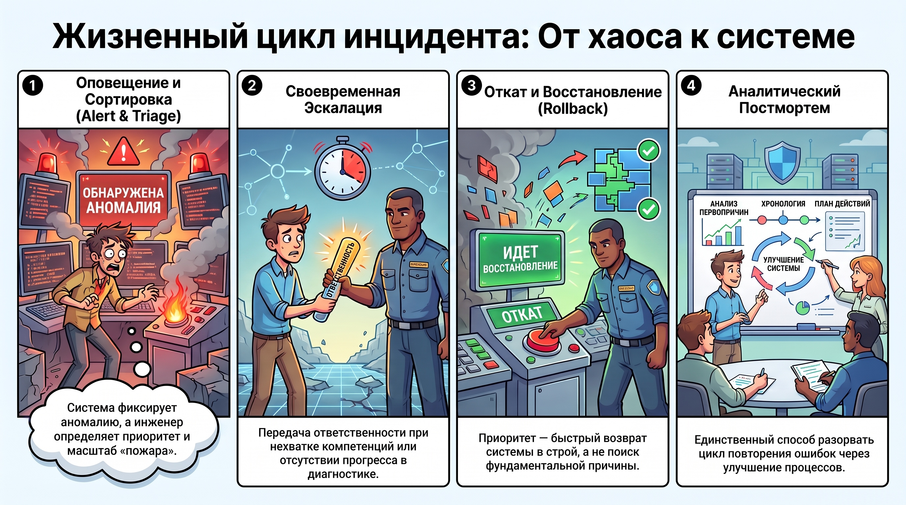
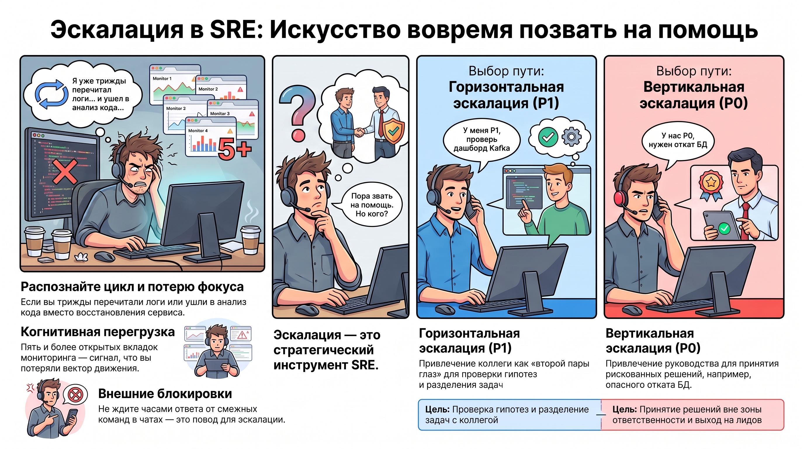
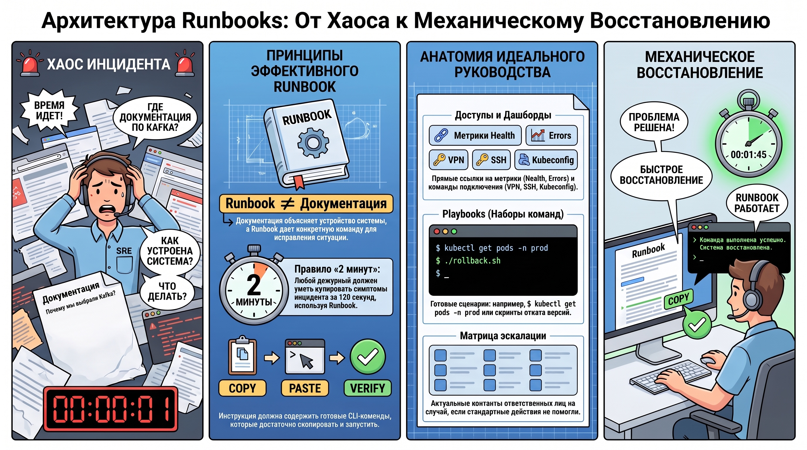

# Реагирование на инциденты и on-call процессы

В современной SRE-практике надежность системы рассматривается не как отсутствие ошибок в коде, а как способность организации эффективно справляться с неизбежными сбоями. Переход от стихийного «героизма» к системному управлению инцидентами — это обязательное условие масштабируемости эксплуатации. Индивидуальный героизм не только непредсказуем, но и опасен: он ведет к выгоранию персонала и не позволяет тиражировать успешный опыт. Анализ причин сбоев показывает, что до 80% проблем вызваны отсутствием четкого алгоритма действий дежурного, и лишь оставшиеся 20% обусловлены качеством программного кода. Ключевой принцип on-call культуры — превращение стрессовых ситуаций в рутинные операции. Без системного подхода, включающего обязательные постмортемы, эксплуатация попадает в «бесконечный цикл» рекурсивных инцидентов, где одни и те же ошибки повторяются до тех пор, пока не будет изменена сама процедура реагирования.

Этот переход требует деконструкции инцидента на управляемые фазы, составляющие его жизненный цикл.

### 1. Жизненный цикл инцидента: от оповещения до постмортема

Управление инцидентом — это линейная последовательность критических состояний, где каждый этап имеет конкретную цель и ожидаемый результат.

* **Alert (Оповещение):**  Первичное обнаружение аномалии системой мониторинга. Это сигнал к началу активной фазы дежурства.  
* **Triage (Сортировка):**  Оценка приоритета (P0/P1) и первичная диагностика. На этом этапе определяется масштаб «пожара» и потребность в ресурсах.  
* **Escalation (Эскалация):**  Своевременная передача ответственности при нехватке компетенций, полномочий или обнаружении признаков отсутствия прогресса.  
* **Rollback (Откат/Восстановление):**  Процедура купирования симптомов. Главная цель — максимально быстрый возврат системы в стабильное состояние, а не поиск фундаментальной причины (Root Cause).  
* **Postmortem (Постмортем):**  Аналитический разбор после инцидента. Единственный механизм, позволяющий разорвать цикл повторения проблем через улучшение мониторинга и процессов.

Четкое следование этой структуре позволяет минимизировать MTTR (Mean Time To Recovery), при условии, что инженер владеет методологией принятия решения об эскалации.

### 2. Методология эскалации и критерии оценки прогресса (Triage)

Эскалация в SRE-культуре является стратегическим инструментом сокращения времени простоя, а не признаком профессиональной несостоятельности инженера. Основная задача на этапе Triage — идентифицировать момент «пробуксовки» в диагностике.

**Маркеры необходимости немедленной эскалации:**

* **Цикличность:**  вы трижды прочитали одни и те же логи, не получив новых данных.  
* **Смена приоритетов:**  вы начали анализировать код реализации (что допустимо для диагностики, но недопустимо для оперативного «фикса»), забыв про восстановление сервиса.  
* **Внешние блокировки:**  вы находитесь в режиме ожидания ответа от смежных подразделений в чатах.  
* **Когнитивная перегрузка:**  у вас открыто пять и более вкладок мониторинга, и вы потеряли вектор движения.

**Сравнительный анализ типов эскалации:**

| Тип эскалации | Уровень инцидента | Объекты | Цели и уровень риска | Примеры коммуникации |
| ------ | ------ | ------ | ------ | ------ |
| **Горизонтальная** | **P1** | Secondary on-call (коллега) | «Вторая пара глаз», проверка гипотез, разделение задач по диагностике. | «У меня P1, подключись, пожалуйста: проверь дашборд Kafka, пока я смотрю логи». |
| **Вертикальная** | **P0** | Тимлид, менеджер, архитектор | Принятие рискованных решений, выход за зону ответственности (например, опасные операции с БД). | «У нас P0, действия А и Б не помогли. Нужно решение по откату версии БД, риск потери данных — X%». |

Для обеспечения скорости реакции на любом уровне эскалации инженеру необходим инструмент, исключающий поиск информации в момент кризиса — Runbook.

### 3. Архитектура и функциональное назначение Runbooks

Важно проводить жесткую демаркационную линию между технической документацией и Runbook. Документация отвечает на вопрос «Почему мы выбрали Kafka?», в то время как Runbook дает четкую инструкцию: «Команда для перезапуска консьюмера».

**Требования к Runbook:**

1. **Лаконичность:**  Формат «один лист» для мгновенного сканирования глазами.  
2. **Оперативность:**  Runbook должен позволять любому дежурному инженеру (даже не знакомому с архитектурой сервиса)  **в течение 2 минут**  купировать симптомы.  
3. **Прикладной характер:**  Использование принципа **Copy - Paste - Verify**.

**Обязательные компоненты Runbook:**

* **Доступы:**  Прямые команды для подключения (VPN, SSH, контексты Kubeconfig).
* **Дашборды:**  Ссылки на ключевые метрики (Health, Errors, состояние БД).  
* **Playbooks:**  Готовые наборы CLI-команд для типичных операций.  
  * *Пример:*  `$ kubectl get pods -n prod`
  * *Пример:*  `$ ./rollback.sh feature-x --version 42`
* **Escalation:**  Матрица контактов с актуальными каналами связи.

Стандартизация этих руководств превращает процесс восстановления системы в механическую, предсказуемую и высокоэффективную процедуру.

### 4. Результирующие выводы

Эффективное реагирование на инциденты базируется на трех столпах:

1. **Дисциплина вместо интуиции:**  Надежность системы обеспечивается строгим соблюдением регламентированных алгоритмов действий, что нивелирует риски, связанные с «человеческим фактором» и стрессом.  
2. **Процессная минимизация MTTR:**  Использование лаконичных Runbooks и четких протоколов эскалации позволяет перевести фокус с поиска виноватых на максимально быстрое восстановление работоспособности сервиса.  
3. **Эволюция через постмортемы:**  Постмортем — это единственный способ трансформации негативного опыта в развитие системы эксплуатации, предотвращающий рекурсию инцидентов.

Главный результат внедрения on-call культуры — превращение аварийных ситуаций из катастрофы в управляемый технологический процесс.
