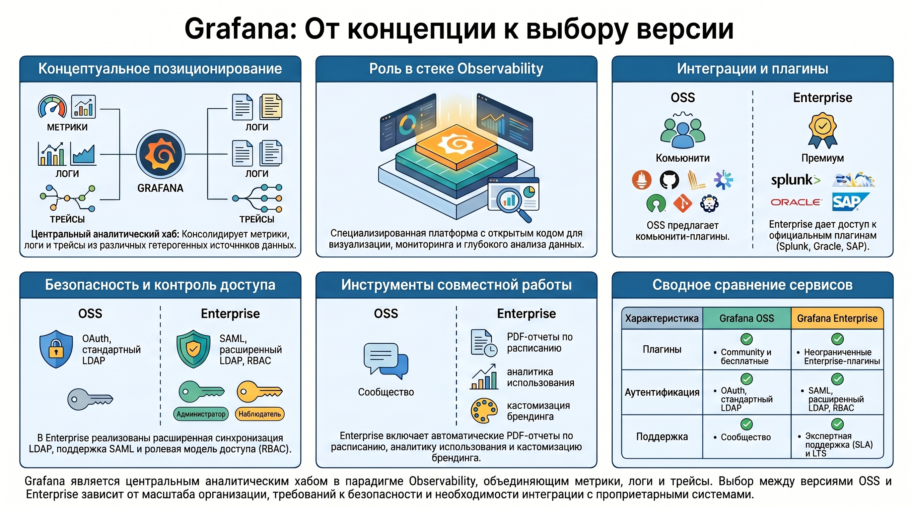
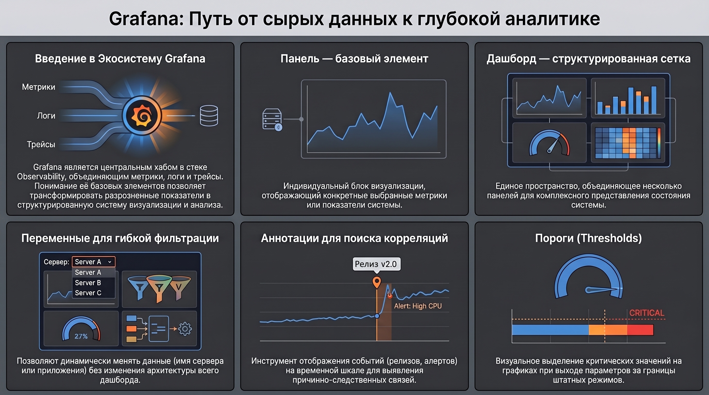

# Системы визуализации данных в стеке Observability (Grafana)

### 1\. Концептуальное позиционирование и функциональные версии Grafana

Grafana — специализированная платформа с открытым исходным кодом, предназначенная для визуализации, мониторинга и анализа данных. В парадигме Observability она выполняет роль центрального аналитического хаба, консолидирующего метрики, логи и трейсы из гетерогенных источников.Различия между версиями Grafana OSS и Grafana Enterprise определяют масштабируемость и уровень безопасности системы мониторинга в организации (на основе данных SOURCE\_IMAGE\_21, 22, 23):

* **Плагины:**  
  * OSS: доступ к Community-плагинам и бесплатным решениям Grafana Labs.  
  * Enterprise: неограниченный доступ к официальным Enterprise-плагинам (Splunk, New Relic, AppDynamics, Oracle, Dynatrace, ServiceNow, DataDog).  
* **Инструменты совместной работы:**  
  * OSS: базовый функционал дашбордов.  
  * Enterprise: индикатор присутствия пользователей, аналитика использования (insights), автоматическая генерация PDF-отчетов по расписанию, кастомизация брендинга.  
* **Безопасность и аутентификация:**  
  * OSS: поддержка OAuth, стандартный LDAP.  
  * Enterprise: поддержка SAML, расширенная синхронизация LDAP (группы и команды), контроль доступа на основе ролей (RBAC).  
* **Поддержка:**  
  * Enterprise гарантирует экспертную поддержку с регламентированным SLA и долгосрочную поддержку версий (LTS).Внедрение платформы обеспечивает эффективность визуализации, унификацию аналитического инструментария и развитие инженерных компетенций в области современной эксплуатации систем. Выбор Enterprise-версии критичен для крупных организаций, требующих интеграции с проприетарным стеком и соблюдения строгих политик безопасности.

### 2\. Базовая терминология и архитектурные единицы

Стандартизация понятийного аппарата является необходимым условием эффективного проектирования систем визуализации. На основе SOURCE\_IMAGE\_24 выделяются следующие сущности:

* **Панель:**  Базовый элемент визуализации конкретных выбранных показателей.  
* **Дашборд:**  Структурированная сетка панелей, объединенная набором переменных. Переменные (например, имя сервера, приложения или тип датчика) обеспечивают динамическую фильтрацию данных без изменения архитектуры дашборда.  
* **Аннотации:**  Инструмент событийного анализа, позволяющий отображать специфические события (например, релизы, алерты) на временных шкалах различных панелей для выявления корреляций.Иерархическая структура платформы обеспечивает переход от дискретных метрик к комплексному представлению состояния системы на уровне дашборда.

### 3\. Техническая реализация: развертывание и интерфейс

Доступность инфраструктуры мониторинга напрямую зависит от стандартизированного развертывания компонентов визуализации.

**Алгоритм установки для CentOS / RHEL SOURCE\_IMAGE\_27:**

1. Получение GPG-ключа: выполнение запроса к rpm.grafana.com/gpg.key через wget.  
2. Импорт ключа в систему с помощью rpm \--import.  
3. Конфигурация репозитория: создание файла /etc/yum.repos.d/grafana.repo со следующими параметрами:  
  * name=grafana  
  * baseurl=https://rpm.grafana.com  
  * repo\_gpgcheck=1  
  * enabled=1  
  * gpgcheck=1  
  * gpgkey=https://rpm.grafana.com/gpg.key  
  * sslverify=1  
  * sslcacert=/etc/pki/tls/certs/ca-bundle.crt  
4. Установка пакета: запуск dnf install grafana.

**Параметры доступа:**  Работоспособность системы проверяется по адресу http://Server-IP:3000. Параметры аутентификации по умолчанию: admin/admin.

**Структура интерфейса SOURCE\_IMAGE\_31, 32, 33:**  
* **Поиск:**  Навигация по объектам системы.  
* **Explore:**  Среда для оперативного исследования данных и отладки запросов без создания постоянных панелей.  
* **Alerting:**  Управление правилами оповещений, точками контакта и политиками уведомлений.  
* **Connections:**  Интеграция и управление источниками данных (Connect data, Your connections).  
* **Administration:**  Глобальное администрирование инстанса, управление пользователями и плагинами.

### 4\. Методология работы с данными и визуальными формами

Использование готовых решений из внешних репозиториев (grafana.com/dashboards) позволяет сократить цикл разработки систем мониторинга. Процесс включает поиск шаблона и его последующий импорт в локальную систему.

**Инструментарий управления дашбордом SOURCE\_IMAGE\_33:**

* **Контроль версий:**  Сохранение истории изменений для аудита и отката правок.  
* **Права доступа:**  Настройка разрешений на уровне пользователей и команд.  
* **Экспорт:**  Выгрузка конфигурации в формате JSON.  
* **Sharing:**  Получение прямой ссылки для расшаривания или встраивания дашборда (например, на внешнем веб\-сайте).

**Синтаксис временных интервалов:**  Grafana поддерживает нотацию от секунд (s) до лет (y). Использование операторов «+» и «-» обеспечивает относительный сдвиг времени, необходимый для сравнительного анализа периодов. Качество настройки этих параметров определяет оперативность интерпретации данных.

### 5\. Расширенная настройка панелей и аналитические триггеры

Преобразование сырых данных в операционные инсайты осуществляется через прецизионную настройку визуализации и аналитических триггеров.

**Threshold (Порог срабатывания):** Функционал предназначен для выделения критических значений на графике и визуализации фактов выхода параметров за границы штатных рабочих режимов SOURCE\_IMAGE\_33.

**Параметры стилизации графиков:** Для повышения информативности интерфейса используются:
* Толщина и стиль линии.  
* Уровень прозрачности и градиентные заливки.  
* Способы выделения показаний (например, точками). 

Режим **Explore**  позволяет проводить ad-hoc исследования данных, обеспечивая проверку гипотез в реальном времени. Эффективный интерфейс требует баланса между визуальной эстетикой и плотностью полезной информации.

### 6\. Итоги

В результате изучения платформы формируются ключевые компетенции по проектированию универсальных систем мониторинга. Итоговая логика охватывает полный цикл эксплуатации системы: от защищенной установки и настройки политик доступа до подключения многопрофильных источников данных (метрик, логов, трейсов).

Использование инструментов Adaptive Telemetry и выбор между OSS и Enterprise версиями позволяют достичь баланса между глубиной аналитики и стоимостью владения инфраструктурой. Сформированная система обеспечивает полную прозрачность ИТ-ландшафта и предоставляет инструментарий для оперативного реагирования на инциденты любого уровня сложности.
