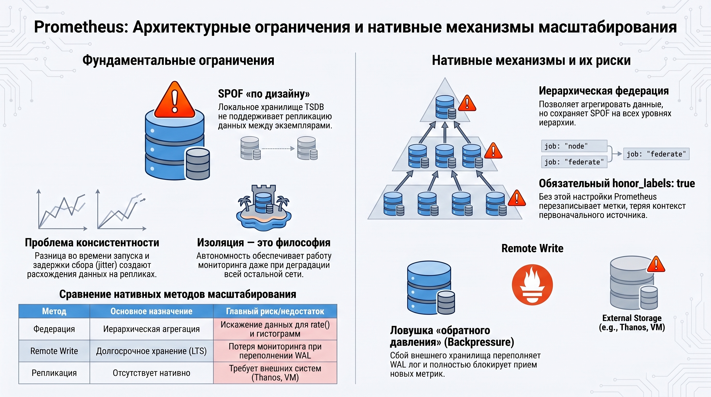
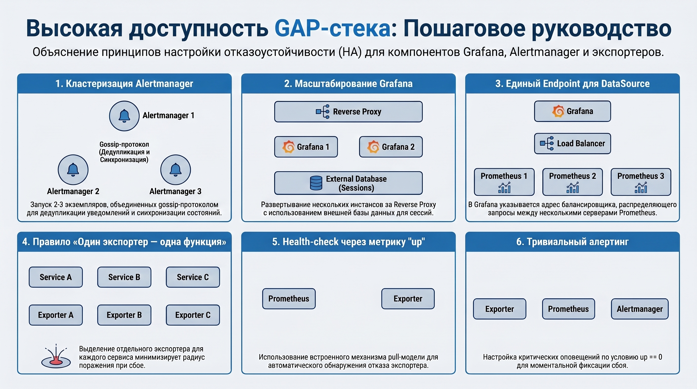
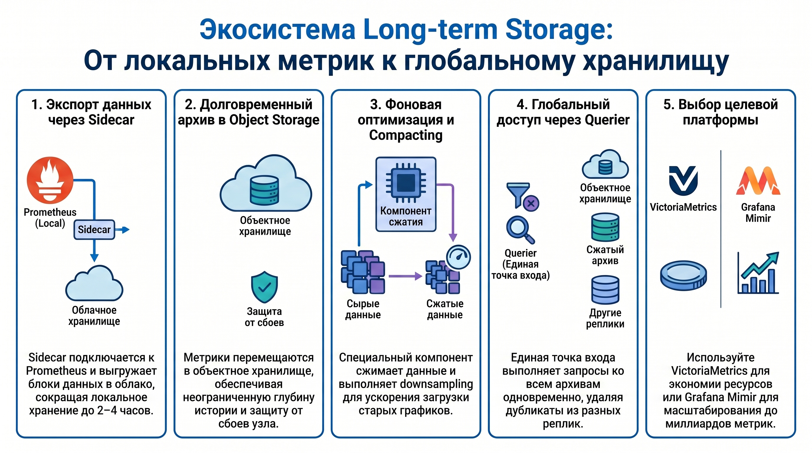

# Отказоустойчивость Prometheus и системы долговременного хранения метрик: аналитический конспект занятия

### 1\. Архитектурные ограничения и нативные механизмы масштабирования Prometheus

Prometheus спроектирован как принципиально автономная одноузловая система, приоритетами которой являются операционная независимость и способность функционировать в изолированных сегментах сети. Для проектирования отказоустойчивых production-сред стратегически необходимо осознавать заложенные в архитектуру ограничения, поскольку отсутствие нативной репликации диктует специфические требования к обеспечению непрерывности мониторинга.

#### **Концепция Single Point of Failure (SPOF) в дизайне Prometheus.**

Одиночный инстанс Prometheus представляет собой единую точку отказа в силу фундаментальных архитектурных решений: локальное хранилище TSDB не поддерживает синхронизацию данных между экземплярами. Использование двух идентичных серверов без внешних средств оркестрации не решает проблему, так как неизбежные расхождения во времени запуска и задержки сбора (scrape jitter) приводят к неконсистентности данных. Выход инстанса из строя создает необратимые лакуны в истории метрик, что делает невозможным обеспечение целостности при банальной балансировке запросов.

#### **Механизм федерации как инструмент иерархии.**

Федерация предназначена для построения иерархических структур, где вышестоящий сервер агрегирует данные с нижестоящих по pull-модели. Критическим параметром конфигурации здесь является `honor\_labels: true`, обеспечивающий сохранение оригинальных меток и предотвращающий их перезапись. Несмотря на пользу для логического масштабирования, федерация не является средством HA, сохраняя SPOF на каждом уровне. Использование функций `rate()` и `histogram` на агрегированных данных несет риски математических искажений из\-за дискретности передачи метрик между звеньями цепи.

#### **Remote Write и риски «обратного давления».**

Механизм Remote Write транслирует метрики во внешние системы через буфер WAL (Write-Ahead Log). В данной схеме заложена «ловушка обратного давления» (backpressure): в случае недоступности или деградации производительности внешнего хранилища WAL-лог переполняется, что блокирует прием новых данных основным сервером. Таким образом, сбой вспомогательного компонента может парализовать всю систему сбора, приводя к полной потере мониторинга.Вышеуказанные факторы подтверждают недостаточность нативного инструментария для High Availability, что обуславливает необходимость внедрения специализированных архитектурных решений.

### 2\. Высокая доступность компонентов GAP-стека (Grafana, Alertmanager) и экспортеров

Отказоустойчивость системы мониторинга определяется связностью и доступностью всех её элементов — от транспортного уровня и логики оповещений до интерфейсов визуализации.

#### **Кластеризация Alertmanager.**

Высокая доступность Alertmanager достигается развертыванием кластера из 2–3 экземпляров, синхронизированных через gossip-протокол. Механизм гарантирует доставку уведомлений по принципу at-least-once. Для исключения дублирования используется дедупликация и синхронизация состояний тишины (silences). Важной настройкой является разнесение времени ожидания на репликах (например, 0s, 15s и 30s), что позволяет кластеру корректно обрабатывать алерты даже при кратковременных сетевых разделениях.

#### **Масштабирование Grafana.**

HA-схема для Grafana предполагает запуск нескольких инстансов за reverse proxy (load balancer). Кластер требует наличия общей базы данных для сессий и использования gossip-протокола для синхронизации встроенного движка алертинга. Для защиты уровня отображения критически важно в настройках DataSource указывать не конкретный инстанс Prometheus, а endpoint балансировщика, распределяющего запросы между бэкендами сбора данных.

#### **Стратегия изоляции экспортеров.**

Сбор метрик должен следовать парадигме «один экспортер — одна функция», что минимизирует радиус поражения при сбоях и устраняет операционные bottleneck’и. Pull-модель Prometheus позволяет использовать нативную метрику `up` для реализации health-check’ов. Это дает возможность строить тривиальные и надежные алерты вида `up \== 0`, где отсутствие ответа экспортера однозначно интерпретируется как отказ целевого сервиса.

Обеспечение отказоустойчивости интерфейсов и транспорта подготавливает фундамент для перехода к масштабируемому слою централизованного хранения.

### 3\. Экосистема решений для долговременного хранения (Long-term Storage)

Системы Thanos, VictoriaMetrics и Grafana Mimir предназначены для нивелирования ограничений Prometheus в части глубины хранения данных и обеспечения глобального представления (Global View) распределенной инфраструктуры.

#### **Модульная архитектура Thanos.**

Thanos реализует распределенный подход к хранению через набор специализированных компонентов:

* **Sidecar:**  Интегрируется с Prometheus, предоставляя доступ к оперативным данным через gRPC Store API. Sidecar выгружает TSDB-блоки в Object Storage, что позволяет агрессивно снизить локальную политику retention Prometheus до 2–4 часов.  
* **Querier:**  Выполняет декомпозицию PromQL-запросов, осуществляет федеративное выполнение и дедупликацию данных.  
* **Store Gateway:**  Обеспечивает доступ к историческим архивам в объектном хранилище, кэшируя индексы для ускорения поиска.  
* **Compactor:**  Выполняет фоновую оптимизацию данных, слияние блоков и понижение дискретизации (downsampling) для повышения производительности долгосрочных запросов.  
* **Receiver:**  Поддерживает push-модель через Remote Write, что актуально для эфемерных сред.

#### **Высокопроизводительные кластеры VictoriaMetrics и Grafana Mimir.**

VictoriaMetrics позиционируется как решение с экстремально низким потреблением ресурсов, поддерживающее два режима: Single-node (для локальных инсталляций) и Cluster. В кластерном режиме используется shared-nothing architecture, изолирующая компоненты друг от друга. Grafana Mimir, в свою очередь, ориентирован на масштаб до 1 миллиарда активных временных рядов, используя микросервисный подход для независимого горизонтального масштабирования каждого элемента системы.

Данные решения формируют единый масштабируемый слой, обеспечивая отказоустойчивость хранения и аналитики в масштабах предприятия.

### 4\. Выводы

Освоение принципов построения отказоустойчивых систем мониторинга предполагает осознанный отказ от эксплуатации изолированных экземпляров Prometheus в пользу распределенных архитектур. Ключевым результатом является понимание логики перехода к HA-стеку, где связность компонентов Alertmanager и Grafana обеспечивается gossip-протоколами и балансировщиками, а масштабируемость данных достигается через использование объектных хранилищ. Инженерная практика требует внедрения промежуточных слоев агрегации, таких как Thanos, VictoriaMetrics или Mimir, которые позволяют преодолеть ограничения нативного TSDB-хранилища, обеспечивая глобальное представление метрик и надежную защиту от потери данных при сбоях отдельных узлов инфраструктуры.  
