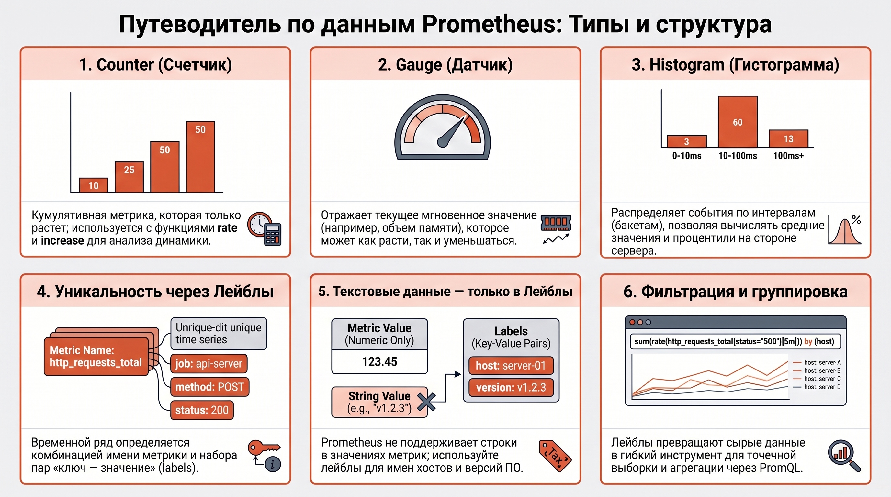
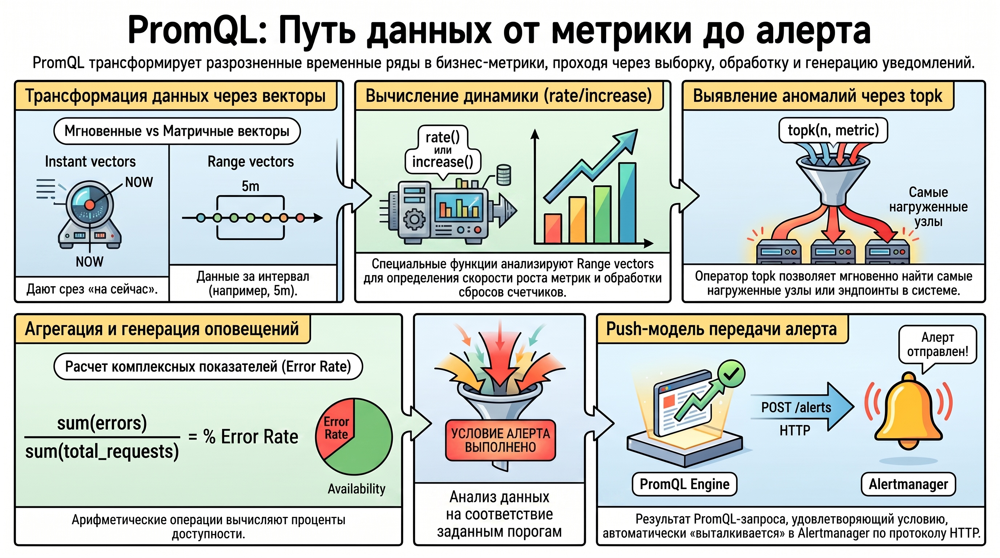
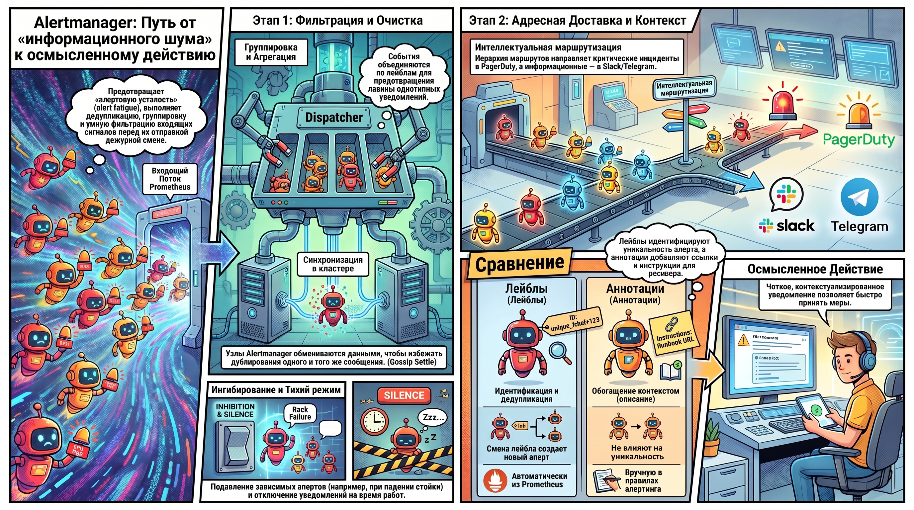
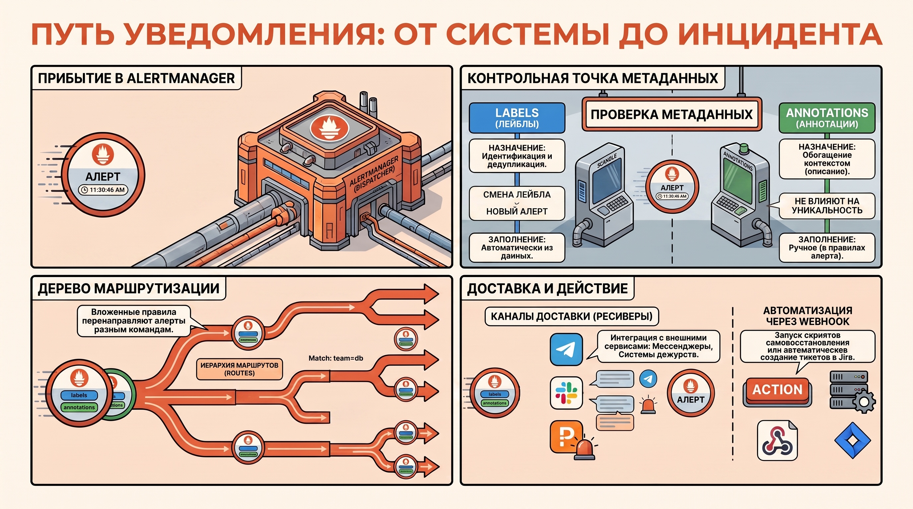

# Метрики, PromQL и архитектура оповещений в Prometheus

Инженерная надежность современной системы мониторинга определяется не только полнотой сбора данных, но и архитектурной корректностью их интерпретации. Данный конспект систематизирует подходы к типизации метрик, использованию языка PromQL и настройке Alertmanager как ключевых компонентов для построения отказоустойчивой Observability-инфраструктуры.

### 1\. Типология метрик и модель данных в Prometheus

Выбор адекватного типа метрики является фундаментом для обеспечения точности аналитических вычислений. Ошибочная типизация на этапе проектирования экспортера приводит к потере данных при рестартах систем и некорректной работе функций агрегации, что критично для расчета показателей доступности (SLA).

#### **Классификация типов метрик**

В архитектуре Prometheus реализованы четыре основных типа данных, каждый из которых обладает специфической логикой обработки:

* **Counter (Счетчик):**  Кумулятивная метрика, значение которой монотонно увеличивается. Сброс значения происходит только при рестарте экспортера. Важнейшей особенностью является необходимость использования специализированных функций, таких как `rate` или `increase`, которые учитывают разрывы в данных (counter resets) и вычисляют динамику изменения во времени.  
* **Gauge (Датчик):**  Вариативная метрика для отображения текущих мгновенных значений (температура, использование памяти). В отличие от счетчика, Gauge может как увеличиваться, так и уменьшаться. Обнуление Gauge системой интерпретируется как реальное изменение значения, а не технический сброс, поэтому функции типа `rate` к нему неприменимы.  
* **Histogram (Гистограмма):**  Агрегированная структура, распределяющая наблюдения по интервалам (бакетам). Каждая гистограмма автоматически создает временные ряды с суффиксами `_sum` (сумма всех значений) и `_count` (общее количество событий). Это позволяет вычислять средние значения и процентили (например, p99) на стороне сервера Prometheus.  
* **Summary (Сводка):**  Аналогично гистограмме предоставляет данные о количестве и сумме, однако расчет процентилей происходит на стороне приложения. Ввиду сложности агрегации квантилей из разных источников, Summary используется в профессиональной практике значительно реже гистограмм.

#### **Структура данных и фильтрация**

Prometheus оперирует моделью  **«Ключ — значение»** . Уникальность временного ряда формируется именем метрики и набором лейблов (labels). Следует учитывать архитектурное ограничение: Prometheus не поддерживает строковые (текстовые) значения метрик. Любая текстовая информация (имена хостов, версии ПО, IP-адреса) должна передаваться исключительно через значения лейблов, что превращает их в мощный инструмент метаданных для фильтрации и группировки.

*Механизмы фильтрации на основе матчинга лейблов определяют синтаксис мгновенных векторов (Instant vectors), становясь базисом для извлечения данных в PromQL.*

### 2\. Язык запросов PromQL: Векторный анализ и агрегация

Язык PromQL является инструментом трансформации сырых временных рядов в прикладные аналитические метрики. Его гибкость позволяет оперировать данными как математическими векторами, обеспечивая высокую скорость обработки массивов телеметрии.

#### **Векторные типы данных**

Работа в PromQL базируется на двух типах выборок:

1. **Instant vectors (Мгновенные векторы):**  Набор значений для каждого ряда в конкретную точку времени (сейчас). Используются для отображения текущего состояния и в правилах алертинга.  
2. **Range vectors (Матричные векторы):**  Данные за определенный интервал (например, `[5m]`). Необходимы для функций, вычисляющих динамику изменений (rate, increase).

#### **Функции и операции агрегации**

Для получения высокоуровневых показателей применяются следующие механизмы:

* **Арифметические операции:**  Позволяют вычислять коэффициенты и соотношения. Например, деление сумм `sum(metric1) / sum(metric2)` часто применяется для расчета процента ошибок (Error Rate).  
* **Временная агрегация:**  Функции вроде `avg_over_time` позволяют сглаживать пиковые значения для выявления долгосрочных трендов.  
* **Селекторы топ-значений:**  Оператор `topk` в сочетании с модификатором `by (label)` (например, `by (url)`) позволяет идентифицировать наиболее нагруженные эндпоинты или узлы системы.

*Правила алертинга в Prometheus представляют собой PromQL-выражения, возвращающие вектор; при выполнении условий результат "выталкивается" (push) в Alertmanager по протоколу HTTP для дальнейшей обработки.*

### 3\. Alertmanager: Архитектура и функциональные возможности

Alertmanager выполняет стратегическую функцию управления когнитивной нагрузкой оператора. Он выступает интеллектуальным буфером, который предотвращает "алертовую усталость" (alert fatigue) за счет фильтрации и консолидации сигналов.

#### **Место компонента в стеке мониторинга**

Alertmanager получает алерты от Prometheus Server и берет на себя задачи по их дедупликации, группировке и маршрутизации. Компонент поддерживает работу в режиме кластера (High Availability) для обеспечения отказоустойчивости Notification Pipeline.

#### **Логика Notification Pipeline**

Процесс обработки события включает несколько стадий, обеспечивающих надежность и осмысленность уведомлений:

1. **Dispatcher (Aggregation):**  На начальном этапе происходит агрегация событий и их первичная группировка по лейблам.  
2. **Gossip Settle:**  Этап синхронизации в кластере для исключения дублирования уведомлений разными узлами Alertmanager.  
3. **Inhibitor (Заглушение):**  Механизм подавления уведомлений. Позволяет избежать избыточных сигналов: например, если сработал критический алерт "Rack Down", уведомления от всех серверов в этой стойке будут заглушены.  
4. **Silencer (Тихий режим):**  Временное отключение оповещений на основе совпадения лейблов (применяется при плановых работах).  
5. **Wait / Dedup / Retry:**  Стадии ожидания накопления группы алертов, финальной дедупликации и повторных попыток отправки в случае сбоя внешнего ресивера.

*После прохождения всех стадий фильтрации алерт передается в систему маршрутизации для доставки целевому получателю.*

### 4\. Конфигурирование маршрутизации и интеграция уведомлений

Структурированная доставка оповещений является критическим фактором соблюдения SLA. Alertmanager позволяет гибко управлять потоками уведомлений в зависимости от контекста инцидента.

#### **Ресиверы (Receivers) и интеграции**

Ресивер — это именованная конфигурация интеграции с внешним сервисом. Поддерживаются:

* **Мессенджеры:**  Telegram, Slack, MS Teams, Discord.  
* **Системы дежурств:**  PagerDuty, OpsGenie, VictorOps.  
* **Webhook:**  Универсальный механизм, позволяющий интегрировать мониторинг с любой кастомной системой (автоматическое заведение тикетов, скрипты самовосстановления).

#### **Правила маршрутизации и атрибуты**

Иерархия маршрутов (Routes) позволяет использовать вложенные правила для перенаправления алертов разным командам. Ключевую роль в управлении жизненным циклом алертов играют метаданные:

| Характеристика | Labels (Лейблы) | Annotations (Аннотации) |
| ------ | ------ | ------ |
| **Назначение** | Идентификация и дедупликация | Обогащение контекстом (описание, ссылки) |
| **Логика работы** | Изменение лейбла \= создание нового алерта | Не влияют на уникальность сообщения |
| **Заполнение** | Автоматическое (из данных Prometheus) | Ручное (формируется в правиле алерта) |

### Итог

Изучение архитектуры Prometheus и Alertmanager позволяет синтезировать целостный подход к управлению состоянием систем:

* Основой точности является понимание внутренней логики работы типов данных: кумулятивность счетчиков (Counter) и вариативность датчиков (Gauge).  
* PromQL выступает не просто языком запросов, а мощным инструментом аналитической трансформации, позволяющим переходить от мониторинга отдельных метрик к расчету бизнес-показателей.  
* Alertmanager реализует полный цикл управления инцидентами: от подавления шума через Inhibitor до гибкой маршрутизации по лейблам.Итоговым результатом является переход от реактивного сбора данных к проактивной системе умного оповещения, минимизирующей время реакции (MTTR) и оптимизирующей нагрузку на дежурную смену.
