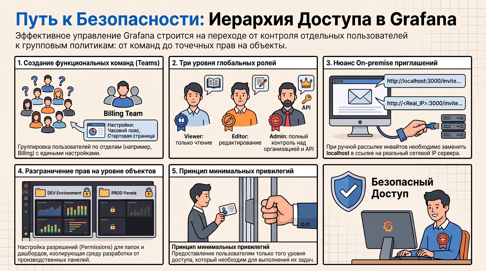
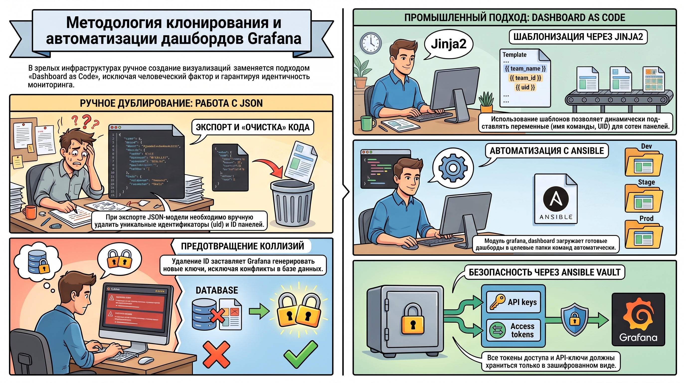
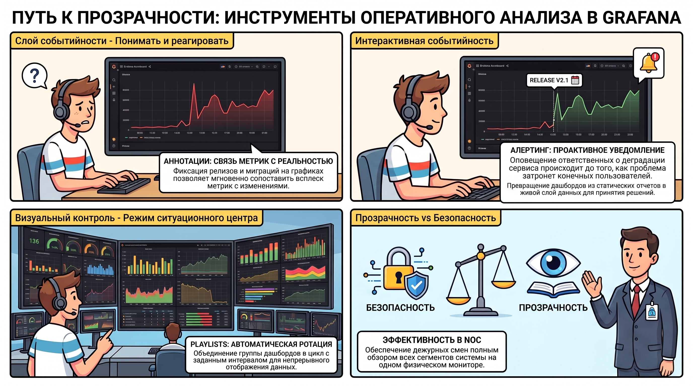

# Продвинутое администрирование и эксплуатация Grafana

Внедрение развитой ролевой модели доступа (RBAC) в Grafana является не просто технической задачей, а стратегическим элементом управления рисками в крупных организациях. Четкая структуризация прав позволяет не только защитить чувствительные бизнес-метрики от несанкционированного просмотра, но и предотвратить деградацию системы из-за случайных модификаций критических панелей.

### 1. Управление доступом: иерархия пользователей, команд и прав

Эффективная эксплуатация платформы мониторинга в масштабах предприятия требует ухода от управления отдельными пользователями в сторону групповых политик и делегирования полномочий.

#### **1.1. Командная структура и настройки групп**

Для логической группировки сотрудников используется механизм создания команд ( **Teams** ) в разделе  *Configuration* . Архитектурно это позволяет назначать права сразу на функциональный блок (например, «Billing» или «L1 Support»). При настройке группы определяются следующие параметры:

* **Наименование (Name):**  Уникальный идентификатор команды.  
* **Общий адрес (Email):**  Почтовый адрес группы. Важный архитектурный нюанс: данный Email используется преимущественно для синхронизации аватара команды через сервис  **Gravatar** .  
* **Визуальная тема (UI Theme):**  Определение темы по умолчанию (Dark, Light).  
* **Целевой дашборд (Home Dashboard):**  Установка специализированной стартовой страницы для конкретной команды.  
* **Часовой пояс (Timezone):**  Локализация временных настроек для распределенных команд.

#### **1.2. Механизм добавления пользователей и система ролей**

Приглашение участников осуществляется через интерфейс  **Invite** , что инициирует стандартный процесс регистрации. В Grafana предусмотрена строгая иерархия глобальных ролей:

* **Viewer:**  Ограничение доступа только чтением данных.  
* **Editor:**  Возможность создания и редактирования дашбордов и алертов.  
* **Admin:**  Полный административный контроль над организацией, включая управление пользователями и API-интеграциями.

**Технический нюанс для On-premise инсталляций:**  В разделе  *Pending Invites*  при использовании локальных серверов необходимо вручную модифицировать ссылку приглашения. Системный адрес (например, `http://localhost:3000/invite/...`) должен быть заменен на актуальный сетевой IP и порт (например, `http://127.0.0.1:32038/invite/...`), иначе внешний пользователь не сможет достичь точки регистрации.

#### **1.3. Делегирование прав на уровне объектов**

Для реализации принципа минимальных привилегий (Principle of Least Privilege) используется разграничение на уровне папок ( **Folders** ) и дашбордов. Через меню  *Manage Dashboards*  и функцию  *Go to folder*  администратор может гибко переопределять права ( **Permissions** ) для конкретных команд, изолируя среду разработки одной группы от производственных панелей другой.

*Грамотно выстроенная система прав создает доверенную среду, необходимую для эффективного тиражирования и масштабирования инструментов мониторинга во всей организации.*

### 2. Методология клонирования и автоматизации дашбордов

В зрелых инфраструктурах ручное создание визуализаций заменяется подходом  **Dashboard as Code** . Это исключает человеческий фактор и гарантирует идентичность мониторинга в различных окружениях (Dev/Stage/Prod).

#### **2.1. Ручное дублирование через JSON-модель**

При необходимости быстрого копирования инструмента используется работа с его JSON-моделью. Процесс включает экспорт исходного кода и его последующий импорт с обязательной «очисткой». Критически важно удалить уникальный идентификатор (`uid`) и идентификаторы всех панелей (`id`). Это необходимо для предотвращения коллизий состояний в базе данных Grafana: при импорте система должна сгенерировать новые уникальные ключи для корректной работы ссылок и истории версий.

#### **2.2. Промышленное клонирование (Ansible и Provisioning)**

Для автоматизации жизненного цикла сотен дашбордов применяются роли Ansible и возможности Grafana API. Процесс строится на следующих принципах:

* **Шаблонизация (Jinja2):**  Использование шаблонов `.j2` для формирования JSON-моделей. Это позволяет динамически подставлять такие переменные, как `team_name`, `owner` или специфический `uid` для каждой команды.  
* **Модульный подход:**  Использование специализированного модуля Ansible (`grafana_dashboard_module`) для загрузки дашбордов в целевые папки команд.  
* **Безопасность конфигурации:**  Все учетные данные и токены доступа для API должны храниться исключительно в зашифрованных хранилищах, таких как  **Ansible Vault** .

*Переход к автоматизированному управлению визуализацией освобождает ресурсы экспертов для более глубокого оперативного анализа инцидентов.*

### 3. Инструментарий оперативного анализа: алертинг, аннотации и визуализация

Продвинутые функции визуализации превращают дашборды из пассивных отчетов в интерактивный слой событийности, поддерживающий принятие решений в реальном времени.

#### **3.1. Аннотации и алерты как слой событийности**

* **Аннотации (Annotations):**  Позволяют фиксировать на временной шкале графиков значимые события (релизы, миграции БД, перезапуски). Это дает аналитику необходимый контекст для сопоставления всплесков метрик с изменениями в инфраструктуре.  
* **Алерты (Alerts):**  Механизм проактивного уведомления. Настройка порогов срабатывания в Grafana позволяет своевременно информировать ответственных лиц о деградации сервисов до того, как проблема станет критической для пользователей.

#### **3.2. Механизмы демонстрации: Playlists и ротация**

Для мониторинга в ситуационных центрах (NOC) используется функционал  **Playlists** . Он позволяет объединять группу дашбордов в цикл ротации. Администратор настраивает интервал обновления (Interval), по истечении которого система автоматически переключается на следующую панель, обеспечивая дежурным сменам полный обзор всех сегментов системы на одном физическом мониторе.

*Обеспечивая высокую прозрачность операционных данных, необходимо сохранять строгий контроль над безопасностью при их передаче внешним потребителям.*

### 4. Взаимодействие с внешними системами и безопасность

Управление платформой требует интеграции с внешними инструментами автоматизации и безопасных способов передачи срезов данных внешним контрагентам.

#### **4.1. Управление программным доступом через API Keys**

Для работы внешних скриптов и Ansible-плейбуков генерируются API-ключи в разделе  *Configuration*:

* **Идентификация:**  Каждому ключу присваивается уникальное имя и роль (Viewer/Editor/Admin).  
* **Управление рисками (TTL):**  Определение срока действия ключа. С точки зрения безопасности, создание ключей без TTL (бессрочных) несет значительные риски и требует особого обоснования и контроля. Ключи должны регулярно ротироваться и храниться в Ansible Vault.

#### **4.2. Снимки данных (Snapshots)**

**Snapshots**  — это эффективный инструмент для передачи состояния дашборда внешним сотрудникам или аудиторам для анализа инцидента. Снапшот представляет собой статический срез данных за выбранный период, что исключает возможность внесения изменений в запросы к источнику данных.

* **Критический параметр:**  При создании снапшота важно определить  **«Период между точками данных»**  (Data point period), который определяет детализацию сохраненного состояния.  
* **Варианты хранения:**  Снапшоты могут храниться локально на инстансе Grafana или публиковаться через внешний сервис raintank.io.

*Системное использование API и инструментов обмена данными знаменует переход от простой визуализации к созданию целостной экосистемы управления платформой мониторинга.*

### 5. Итог

Построение зрелого процесса Observability базируется на четырех критически важных компетенциях:

1. **Проектирование RBAC:**  Умение выстраивать иерархию прав на уровне команд и объектов, соблюдая баланс между доступностью данных и безопасностью (Identity Governance).  
2. **Масштабируемый Provisioning:**  Способность автоматизировать жизненный цикл дашбордов через Ansible и Jinja2-шаблоны, предотвращая конфликты состояний в БД.  
3. **Управление рисками безопасности:**  Владение механизмами программного доступа (API Keys) с контролем TTL и безопасным хранением секретов.  
4. **Событийный мониторинг:**  Навыки обогащения метрик контекстом через аннотации и настройки проактивного оповещения (Alerting) для минимизации времени обнаружения инцидентов (MTTD).

Освоение этих компетенций позволяет системному архитектору трансформировать Grafana из набора разрозненных графиков в защищенную, управляемую и высокопроизводительную платформу анализа данных всей организации.
