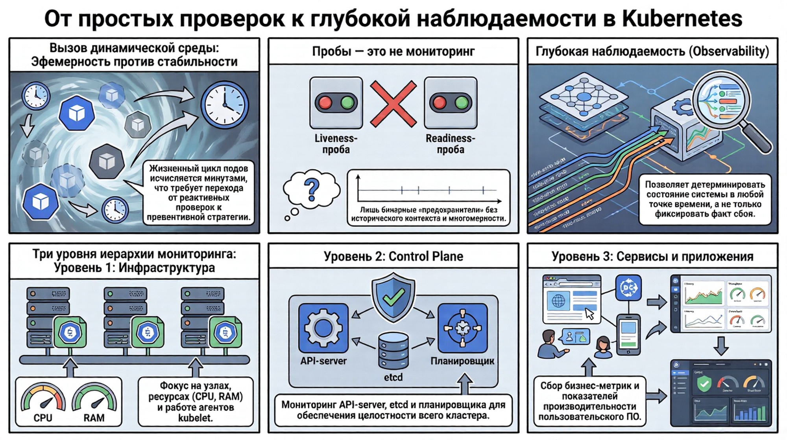
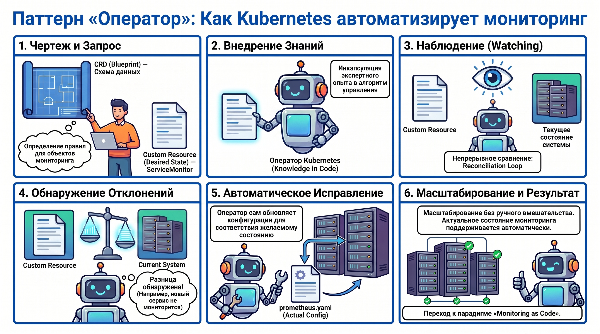
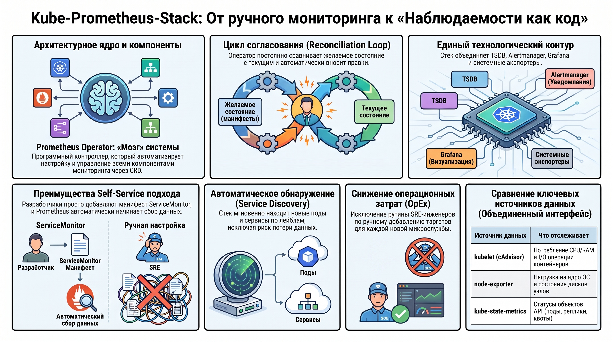
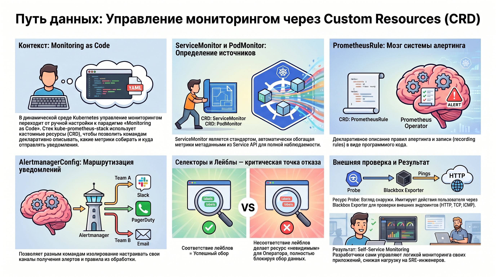
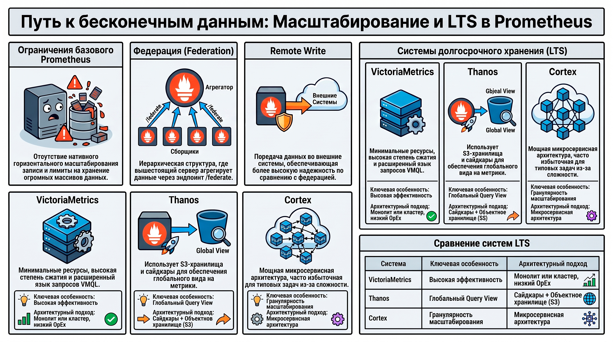
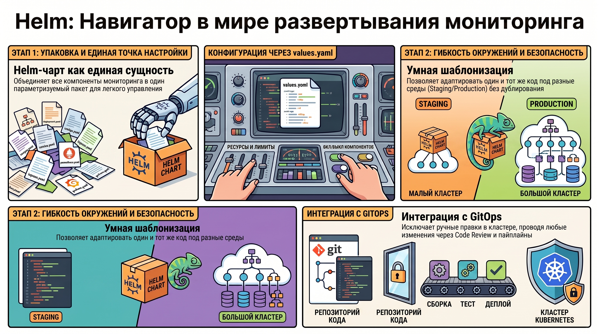

# Kube-prometheus-stack: архитектура и методология мониторинга в Kubernetes

## 1. Теоретические основы и уровни наблюдаемости в динамических средах

Эфемерная природа объектов в кластере Kubernetes, где жизненный цикл подов исчисляется минутами, а топология сети непрерывно трансформируется, диктует необходимость перехода от реактивных проверок к превентивной стратегии полнофункционального мониторинга. В условиях высокой динамичности классические методы контроля доступности становятся вторичными по отношению к обеспечению глубокой наблюдаемости (observability), позволяющей детерминировать состояние системы в любой точке временной шкалы.

Для декомпозиции сложности облачной среды необходимо выделять три иерархических уровня мониторинга:

* **Инфраструктурный уровень:** фокус на физических или виртуальных узлах и функционировании агентов kubelet (потребление системных ресурсов, состояние аппаратного обеспечения).
* **Уровень Control Plane:** агрегация метрик критических компонентов оркестрации (API-server, etcd, scheduler, controller-manager), определяющих целостность всего кластера.
* **Уровень сервисов и приложений:** сбор специфических бизнес-метрик и показателей производительности пользовательского программного обеспечения.

Критический анализ встроенных механизмов **Liveness и Readiness** проб позволяет утверждать, что они являются лишь дискретными сигналами жизнеспособности, но не инструментами глубокой диагностики. В отличие от полноценных временных рядов, пробы лишены исторического контекста и многомерности (dimensionality). Они выполняют роль бинарных «предохранителей», способных инициировать перезапуск контейнера, но не отвечающих на вопрос о первопричине деградации системы. Для качественной аналитики требуется структурированный подход к сбору данных из разнородных источников кластера.

## 2. Технологический базис: Паттерн «Оператор» и расширение API (CRD)

Внедрение парадигмы Configuration as Code (CaC) в процессы эксплуатации Kubernetes реализуется через паттерн «Оператор». Оператор представляет собой специализированный контроллер, который инкапсулирует экспертные знания об управлении сложными системами в программный код, расширяя стандартный API Kubernetes для автоматизации жизненного цикла приложений.

Систематизация ключевых источников метрик в кластере представлена в следующей таблице:

| Источник данных | Тип генерируемых метрик и показателей |
| ------ | ------ |
| kubelet (cAdvisor) | Утилизация CPU, RAM, сетевая активность и I/O операции контейнеров. |
| node-exporter | Системные показатели узлов: прерывания, дескрипторы файлов, нагрузка на ядро ОС. |
| kube-state-metrics | Состояние объектов API: статусы подов, доступность реплик, квоты и состояние PVC. |
| kube-apiserver | Интенсивность входящих запросов, коды ответов и задержки (latency) API. |
| etcd | Объем базы ключей, состояние кворума (лидер), лаги репликации и задержки записи. |
| Scheduler / Controller-manager | Метрики задержек планирования (scheduling latency) и количество повторных попыток (retries). |

Архитектурно данная модель опирается на механизм **Custom Resource Definition (CRD)**, который позволяет декларативно описывать ресурсы мониторинга. Структура включает два критических звена:

1. **CRD-объект (схема):** расширение метамодели Kubernetes, определяющее схему данных (apiVersion, kind), правила валидации и название нового типа ресурса.
2. **Custom Resource (экземпляр):** конкретная декларация желаемого состояния (например, манифест ServiceMonitor), создаваемая пользователем.

Оператор реализует **Reconciliation Loop (цикл согласования)**: он непрерывно сопоставляет текущее состояние системы с объявленным в Custom Resource и при обнаружении отклонений автоматически вносит изменения в конфигурационные файлы (например, генерирует `prometheus.yaml`). Это устраняет необходимость ручного управления конфигурациями при масштабировании инфраструктуры.

## 3. Архитектура и функциональные преимущества kube-prometheus-stack

`kube-prometheus-stack` является комплексным решением, обеспечивающим развертывание интегрированной экосистемы мониторинга «из коробки». Стек объединяет разрозненные инструменты в единый технологический контур, оптимизированный для работы в высоконагруженных средах.

**Функциональные компоненты стека:**

* **Prometheus Operator:** управляющее ядро, координирующее работу всех кастомных ресурсов.
* **Prometheus Server:** высокопроизводительная база данных временных рядов (TSDB) и механизм сбора данных.
* **Alertmanager:** система обработки, группировки и маршрутизации уведомлений.
* **Grafana:** платформа визуализации с набором эталонных дашбордов для Control Plane и инфраструктуры.
* **Набор экспортеров:** агенты (node-exporter, kube-state-metrics) для извлечения системных показателей.

Основное преимущество стека заключается в реализации модели **Self-Service Monitoring**. Благодаря автоматическому Service Discovery, разработчики получают возможность самостоятельно управлять логикой наблюдаемости своих приложений, внедряя соответствующие манифесты непосредственно в репозитории кода. Это радикально снижает операционные затраты (OpEx), исключая участие SRE-инженеров в рутинных операциях по добавлению таргетов для сбора метрик.

## 4. Методология управления сбором метрик и алертингом через кастомные ресурсы

Эффективность мониторинга в Kubernetes определяется качеством проектирования кастомных ресурсов, которые децентрализуют управление наблюдаемостью.

**Классификация ресурсов мониторинга:**

* **ServiceMonitor vs PodMonitor:** ServiceMonitor является стандартом де-факто, так как обеспечивает абстракцию над K8s-сервисами и автоматически обогащает метрики метаданными из Service API. PodMonitor применяется в исключительных случаях, когда прямая адресация подов необходима в обход сервисного слоя.
* **PrometheusRule:** ресурс для декларативного описания правил алертинга и правил записи (recording rules) как кода.
* **AlertmanagerConfig:** инструмент для децентрализованной настройки маршрутизации уведомлений (routes, receivers), что критически важно в мультикомандных средах для изоляции алертов разных сервисов.
* **Probe:** ресурс, использующий Blackbox Exporter для реализации мониторинга внешних эндпоинтов (HTTP, TCP, ICMP) изнутри кластера, имитируя запросы пользователей.

Критическим фактором надежности архитектуры является механизм селекторов и лейблов. Несоответствие лейблов в манифесте ServiceMonitor селекторам, определенным в конфигурации Prometheus Operator, является «критической точкой отказа»: в этом случае ресурс становится невидимым для оператора, и сбор метрик не инициируется.

При экспоненциальном росте объема данных и необходимости хранения метрик за длительные периоды стандартных возможностей локального стека становится недостаточно, что требует перехода к стратегиям масштабирования и долгосрочного хранения.

## 5. Масштабирование, федерация и долгосрочное хранение данных

Базовая архитектура Prometheus имеет фундаментальные ограничения в области горизонтального масштабирования записи и не предназначена для сверхдолговременного хранения больших массивов данных.

**Механизмы масштабирования:**

* **Федерация:** иерархическая структура, где вышестоящий сервер собирает агрегированные данные через эндпоинт `/federate`. Важно отметить, что в текущей реализации Prometheus Operator настройка федерации не автоматизирована полностью и часто требует ручного внесения в `static_config` или использования Remote Write.
* **Remote Write:** метод передачи данных во внешние специализированные системы хранения, обеспечивающий большую надежность по сравнению с классической федерацией.

**Системы долгосрочного хранения (Long-Term Storage):**

1. **VictoriaMetrics:** демонстрирует наименьший операционный след (operational footprint) и высокую эффективность сжатия. Особую ценность представляет язык VMQL, предлагающий расширенный функционал по сравнению со стандартным PromQL для сложных аналитических запросов.
2. **Thanos:** опирается на модель сайдкаров (sidecars) и объектные хранилища (S3), обеспечивая глобальный вид на метрики (Global Query View) и неограниченную глубину хранения.
3. **Cortex:** предлагает микросервисную архитектуру с высокой степенью гранулярности масштабирования, однако из-за высокой сложности настройки часто расценивается как избыточное решение (over-engineering) для большинства типовых задач.

Выбор конкретной системы хранения и последующая оркестрация всех компонентов стека в кластере требуют использования инструментов, обеспечивающих повторяемость и управляемость деплоя.

## 6. Инструментарий развертывания: Пакетный менеджер Helm

Стандартом де-факто для управления жизненным циклом сложных манифестов в Kubernetes является пакетный менеджер Helm, который позволяет упаковать всю экосистему мониторинга в единую параметризуемую сущность.

**Структура и роль Helm-чарта:**

* **values.yaml:** служит единой точкой входа для настройки всего стека. Здесь определяются ресурсы (requests/limits), включаются или отключаются компоненты и настраиваются параметры хранения.
* **Шаблонизация:** позволяет адаптировать конфигурацию мониторинга под различные окружения (staging/production) без дублирования кода.
* **GitOps-интеграция:** хранение конфигурационных параметров в Git обеспечивает полную прослеживаемость изменений. Любая модификация мониторинга проходит через процедуры Code Review и автоматизированные пайплайны, что исключает риск неконтролируемых ручных правок в кластере.

## 7. Заключение

Главным результатом освоения методологии `kube-prometheus-stack` является концептуальный переход от ручного конфигурирования систем наблюдения к парадигме Monitoring as Code.

Итоговая компетенция специалиста включает в себя:

1. Глубокое понимание архитектуры оператора как механизма автоматизации жизненного цикла Prometheus.
2. Навыки децентрализованного управления сбором данных и алертингом через специализированные CRD (`ServiceMonitor`, `PrometheusRule`, `AlertmanagerConfig`).
3. Способность проектировать масштабируемые системы наблюдаемости с использованием инструментов долгосрочного хранения данных.

Внедрение данного стека закладывает фундамент надежности современной инфраструктуры, обеспечивая прозрачность как на уровне системных компонентов Kubernetes, так и на уровне прикладной бизнес-логики.
